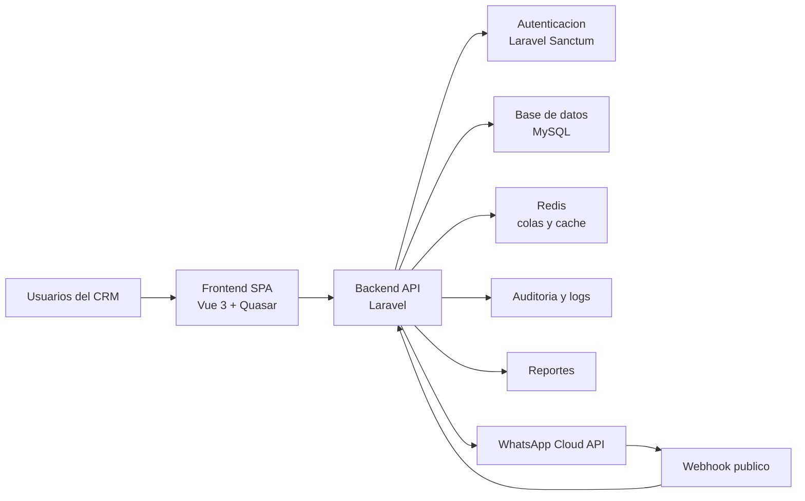
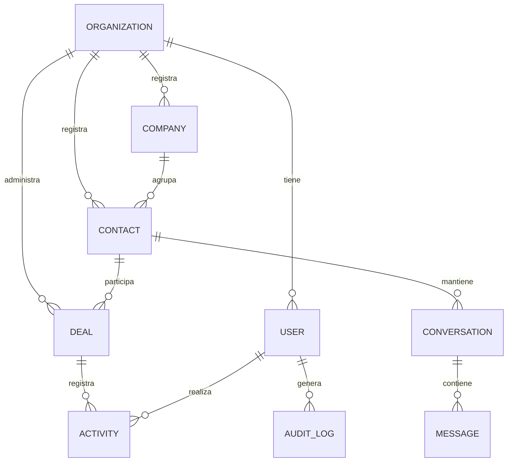
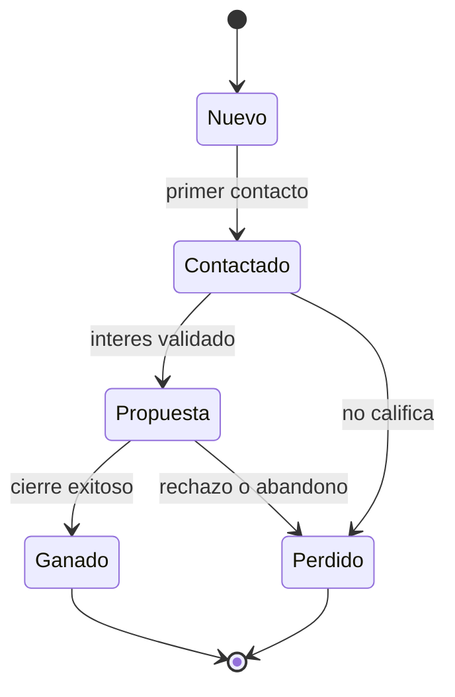
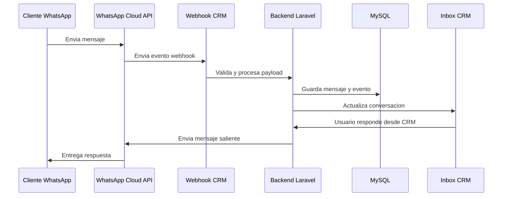
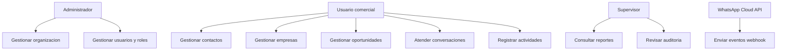

# Proyecto de Grado

## Desarrollo de un sistema CRM conversacional multiempresa con integracion a WhatsApp Cloud API para la gestion de clientes y oportunidades comerciales

**Carrera:** Ingenieria de Sistemas  
**Modalidad:** Proyecto de Grado  
**Postulante:** [Nombre del postulante]  
**Tutor:** [Nombre del tutor]  
**Institucion:** Universidad Tecnica Privada Cosmos - UNITEPC  
**Gestion:** 2026  

---

## Dedicatoria

[Redactar dedicatoria personal en una pagina independiente, si corresponde.]

## Agradecimientos

[Redactar agradecimientos al tutor, docentes, familia, institucion y personas que apoyaron el desarrollo del proyecto.]

## Resumen

El presente proyecto de grado tiene como finalidad desarrollar un sistema CRM conversacional multiempresa con integracion a WhatsApp Cloud API para mejorar la gestion de clientes, oportunidades comerciales y procesos de seguimiento en pequenas y medianas empresas. La propuesta surge a partir de la necesidad de centralizar informacion comercial que habitualmente se encuentra dispersa en hojas de calculo, telefonos personales, conversaciones de WhatsApp, notas individuales y herramientas no integradas. Esta dispersion dificulta mantener trazabilidad sobre clientes, contactos, empresas, conversaciones, responsables, actividades y estado real de las oportunidades comerciales.

El sistema propuesto se concibe como una plataforma web modular, compuesta por un backend API desarrollado en Laravel, una interfaz SPA construida con Vue 3 y Quasar Framework, una base de datos MySQL, Redis para procesos en segundo plano y una integracion con WhatsApp Cloud API basada en webhooks. El enfoque multiempresa permite que distintas organizaciones utilicen la plataforma manteniendo separacion logica de datos, usuarios, roles y configuraciones. El proyecto incorpora modulos de autenticacion, organizaciones, usuarios, contactos, empresas, pipeline comercial, actividades, inbox conversacional, integracion WhatsApp, automatizaciones basicas, reportes y auditoria.

Metodologicamente, el trabajo se desarrolla como una investigacion aplicada, descriptiva y propositiva, apoyada en principios de ingenieria de software, ingenieria de requisitos, arquitectura de software, seguridad en aplicaciones web y calidad de software. Se emplean tecnicas de revision documental, observacion, analisis de requerimientos, modelado de sistemas y pruebas funcionales. La fundamentacion teorica se apoya en autores y normas relacionadas con CRM, ingenieria de software, arquitectura, requisitos, calidad y seguridad, entre ellas Prior, Buttle y Maklan (2024), Payne (2006), Sommerville (2016), Pressman y Maxim (2020), Bass, Clements y Kazman (2022), ISO/IEC/IEEE 29148:2018, ISO/IEC 25010:2023, OWASP Top 10 y OWASP API Security Top 10.

Como resultado esperado, el proyecto entrega un prototipo funcional capaz de centralizar informacion comercial, registrar clientes y empresas, administrar oportunidades en un pipeline, gestionar conversaciones asociadas a contactos, recibir eventos de WhatsApp mediante webhooks, generar reportes basicos y conservar trazabilidad mediante auditoria. La solucion propuesta contribuye a mejorar el seguimiento comercial, reducir perdida de informacion, fortalecer la coordinacion interna y apoyar la toma de decisiones basada en datos.

**Palabras clave:** CRM, WhatsApp Cloud API, pipeline comercial, multiempresa, Laravel, Vue, Quasar, webhooks, gestion de clientes.

## Introduccion

La gestion de clientes constituye una actividad central para empresas que dependen de procesos de venta, atencion, seguimiento y fidelizacion. En muchos entornos empresariales, especialmente en pequenas y medianas empresas, esta gestion se realiza mediante registros aislados y canales de comunicacion no integrados. Aunque herramientas como hojas de calculo, agendas personales, llamadas telefonicas y aplicaciones de mensajeria permiten resolver necesidades inmediatas, su uso disperso limita la trazabilidad de la informacion y dificulta la toma de decisiones.

El crecimiento de canales conversacionales, particularmente WhatsApp, ha transformado la forma en que las empresas se comunican con sus clientes. No obstante, cuando las conversaciones se gestionan desde telefonos personales o cuentas sin integracion con un sistema empresarial, se generan riesgos relacionados con perdida de historial, duplicidad de informacion, falta de responsables, ausencia de metricas y bajo control de seguridad. En este contexto, un CRM conversacional permite vincular la gestion comercial con la comunicacion directa, convirtiendo las interacciones en informacion estructurada y util para la organizacion.

El presente documento desarrolla el proyecto de grado titulado "Desarrollo de un sistema CRM conversacional multiempresa con integracion a WhatsApp Cloud API para la gestion de clientes y oportunidades comerciales". La propuesta se enmarca en el area de Ingenieria de Sistemas porque implica el analisis de un problema organizacional, la especificacion de requisitos, el diseno de una arquitectura de software, la implementacion de modulos funcionales, la integracion con servicios externos y la validacion del producto mediante pruebas.

El documento se organiza en seis capitulos. El Capitulo I presenta la tematica de investigacion, los antecedentes, el planteamiento del problema, los objetivos, la justificacion y la delimitacion. El Capitulo II desarrolla el marco contextual relacionado con pequenas y medianas empresas, procesos comerciales y uso de canales conversacionales. El Capitulo III expone el marco teorico sobre CRM, ingenieria de software, arquitectura, requisitos, seguridad, calidad e integracion mediante webhooks. El Capitulo IV describe el diseno metodologico. El Capitulo V presenta el diseno de ingenieria y la propuesta tecnologica. Finalmente, el Capitulo VI establece el analisis e interpretacion de resultados, incluyendo criterios de validacion funcional y de calidad.

---

# Capitulo I. Presentacion de la tematica de investigacion

## 1.1 Antecedentes

La gestion de relaciones con clientes ha evolucionado desde registros manuales y bases de datos aisladas hacia plataformas integradas que permiten organizar informacion comercial, historiales de interaccion, oportunidades de venta y procesos de seguimiento. En este contexto, el Customer Relationship Management (CRM) se comprende como una estrategia apoyada por procesos y tecnologias que busca crear, mantener y fortalecer relaciones de valor entre una organizacion y sus clientes. Prior, Buttle y Maklan (2024) explican que el CRM integra conceptos, aplicaciones y tecnologias orientadas a gestionar relaciones beneficiosas, lo cual permite entender que un sistema CRM no debe limitarse al almacenamiento de datos, sino apoyar procesos de decision y coordinacion operativa.

Desde una perspectiva organizacional, Payne (2006) sostiene que la gestion de clientes requiere alinear procesos, personas, informacion y tecnologia para mejorar el desempeno comercial. Esta idea resulta relevante para empresas que dependen del contacto continuo con prospectos y clientes, ya que la informacion dispersa reduce la capacidad de seguimiento y afecta la continuidad de las oportunidades comerciales. En pequenas y medianas empresas, este problema suele manifestarse mediante el uso de hojas de calculo, conversaciones en telefonos personales, notas no estandarizadas y ausencia de un historial comun.

El crecimiento de los canales conversacionales ha incrementado la necesidad de integrar la comunicacion con los procesos comerciales. WhatsApp se ha consolidado como un canal frecuente de atencion, prospeccion y seguimiento; sin embargo, cuando las conversaciones se gestionan sin una plataforma centralizada, la empresa pierde trazabilidad sobre el historial de contacto, los responsables, los estados de oportunidad y los resultados obtenidos. La documentacion de Meta (2026a, 2026b) sobre WhatsApp Business Platform y webhooks establece que la integracion de mensajes permite recibir eventos y estados de comunicacion desde la plataforma hacia sistemas externos.

En el area de Ingenieria de Sistemas, el desarrollo de un CRM conversacional requiere aplicar principios de ingenieria de software, arquitectura, seguridad, calidad e integracion de servicios. Sommerville (2016) senala que el desarrollo de software debe considerar actividades sistematicas de especificacion, diseno, implementacion, validacion y evolucion. Del mismo modo, Pressman y Maxim (2020) destacan la necesidad de estructurar el proceso de desarrollo mediante requisitos, modelos, diseno, pruebas y gestion de calidad.

Con base en estos antecedentes, el proyecto propone el desarrollo de un sistema CRM conversacional multiempresa orientado a centralizar clientes, contactos, empresas, oportunidades comerciales, conversaciones por WhatsApp, automatizaciones, reportes y auditoria. El proyecto se plantea como una propuesta tecnologica aplicable al contexto de pequenas y medianas empresas que requieren mejorar su gestion comercial y fortalecer la relacion con sus clientes mediante una plataforma web modular.

## 1.2 Planteamiento del problema

### 1.2.1 Descripcion del problema

En muchas pequenas y medianas empresas, la gestion de clientes y oportunidades comerciales se realiza mediante herramientas dispersas. Los datos de clientes pueden encontrarse en hojas de calculo, telefonos personales, conversaciones de WhatsApp, correos electronicos, notas individuales o aplicaciones no conectadas entre si. Esta forma de trabajo dificulta mantener un historial unificado de interacciones, identificar el estado real de cada oportunidad comercial y asignar responsabilidades claras dentro del equipo.

La ausencia de un sistema centralizado provoca perdida de informacion, duplicidad de registros, seguimiento irregular de prospectos, falta de reportes comerciales y dificultad para medir el desempeno del proceso de ventas. Cuando una oportunidad comercial depende de conversaciones aisladas, el cambio de responsable, la perdida de un telefono o la falta de registro de acuerdos puede ocasionar que el cliente no reciba seguimiento oportuno. Esta situacion afecta la eficiencia operativa y reduce la capacidad de la empresa para tomar decisiones basadas en informacion confiable.

El problema tambien se relaciona con la seguridad y el control de acceso. La informacion comercial contiene datos de clientes, conversaciones, montos de oportunidades y decisiones internas. OWASP Foundation (2021) identifica el control de acceso roto como uno de los riesgos criticos en aplicaciones web, mientras que OWASP Foundation (2023) advierte sobre riesgos especificos en APIs, como autorizacion inadecuada, exposicion excesiva de datos y falta de control sobre recursos. Por ello, un CRM conversacional debe considerar autenticacion, autorizacion, separacion de datos por empresa y auditoria desde su diseno.

Desde el punto de vista tecnico, la integracion con WhatsApp Cloud API requiere procesar webhooks, almacenar eventos, relacionar mensajes con contactos y mantener trazabilidad de estados de envio y recepcion. Si esta integracion no se disena adecuadamente, pueden producirse inconsistencias entre las conversaciones y los procesos comerciales. La ingenieria de requisitos propuesta por ISO/IEC/IEEE 29148:2018 permite organizar y validar necesidades funcionales y no funcionales, lo cual resulta necesario para que el sistema responda a un problema real.

En consecuencia, se identifica la necesidad de desarrollar una plataforma CRM conversacional multiempresa que centralice la informacion de clientes, contactos, conversaciones y oportunidades comerciales, permitiendo mejorar la trazabilidad, el seguimiento, la seguridad y la toma de decisiones.

### 1.2.2 Formulacion del problema

De que manera el desarrollo de un sistema CRM conversacional multiempresa con integracion a WhatsApp Cloud API permitira mejorar la gestion de clientes, oportunidades comerciales y procesos de seguimiento en pequenas y medianas empresas?

La Tabla 1 sintetiza la relacion entre los problemas identificados, sus causas, sus efectos y la necesidad que el sistema debe atender.

### Tabla 1. Matriz de problemas, causas y efectos

| Problema identificado | Causas principales | Efectos en la organizacion | Necesidad asociada |
| --- | --- | --- | --- |
| Informacion de clientes dispersa | Uso de hojas de calculo, telefonos personales y registros no integrados | Duplicidad de datos, perdida de historial y baja trazabilidad | Centralizar clientes, contactos y empresas |
| Seguimiento comercial irregular | Falta de pipeline y responsables definidos | Oportunidades olvidadas, retrasos y menor conversion | Gestionar oportunidades por etapas comerciales |
| Conversaciones no vinculadas al proceso comercial | Uso de WhatsApp sin integracion al CRM | Dificultad para conocer acuerdos, solicitudes y estado del cliente | Integrar WhatsApp Cloud API mediante webhooks |
| Falta de reportes | Datos no estructurados o incompletos | Decisiones basadas en percepciones y no en indicadores | Generar reportes comerciales y operativos |
| Riesgo de acceso no controlado | Ausencia de roles, permisos y separacion multiempresa | Exposicion de informacion sensible | Incorporar autenticacion, autorizacion y auditoria |

## 1.3 Objetivos

### 1.3.1 Objetivo general

Desarrollar un sistema CRM conversacional multiempresa con integracion a WhatsApp Cloud API para mejorar la gestion de clientes, oportunidades comerciales y procesos de seguimiento en pequenas y medianas empresas.

### 1.3.2 Objetivos especificos

1. Diagnosticar los procesos actuales de gestion de clientes, contactos, conversaciones y oportunidades comerciales, identificando necesidades funcionales y no funcionales del sistema.
2. Disenar la arquitectura, modelo de datos y estructura modular del sistema CRM conversacional multiempresa, considerando requisitos de seguridad, escalabilidad, mantenibilidad e integracion.
3. Implementar los modulos principales del sistema, incluyendo autenticacion, organizaciones, contactos, empresas, pipeline comercial, inbox conversacional, integracion con WhatsApp Cloud API, reportes y auditoria.
4. Validar el funcionamiento del sistema mediante pruebas funcionales, revision de requisitos y criterios de calidad de software aplicables al proyecto.

La Tabla 2 relaciona cada objetivo especifico con el resultado esperado y la evidencia que permitira verificar su cumplimiento.

### Tabla 2. Objetivos especificos y resultados esperados

| Objetivo especifico | Resultado esperado | Evidencia |
| --- | --- | --- |
| Diagnosticar procesos y necesidades | Requerimientos funcionales y no funcionales definidos | Matriz de requerimientos, entrevistas, ficha de observacion |
| Disenar arquitectura y modelo de datos | Diseno tecnico del sistema CRM | Diagramas de arquitectura, entidad-relacion y modulos |
| Implementar modulos principales | Prototipo funcional del sistema | Codigo fuente, interfaces, endpoints y documentacion tecnica |
| Validar el funcionamiento | Resultados de pruebas y cumplimiento de requisitos | Casos de prueba, checklist de calidad y reporte de resultados |

## 1.4 Justificacion

### 1.4.1 Justificacion practica

El proyecto se justifica practicamente porque propone una solucion tecnologica a un problema frecuente en pequenas y medianas empresas: la gestion dispersa de clientes, conversaciones y oportunidades comerciales. Un sistema CRM conversacional permitira centralizar informacion, registrar interacciones, administrar etapas de venta y facilitar el seguimiento de cada prospecto o cliente. Esta centralizacion puede contribuir a reducir perdida de informacion, mejorar la coordinacion interna y disponer de reportes para la toma de decisiones.

La integracion con WhatsApp Cloud API resulta pertinente porque muchas empresas utilizan WhatsApp como canal principal de comunicacion con clientes. Al vincular las conversaciones con contactos y oportunidades comerciales, el sistema permitira conservar historial, asociar mensajes a procesos de venta y mantener mayor control sobre la atencion. Esta integracion transforma un canal conversacional cotidiano en una fuente estructurada de informacion comercial.

### 1.4.2 Justificacion teorica

La propuesta se apoya en fundamentos de CRM, gestion comercial e ingenieria de software. Prior, Buttle y Maklan (2024) explican que el CRM integra aspectos estrategicos, operativos y analiticos para crear valor en la relacion con clientes. Payne (2006) complementa esta vision al resaltar la importancia de procesos orientados al cliente y de la coordinacion organizacional. Por ello, el proyecto no se limita a construir una aplicacion, sino que busca representar un proceso comercial organizado mediante una herramienta tecnologica.

Desde la Ingenieria de Sistemas, el proyecto se sustenta en principios de especificacion, diseno, implementacion y validacion de software. Sommerville (2016) y Pressman y Maxim (2020) coinciden en que el desarrollo de sistemas debe responder a requisitos definidos, modelos de diseno, pruebas y control de calidad. Asimismo, Bass, Clements y Kazman (2022) permiten fundamentar la importancia de la arquitectura de software como base para lograr atributos de calidad como mantenibilidad, seguridad, modificabilidad y escalabilidad.

### 1.4.3 Justificacion metodologica

Metodologicamente, el proyecto se justifica porque aplica un proceso sistematico de investigacion aplicada y desarrollo tecnologico. Se realiza levantamiento de informacion, analisis de requerimientos, diseno de arquitectura, implementacion modular y validacion mediante pruebas. ISO/IEC/IEEE 29148:2018 sirve como referencia para la definicion y gestion de requisitos, mientras que ISO/IEC 25010:2023 permite orientar criterios de calidad del producto de software.

Adicionalmente, se considera una organizacion iterativa del trabajo inspirada en Scrum, tomando como referencia la guia de Schwaber y Sutherland (2020). Esta aproximacion permite dividir el desarrollo en incrementos funcionales, revisar avances y ajustar el producto de acuerdo con los objetivos del proyecto.

## 1.5 Delimitacion

### 1.5.1 Delimitacion temporal

El proyecto se planifica para un periodo referencial de seis meses, considerando actividades de revision bibliografica, diagnostico, levantamiento de requerimientos, diseno, implementacion, pruebas, correcciones y redaccion del documento final.

### 1.5.2 Delimitacion espacial

El proyecto se desarrolla en un contexto academico y se orienta como prototipo funcional aplicable a pequenas y medianas empresas que requieren gestionar clientes, contactos, conversaciones y oportunidades comerciales. No se limita a una unica empresa especifica, sino que se plantea como una plataforma multiempresa adaptable a organizaciones con procesos comerciales similares.

### 1.5.3 Delimitacion financiera

La delimitacion financiera considera recursos de desarrollo, infraestructura de prueba, servicios externos y herramientas necesarias para implementar y validar el sistema.

La Tabla 3 resume el alcance temporal, espacial, funcional, tecnico y de evaluacion del proyecto.

### Tabla 3. Delimitacion del proyecto

| Dimension | Alcance definido |
| --- | --- |
| Temporal | Seis meses de trabajo referencial |
| Espacial | Prototipo academico aplicable a pequenas y medianas empresas |
| Funcional | Clientes, contactos, empresas, pipeline, inbox, WhatsApp, reportes, auditoria y automatizaciones basicas |
| Tecnica | Laravel, MySQL, Redis, Vue 3, Quasar, Laravel Sanctum y WhatsApp Cloud API |
| Seguridad | Autenticacion, autorizacion, roles, separacion multiempresa y buenas practicas OWASP |
| Evaluacion | Pruebas funcionales, validacion de requisitos y criterios de calidad ISO/IEC 25010 |

La Tabla 4 presenta un presupuesto estimado para los recursos necesarios durante el desarrollo y validacion del proyecto.

### Tabla 4. Presupuesto estimado

| Recurso | Descripcion | Costo estimado Bs. |
| --- | --- | ---: |
| Equipo de desarrollo | Computadora personal, perifericos y entorno local | 0 |
| Dominio | Dominio referencial para despliegue o pruebas externas | 100 |
| Hosting o VPS de prueba | Servidor para publicar prototipo, API y base de datos | 500 |
| Servicios de mensajeria | Pruebas con WhatsApp Cloud API o proveedor asociado | 200 |
| Internet y energia | Consumo asociado al desarrollo y pruebas | 300 |
| Herramientas de documentacion | Edicion, diagramacion y preparacion de anexos | 100 |
| Material bibliografico | Consulta, adquisicion o acceso a fuentes | 300 |
| Contingencia | Ajustes, pruebas adicionales o recursos imprevistos | 300 |
| **Total estimado** |  | **1.800** |

---

# Capitulo II. Marco contextual

## 2.1 Contexto de pequenas y medianas empresas

Las pequenas y medianas empresas requieren administrar relaciones con clientes en condiciones de recursos limitados, equipos reducidos y procesos que muchas veces no se encuentran completamente formalizados. En este tipo de organizaciones, una misma persona puede encargarse de ventas, atencion, seguimiento, registro de informacion y coordinacion de actividades posteriores. Esta realidad genera dependencia de herramientas de uso personal y dificulta la continuidad del proceso comercial cuando la informacion no se encuentra centralizada.

En este tipo de contexto, la relacion con el cliente no se limita a una transaccion aislada. Implica identificar necesidades, registrar datos, mantener comunicacion, dar seguimiento, presentar propuestas, resolver dudas y conservar evidencia de los acuerdos alcanzados. Desde la perspectiva del CRM, la informacion del cliente debe integrarse con los procesos de la organizacion para crear valor y fortalecer relaciones comerciales sostenibles (Prior et al., 2024). Payne (2006) tambien resalta que la gestion de clientes requiere articular procesos, personas, tecnologia e informacion, aspecto especialmente importante cuando los equipos son pequenos y no existen unidades separadas para ventas, marketing y soporte.

El contexto de aplicacion del proyecto corresponde a organizaciones que interactuan con prospectos y clientes por canales digitales, registran datos comerciales y necesitan hacer seguimiento de oportunidades. La solucion propuesta se orienta a empresas que requieren una herramienta accesible, modular y adaptable, sin asumir una estructura corporativa compleja. Por ello, el diseno multiempresa permite que la plataforma pueda ser utilizada por distintas organizaciones con separacion de datos y configuraciones.

En el marco de este proyecto, una pequena o mediana empresa se entiende como una organizacion que necesita gestionar clientes y oportunidades comerciales, pero que no necesariamente dispone de un sistema formal para centralizar informacion. La Tabla 5 presenta las caracteristicas del contexto empresarial considerado para el desarrollo de la propuesta.

### Tabla 5. Caracteristicas del contexto empresarial considerado

| Caracteristica | Descripcion | Implicacion para el sistema |
| --- | --- | --- |
| Equipo reducido | Pocas personas cumplen varias funciones comerciales y administrativas | La interfaz debe ser clara, directa y facil de adoptar |
| Procesos parcialmente formalizados | Existen practicas de ventas, pero no siempre estan documentadas | El CRM debe ordenar el flujo sin imponer complejidad excesiva |
| Uso frecuente de WhatsApp | La comunicacion con clientes ocurre por mensajeria directa | El inbox debe vincular conversaciones con clientes y oportunidades |
| Informacion dispersa | Datos ubicados en hojas de calculo, chats, notas o telefonos | Se requiere centralizacion de contactos, empresas y conversaciones |
| Necesidad de seguimiento | Las oportunidades requieren control de estado y responsable | El pipeline debe permitir visualizar avances y tareas pendientes |
| Recursos tecnologicos limitados | No siempre se cuenta con infraestructura avanzada | La arquitectura debe ser mantenible y viable en despliegues moderados |

## 2.2 Proceso comercial general

El proceso comercial considerado en el proyecto inicia cuando una persona o empresa muestra interes en un producto o servicio. Este interes puede surgir por contacto directo, recomendacion, campana, consulta por WhatsApp o registro manual. Posteriormente, el usuario comercial registra o actualiza el contacto, identifica si pertenece a una empresa, crea una oportunidad comercial y la ubica en una etapa del pipeline.

La importancia de formalizar este proceso radica en que permite convertir interacciones aisladas en informacion organizada. Un contacto que escribe por WhatsApp puede convertirse en una oportunidad comercial; una oportunidad puede generar actividades de seguimiento; y una actividad puede producir una propuesta o cierre. Esta continuidad es coherente con la vision de CRM operativo, donde la tecnologia apoya las actividades de ventas, servicio y relacionamiento directo con clientes (Prior et al., 2024).

El pipeline propuesto considera cinco etapas principales: Nuevo, Contactado, Propuesta, Ganado y Perdido. La etapa Nuevo representa oportunidades recien detectadas; Contactado indica que ya existio un primer acercamiento; Propuesta representa una oportunidad con oferta, cotizacion o alcance presentado; Ganado registra cierre exitoso; y Perdido identifica oportunidades descartadas o no concretadas.

La Tabla 6 resume el proceso comercial general que el sistema debe apoyar, desde la entrada del contacto hasta el cierre o descarte de la oportunidad.

### Tabla 6. Proceso comercial general del CRM

| Etapa del proceso | Descripcion | Datos que deben registrarse | Modulo relacionado |
| --- | --- | --- | --- |
| Captacion o registro | Se identifica un prospecto o cliente | Nombre, telefono, correo, origen, observaciones | Contactos |
| Asociacion empresarial | Se vincula el contacto con una empresa, si corresponde | Empresa, industria, sitio web, relacion | Empresas |
| Conversacion inicial | Se atiende una consulta o interaccion | Canal, mensajes, responsable, estado | Inbox conversacional |
| Creacion de oportunidad | Se identifica potencial comercial | Nombre del deal, monto estimado, etapa, responsable | Deals |
| Seguimiento | Se registran tareas, notas o recordatorios | Actividad, fecha, usuario, resultado | Actividades |
| Propuesta | Se formaliza una oferta o alcance | Monto, condiciones, documento o detalle | Pipeline |
| Cierre | Se marca la oportunidad como ganada o perdida | Estado final, motivo, fecha, observaciones | Deals y reportes |

## 2.3 Problematica operativa del seguimiento comercial

El seguimiento comercial es una de las areas donde se manifiesta con mayor claridad la necesidad de un CRM. Cuando una empresa atiende multiples conversaciones y oportunidades sin una herramienta centralizada, cada usuario depende de su memoria, de anotaciones personales o de chats aislados. Esta forma de trabajo puede funcionar en etapas iniciales, pero se vuelve riesgosa cuando aumenta el numero de clientes, contactos y propuestas.

Los problemas mas frecuentes son la falta de visibilidad sobre oportunidades pendientes, la imposibilidad de conocer el ultimo contacto realizado, la ausencia de indicadores sobre ventas en curso y la perdida de historial cuando cambia el responsable de una cuenta. Estos problemas no solo afectan la productividad del equipo, sino tambien la experiencia del cliente, que puede recibir respuestas repetidas, incompletas o tardias.

Desde la teoria de CRM, la relacion con el cliente debe administrarse como un proceso continuo y no como una suma de acciones desconectadas. Payne (2006) enfatiza que la excelencia en gestion de clientes depende de procesos integrados que permitan conocer, segmentar, atender y retener clientes. En consecuencia, un sistema CRM conversacional debe articular informacion, comunicacion y seguimiento comercial en un flujo unico.

La Tabla 7 identifica problemas operativos del seguimiento comercial y la forma en que el sistema propuesto responde a cada uno.

### Tabla 7. Problemas operativos y respuesta del sistema propuesto

| Problema operativo | Consecuencia | Respuesta del CRM |
| --- | --- | --- |
| No existe historial unificado del cliente | El equipo desconoce acuerdos previos | Historial por contacto, conversacion y actividad |
| Las oportunidades no tienen estado claro | Se pierden ventas por falta de seguimiento | Pipeline con etapas y responsables |
| Las conversaciones estan en telefonos personales | Dependencia de una persona especifica | Inbox centralizado por organizacion |
| No se registran motivos de perdida | No se aprende de oportunidades fallidas | Estados y observaciones de cierre |
| No hay metricas comerciales | Las decisiones se toman por percepcion | Reportes de deals, conversaciones y actividad |
| El acceso no esta controlado | Riesgo de exposicion de informacion | Roles, permisos y separacion multiempresa |

## 2.4 Comunicacion con clientes

La comunicacion con clientes se realiza habitualmente mediante mensajes, llamadas y correos. WhatsApp ocupa un lugar importante porque permite una comunicacion rapida, directa y familiar para los usuarios. Sin embargo, cuando esta comunicacion no se vincula al CRM, las conversaciones quedan fuera del proceso formal de gestion comercial.

La integracion de un inbox conversacional permite convertir mensajes en informacion gestionable. Cada conversacion puede relacionarse con un contacto, una empresa, una oportunidad comercial, una actividad o una tarea de seguimiento. Esta relacion aporta trazabilidad y permite que otros usuarios autorizados comprendan el contexto de atencion.

La documentacion oficial de Meta indica que la WhatsApp Business Platform permite enviar y recibir mensajes mediante Cloud API y que los webhooks se utilizan para recibir eventos sobre mensajes y estados (Meta, 2026a, 2026b). Esto permite que un sistema externo, como el CRM propuesto, registre automaticamente eventos conversacionales y los vincule con procesos internos.

La Tabla 8 muestra la diferencia entre una comunicacion dispersa y una comunicacion gestionada desde un CRM conversacional.

### Tabla 8. Comparacion entre comunicacion dispersa y comunicacion CRM

| Aspecto | Comunicacion dispersa | Comunicacion gestionada en CRM |
| --- | --- | --- |
| Ubicacion del historial | Telefono o cuenta individual | Conversacion centralizada por organizacion |
| Relacion con clientes | Manual o informal | Asociada a contactos y empresas |
| Relacion con oportunidades | Generalmente inexistente | Vinculada a deals y actividades |
| Continuidad del seguimiento | Depende del responsable | Visible para usuarios autorizados |
| Control de acceso | Limitado o personal | Roles, permisos y auditoria |
| Analisis posterior | Dificil de consolidar | Disponible para reportes |

## 2.5 Necesidad de una plataforma multiempresa

El enfoque multiempresa permite que el sistema administre datos de diferentes organizaciones sin mezclarlos. Para ello, cada registro funcional debe asociarse a una organizacion mediante un identificador de contexto. Esta decision tecnica permite que la plataforma se proyecte como una solucion reutilizable, adaptable y escalable. En terminos de seguridad, tambien exige aplicar controles de autorizacion para asegurar que cada usuario solo acceda a informacion de su organizacion.

La necesidad multiempresa se justifica porque el proyecto no esta orientado unicamente a una empresa especifica, sino a una plataforma aplicable a organizaciones con procesos comerciales similares. Esta caracteristica exige disenar desde el inicio reglas de aislamiento de datos, politicas de acceso, contexto de organizacion activa e indices que permitan consultar informacion sin mezclar registros.

Desde la perspectiva de seguridad, OWASP Foundation (2023) advierte que las APIs pueden presentar riesgos de autorizacion rota a nivel de objeto, lo cual ocurre cuando un usuario accede a recursos que no le corresponden. En un sistema multiempresa, este riesgo es especialmente importante porque un error de filtrado podria exponer informacion de otra organizacion. Por ello, la separacion por `organization_id` y la validacion de permisos forman parte del contexto tecnico y funcional del proyecto.

La Tabla 9 presenta los principios contextuales de multiempresa que guian el diseno del CRM.

### Tabla 9. Principios contextuales del enfoque multiempresa

| Principio | Aplicacion en el CRM | Riesgo que reduce |
| --- | --- | --- |
| Separacion de datos | Cada registro funcional pertenece a una organizacion | Mezcla o exposicion de informacion |
| Contexto activo | El usuario trabaja dentro de una organizacion seleccionada | Acciones sobre datos incorrectos |
| Autorizacion por rol | Las acciones dependen del perfil del usuario | Acceso indebido a funciones |
| Auditoria | Acciones relevantes quedan registradas | Falta de trazabilidad |
| Configuracion por organizacion | Cada empresa puede tener parametros propios | Rigidez del sistema |

## 2.6 Contexto tecnologico

El sistema se desarrolla como un monorepo con dos aplicaciones principales: un backend API en Laravel y una SPA administrativa en Quasar con Vue 3 y TypeScript. La persistencia se basa en MySQL 8+, mientras que Redis se considera para cache, colas y coordinacion de procesos. La autenticacion se apoya en Laravel Sanctum con cookies de sesion para la SPA propia, y la integracion conversacional se implementa inicialmente con Meta WhatsApp Cloud API.

Laravel proporciona una estructura de desarrollo para aplicaciones web y APIs, con herramientas para rutas, controladores, validaciones, modelos, colas, pruebas y seguridad (Laravel, 2026a). Vue permite construir interfaces de usuario mediante un modelo declarativo y basado en componentes (Vue.js, 2026). Quasar complementa esta base con componentes y herramientas para aplicaciones SPA (Quasar Framework, 2026). En conjunto, estas tecnologias permiten construir una plataforma web modular y mantenible.

La Tabla 10 resume el contexto tecnologico de la propuesta y la funcion de cada componente dentro del sistema.

### Tabla 10. Contexto tecnologico de la propuesta

| Componente | Tecnologia | Funcion en el sistema |
| --- | --- | --- |
| Backend API | Laravel | Logica de negocio, endpoints, validaciones y seguridad |
| Autenticacion | Laravel Sanctum | Sesiones SPA, proteccion CSRF y acceso autenticado |
| Frontend SPA | Vue 3 y Quasar | Interfaz administrativa del CRM |
| Base de datos | MySQL 8+ | Persistencia relacional de entidades del CRM |
| Procesos en segundo plano | Redis | Colas, cache y coordinacion de tareas |
| Integracion conversacional | WhatsApp Cloud API | Recepcion y envio de mensajes mediante API y webhooks |
| Seguridad aplicativa | OWASP Top 10 y OWASP API Security | Referencia para controles de acceso, validacion y proteccion |

## 2.7 Actores del contexto de uso

El sistema considera actores humanos y externos. Los actores humanos son usuarios que interactuan con el CRM desde la interfaz web. Los actores externos corresponden a servicios de terceros, principalmente WhatsApp Cloud API, que envia eventos al sistema mediante webhooks.

El administrador gestiona la organizacion, usuarios, roles y configuraciones. El usuario comercial trabaja con contactos, empresas, oportunidades y conversaciones. El supervisor consulta reportes y revisa actividad o auditoria. WhatsApp Cloud API actua como sistema externo que entrega eventos de mensajes y estados. La Tabla 11 resume estos actores y sus responsabilidades contextuales.

### Tabla 11. Actores del contexto de uso

| Actor | Responsabilidad | Interaccion con el sistema |
| --- | --- | --- |
| Administrador | Configurar organizacion, usuarios y permisos | Gestiona seguridad y estructura operativa |
| Usuario comercial | Atender clientes y oportunidades | Registra contactos, deals, actividades y conversaciones |
| Supervisor | Revisar avance comercial y trazabilidad | Consulta reportes, auditoria y actividad |
| Cliente o prospecto | Iniciar o responder conversaciones | Interactua mediante WhatsApp u otros canales |
| WhatsApp Cloud API | Enviar eventos y permitir mensajes salientes | Se comunica con el backend mediante API y webhooks |

## 2.8 Alcance contextual del proyecto

El alcance contextual del proyecto se concentra en la gestion comercial y conversacional. No se busca desarrollar un ERP, un sistema contable, un sistema avanzado de marketing automation ni una plataforma de inteligencia artificial autonoma. La propuesta se limita a centralizar informacion de clientes, empresas, oportunidades, conversaciones y actividades, incorporando reportes y auditoria basica.

Esta delimitacion permite mantener el proyecto dentro de un alcance viable para un proyecto de grado. Al mismo tiempo, deja abierta la posibilidad de evolucionar hacia integraciones futuras, como proveedores adicionales de mensajeria, busqueda avanzada, reportes analiticos o asistencia con inteligencia artificial.

---

# Capitulo III. Marco teorico

## 3.1 Customer Relationship Management

El Customer Relationship Management se refiere al conjunto de estrategias, procesos y tecnologias orientadas a gestionar relaciones con clientes. Prior, Buttle y Maklan (2024) plantean que el CRM integra conceptos y aplicaciones que permiten administrar relaciones de valor, lo cual implica conocer al cliente, registrar interacciones, analizar informacion y mejorar los procesos de relacionamiento. Desde esta perspectiva, un CRM no es solamente un repositorio de datos, sino una plataforma para apoyar decisiones comerciales y mejorar la coordinacion interna.

Payne (2006) sostiene que la gestion efectiva de clientes requiere alinear procesos organizacionales con informacion relevante, tecnologia y personas. Esta vision es importante para el proyecto porque el sistema propuesto busca conectar datos de contactos, empresas, oportunidades y conversaciones en una misma plataforma. La relacion con clientes deja de depender de registros aislados y se convierte en un proceso trazable.

## 3.2 Tipos de CRM

El CRM operativo se enfoca en actividades de ventas, marketing y servicio al cliente. En el proyecto, este componente se refleja en la gestion de contactos, empresas, actividades, conversaciones y oportunidades comerciales. El CRM analitico utiliza informacion almacenada para generar reportes, identificar tendencias y apoyar decisiones. En el sistema propuesto, este aspecto se representa mediante reportes de deals, conversaciones y actividad comercial. El CRM colaborativo se relaciona con la interaccion entre empresa y cliente mediante canales de comunicacion, aspecto que se materializa en el inbox conversacional integrado con WhatsApp.

## 3.3 Pipeline comercial

El pipeline comercial representa el flujo de oportunidades desde su identificacion hasta su cierre. Su importancia radica en que permite visualizar el estado de cada oportunidad y priorizar acciones. Una oportunidad sin pipeline definido puede quedar sin seguimiento, mientras que una oportunidad correctamente clasificada facilita la planificacion del equipo comercial.

En el proyecto, el pipeline se implementa mediante etapas configurables o predefinidas. Cada deal contiene informacion como nombre, monto estimado, estado, responsable, contacto, empresa, probabilidad y fecha prevista de cierre. Adicionalmente, el historial de cambios de etapa permite analizar el recorrido de la oportunidad.

## 3.4 Ingenieria de software

La ingenieria de software proporciona principios, metodos y herramientas para desarrollar sistemas de forma sistematica. Sommerville (2016) explica que el desarrollo de software incluye actividades de especificacion, diseno, implementacion, validacion y evolucion. Estas actividades permiten transformar necesidades del usuario en un producto funcional y mantenible.

Pressman y Maxim (2020) resaltan que el desarrollo de software requiere comprender el problema, modelar la solucion, construir el producto y verificar su funcionamiento. Esta perspectiva orienta el proyecto hacia un proceso ordenado, donde cada modulo del CRM responde a requerimientos identificados y no a decisiones improvisadas.

## 3.5 Ingenieria de requisitos

La ingenieria de requisitos permite identificar, documentar, analizar y validar las necesidades que debe cumplir un sistema. ISO/IEC/IEEE 29148:2018 establece lineamientos para procesos de requisitos durante el ciclo de vida de sistemas y software. En el proyecto, esta referencia se aplica para organizar requerimientos funcionales, no funcionales, reglas de negocio, criterios de aceptacion y restricciones tecnicas.

Los requisitos funcionales describen acciones que el sistema debe permitir, como crear contactos, registrar empresas, mover oportunidades, atender conversaciones o generar reportes. Los requisitos no funcionales definen condiciones de calidad, como seguridad, rendimiento, usabilidad, mantenibilidad e interoperabilidad.

## 3.6 Arquitectura de software

La arquitectura de software define la estructura principal del sistema, sus componentes y las relaciones entre ellos. Bass, Clements y Kazman (2022) explican que la arquitectura influye directamente en atributos de calidad como modificabilidad, rendimiento, seguridad y disponibilidad. En este proyecto, la arquitectura seleccionada corresponde a un monolito modular con frontend SPA y backend API.

El monolito modular permite mantener una estructura simple en la primera etapa, evitando la complejidad de microservicios. Al mismo tiempo, organiza el codigo por dominios funcionales, como contactos, empresas, deals, conversaciones, WhatsApp, reportes y configuracion. Esta decision favorece la mantenibilidad y permite evolucionar el sistema de forma ordenada.

## 3.7 Aplicaciones web SPA

Una aplicacion web SPA permite construir interfaces dinamicas que actualizan vistas sin recargar completamente la pagina. Vue.js (2026) se define como un framework progresivo para construir interfaces de usuario mediante un modelo basado en componentes. Quasar Framework (2026) complementa este enfoque al proporcionar componentes visuales, layouts y herramientas para crear aplicaciones web modernas con Vue.

Para el CRM, una SPA resulta pertinente porque los usuarios necesitan navegar entre dashboard, contactos, empresas, oportunidades, inbox y reportes de forma fluida. La experiencia de usuario debe permitir busquedas, filtros, formularios, tableros y actualizaciones sin interrumpir el flujo de trabajo.

## 3.8 Backend API y autenticacion

Laravel (2026a) proporciona un framework para construir aplicaciones web y APIs con estructura organizada, rutas, controladores, validaciones, modelos, colas y mecanismos de seguridad. Laravel Sanctum permite implementar autenticacion para aplicaciones SPA mediante cookies de sesion y proteccion CSRF, lo cual resulta adecuado para una interfaz web propia (Laravel, 2026b).

El backend API centraliza la logica de negocio del CRM. Sus responsabilidades incluyen validar solicitudes, aplicar politicas de autorizacion, resolver el contexto de organizacion, acceder a la base de datos, procesar eventos de WhatsApp, ejecutar automatizaciones y entregar informacion al frontend.

## 3.9 Base de datos y modelo relacional

El proyecto utiliza MySQL 8+ como base de datos principal. El modelo relacional resulta adecuado porque el CRM requiere representar relaciones entre organizaciones, usuarios, contactos, empresas, oportunidades, conversaciones, mensajes, actividades y auditorias. Para asegurar separacion multiempresa, las tablas funcionales incluyen `organization_id` y consultas filtradas por organizacion.

Las entidades base contempladas son organizaciones, usuarios, contactos, empresas, deals, actividades, conversaciones, mensajes, cuentas de WhatsApp, eventos webhook, automatizaciones, reportes y configuraciones. Los campos JSON se reservan para payloads crudos, configuraciones variables y metadata de terceros, evitando usarlos para datos relacionales criticos.

## 3.10 Integracion mediante webhooks

Los webhooks permiten que un servicio externo envie eventos a una aplicacion mediante solicitudes HTTP. En la integracion con WhatsApp Cloud API, los webhooks permiten recibir mensajes entrantes, estados de entrega y eventos relacionados con la cuenta. Meta (2026b) documenta el uso de esta integracion como parte de la plataforma WhatsApp Business.

En el proyecto, todo webhook se almacena primero como payload crudo para conservar evidencia, permitir reprocesamiento y reducir perdida de informacion. Posteriormente, el sistema interpreta el evento, identifica contacto, conversacion y mensaje, y actualiza el inbox conversacional.

## 3.11 Seguridad en aplicaciones web y APIs

La seguridad es fundamental porque el CRM gestiona informacion sensible de clientes, empresas y comunicaciones. OWASP Foundation (2021) identifica riesgos principales en aplicaciones web, entre ellos fallas de control de acceso, fallas criptograficas, inyeccion, diseno inseguro y configuracion incorrecta. OWASP Foundation (2023) complementa esta vision con riesgos especificos para APIs, como autorizacion rota a nivel de objeto, autenticacion rota, exposicion excesiva de datos y consumo inseguro de APIs.

El sistema debe incorporar autenticacion, autorizacion por roles, politicas por organizacion, validacion de entrada, proteccion CSRF, registros de auditoria y control de acceso a endpoints. Estas medidas permiten reducir riesgos y mejorar la confiabilidad del sistema.

## 3.12 Calidad de software

ISO/IEC 25010:2023 propone un modelo de calidad para productos de software que incluye caracteristicas como adecuacion funcional, eficiencia de desempeno, compatibilidad, usabilidad, fiabilidad, seguridad, mantenibilidad y portabilidad. En el proyecto, estas caracteristicas sirven como referencia para evaluar el sistema.

La adecuacion funcional se relaciona con el cumplimiento de requisitos. La seguridad se vincula con autenticacion, autorizacion y separacion multiempresa. La mantenibilidad se relaciona con la arquitectura modular. La usabilidad se observa en la claridad de la interfaz. La fiabilidad se evalua mediante manejo de errores y persistencia de eventos importantes.

## 3.13 Desarrollo iterativo

Scrum se define como un marco liviano para ayudar a personas, equipos y organizaciones a generar valor mediante soluciones adaptativas (Schwaber & Sutherland, 2020). En el proyecto no se adopta necesariamente Scrum de forma completa, pero si se toman principios de trabajo iterativo, revision frecuente y entrega incremental.

El desarrollo se organiza por modulos: autenticacion y organizaciones, contactos y empresas, pipeline y deals, inbox conversacional, WhatsApp, automatizaciones, reportes y auditoria. Esta organizacion permite validar avances por partes y reducir el riesgo de construir una solucion amplia sin controles intermedios.

---

# Capitulo IV. Diseno metodologico

## 4.1 Enfoque de investigacion

El enfoque de investigacion es mixto con predominio cualitativo. Es cualitativo porque busca comprender los procesos actuales de gestion de clientes, seguimiento comercial y comunicacion con usuarios involucrados. Tambien incorpora apoyo cuantitativo mediante conteo de requerimientos, cumplimiento de casos de prueba, revision de criterios de calidad y resultados de validacion funcional.

El predominio cualitativo se justifica porque el problema principal no se reduce a una medicion numerica, sino a la comprension de una situacion operativa: informacion dispersa, falta de trazabilidad, comunicacion no integrada y ausencia de seguimiento estructurado. Estas condiciones deben analizarse a partir de procesos, roles, necesidades y dificultades observadas. El apoyo cuantitativo se incorpora en la etapa de validacion, donde se contabilizan casos de prueba, requerimientos cumplidos y criterios de aceptacion.

Desde la Ingenieria de Sistemas, este enfoque permite relacionar el analisis del contexto con la construccion de una solucion tecnologica. Sommerville (2016) indica que el desarrollo de software debe partir de la comprension de necesidades y continuar con especificacion, diseno, implementacion y validacion. Por ello, la investigacion no se limita a describir el problema, sino que lo transforma en requisitos y posteriormente en un prototipo funcional.

La Tabla 12 presenta la correspondencia entre el enfoque seleccionado y la forma en que se aplica dentro del proyecto.

### Tabla 12. Aplicacion del enfoque de investigacion

| Componente del enfoque | Aplicacion en el proyecto | Evidencia esperada |
| --- | --- | --- |
| Cualitativo | Analisis de procesos, usuarios, necesidades y problemas de seguimiento | Diagnostico, entrevistas, observacion y matriz de requerimientos |
| Cuantitativo de apoyo | Conteo de requerimientos, casos de prueba y criterios cumplidos | Matriz de validacion y resultados de pruebas |
| Aplicacion tecnologica | Transformacion de necesidades en un sistema CRM funcional | Diseno, implementacion y evidencias del prototipo |
| Validacion | Revision del cumplimiento de funcionalidades y calidad | Casos de prueba, checklist y reporte de resultados |

## 4.2 Tipo de investigacion

La investigacion es aplicada, descriptiva y propositiva. Es aplicada porque busca resolver un problema practico mediante el desarrollo de un sistema tecnologico. Es descriptiva porque analiza la situacion actual de la gestion comercial y conversacional. Es propositiva porque plantea como solucion el diseno e implementacion de un CRM conversacional multiempresa.

La dimension aplicada se evidencia en que el resultado principal del proyecto es un producto de software. El reglamento institucional define el proyecto de grado como un trabajo que puede generar propuestas relativas a modelos, prototipos, arquitecturas, codigos, instaladores u otros productos aplicables a un proceso, organizacion o servicio. Bajo esta perspectiva, el CRM propuesto constituye una solucion tecnologica orientada a mejorar un proceso real de gestion comercial.

La dimension descriptiva permite caracterizar como se gestionan actualmente clientes, conversaciones y oportunidades cuando no existe un sistema centralizado. Esta descripcion es necesaria para justificar los requerimientos funcionales y no funcionales. La dimension propositiva se expresa en la formulacion de una arquitectura, un modelo de datos, modulos funcionales y mecanismos de integracion con WhatsApp Cloud API.

La Tabla 13 explica el tipo de investigacion adoptado y su expresion concreta dentro del trabajo.

### Tabla 13. Tipo de investigacion y aplicacion

| Tipo de investigacion | Justificacion | Aplicacion en el proyecto |
| --- | --- | --- |
| Aplicada | Busca resolver un problema practico mediante tecnologia | Desarrollo de un CRM conversacional multiempresa |
| Descriptiva | Caracteriza una situacion o proceso existente | Descripcion de gestion dispersa, seguimiento y comunicacion |
| Propositiva | Formula una solucion ante el problema identificado | Diseno e implementacion de arquitectura, modulos e integracion |
| Tecnologica | Produce un artefacto de software verificable | Prototipo funcional, codigo, pruebas y documentacion |

## 4.3 Metodos de investigacion

Se emplea el metodo analitico-sintetico para descomponer el problema en procesos, actores, datos y funcionalidades, y luego integrarlos en una propuesta de sistema. Tambien se utiliza el metodo inductivo-deductivo, ya que se parte de observaciones y necesidades concretas para formular requerimientos, y posteriormente se aplican principios de ingenieria de software para disenar la solucion.

Se aplica ademas el modelado de sistemas para representar arquitectura, procesos, entidades, casos de uso y flujos de integracion. Este metodo permite visualizar la solucion antes y durante la implementacion.

El metodo analitico permite separar el problema en elementos manejables: clientes, contactos, empresas, conversaciones, oportunidades, actividades, usuarios, roles, reportes y auditoria. Posteriormente, el metodo sintetico permite integrar estos elementos en un sistema coherente. Esta combinacion resulta pertinente porque un CRM no funciona como un conjunto de pantallas aisladas, sino como una plataforma en la que las entidades se relacionan entre si.

El metodo inductivo se aplica al observar problemas concretos, como perdida de conversaciones, ausencia de historial o dificultad para conocer el estado de una oportunidad. A partir de estos casos, se generalizan necesidades del sistema. El metodo deductivo se aplica cuando se utilizan principios de CRM, ingenieria de software, arquitectura y seguridad para construir la solucion propuesta.

El modelado de sistemas se apoya en representaciones como diagramas de arquitectura, entidad-relacion, casos de uso, flujo de pipeline y secuencia de integracion con WhatsApp. Pressman y Maxim (2020) destacan la importancia del modelado para comprender el problema y representar la solucion antes de construirla. Por tanto, los diagramas incluidos en el Capitulo V no cumplen una funcion decorativa, sino metodologica y tecnica.

La Tabla 14 resume los metodos de investigacion y su aplicacion dentro del proyecto.

### Tabla 14. Metodos de investigacion utilizados

| Metodo | Aplicacion | Producto generado |
| --- | --- | --- |
| Analitico | Separar el problema en procesos, actores, datos y modulos | Diagnostico y requerimientos |
| Sintetico | Integrar componentes en una propuesta de sistema | Arquitectura general del CRM |
| Inductivo | Formular necesidades desde problemas observados | Requerimientos funcionales |
| Deductivo | Aplicar teoria de CRM e ingenieria de software | Diseno tecnico y criterios de validacion |
| Modelado de sistemas | Representar entidades, casos de uso y flujos | Diagramas tecnicos y modelos conceptuales |

## 4.4 Tecnicas e instrumentos

Las tecnicas utilizadas son revision documental, observacion, entrevista semiestructurada, analisis de requerimientos, modelado de sistemas y pruebas funcionales. Los instrumentos correspondientes son fichas bibliograficas, ficha de observacion, guia de entrevista, matriz de requerimientos, diagramas UML o equivalentes, checklist de seguridad y casos de prueba.

La revision documental permite sustentar el trabajo con libros, normas y documentacion oficial. La observacion ayuda a identificar como se registran clientes, conversaciones y oportunidades en escenarios reales o simulados. La entrevista semiestructurada permite obtener informacion de usuarios potenciales sin limitar sus respuestas a opciones cerradas. El analisis de requerimientos convierte necesidades en especificaciones verificables. El modelado de sistemas representa la solucion antes de implementarla. Finalmente, las pruebas funcionales permiten comprobar que las funcionalidades desarrolladas cumplen los criterios definidos.

La Tabla 15 relaciona cada tecnica con su instrumento y proposito dentro del proyecto.

### Tabla 15. Tecnicas e instrumentos de investigacion

| Tecnica | Instrumento | Proposito |
| --- | --- | --- |
| Revision documental | Ficha bibliografica | Sustentar marco teorico y metodologia |
| Observacion | Ficha de observacion | Identificar procesos actuales y problemas operativos |
| Entrevista semiestructurada | Guia de entrevista | Recoger necesidades de usuarios y responsables |
| Analisis de requerimientos | Matriz de requerimientos | Definir funcionalidades, restricciones y criterios |
| Modelado de sistemas | Diagramas de arquitectura, casos de uso y datos | Representar la solucion propuesta |
| Pruebas funcionales | Casos de prueba | Validar cumplimiento de funcionalidades |
| Revision de seguridad | Checklist OWASP | Verificar controles basicos de seguridad |

## 4.5 Fuentes de informacion

Las fuentes primarias son usuarios o responsables relacionados con ventas, atencion al cliente, administracion y seguimiento comercial. Estas fuentes permiten comprender necesidades practicas, dificultades de seguimiento, formas de comunicacion y expectativas frente al sistema. Las fuentes secundarias incluyen libros de CRM e ingenieria de software, normas ISO/IEC, guias OWASP y documentacion oficial de Laravel, Vue, Quasar y Meta.

Las fuentes secundarias cumplen dos funciones. Primero, sustentan teoricamente el documento mediante conceptos de CRM, procesos comerciales, ingenieria de software y arquitectura. Segundo, respaldan tecnicamente las decisiones de implementacion, especialmente en autenticacion, frontend SPA, integracion con WhatsApp, webhooks, APIs y seguridad.

La Tabla 16 clasifica las fuentes de informacion utilizadas en el proyecto.

### Tabla 16. Fuentes de informacion

| Tipo de fuente | Descripcion | Uso en el proyecto |
| --- | --- | --- |
| Primaria | Usuarios comerciales, administradores o supervisores | Diagnostico, necesidades y validacion funcional |
| Secundaria academica | Libros de CRM, ingenieria de software y arquitectura | Marco teorico y fundamentacion |
| Secundaria normativa | ISO/IEC/IEEE 29148 e ISO/IEC 25010 | Requisitos y criterios de calidad |
| Secundaria tecnica | Documentacion Laravel, Vue, Quasar y Meta | Diseno e implementacion tecnologica |
| Secundaria de seguridad | OWASP Top 10 y OWASP API Security Top 10 | Controles de seguridad y validacion |

## 4.6 Poblacion y muestra

La poblacion esta conformada por usuarios potenciales de pequenas y medianas empresas que participan en procesos de gestion comercial y atencion al cliente. Dentro de esta poblacion se consideran usuarios comerciales, responsables administrativos, supervisores, encargados de atencion al cliente y personas que utilizan WhatsApp como canal de comunicacion empresarial.

La muestra es no probabilistica por conveniencia, considerando personas con experiencia directa en registro de clientes, uso de WhatsApp para comunicacion comercial, seguimiento de oportunidades y generacion de reportes. Esta decision se justifica porque el proyecto busca levantar necesidades y validar un prototipo funcional, no realizar una inferencia estadistica sobre una poblacion amplia.

La Tabla 17 describe la poblacion y muestra consideradas para la investigacion.

### Tabla 17. Poblacion y muestra

| Elemento | Descripcion |
| --- | --- |
| Poblacion | Usuarios vinculados a ventas, atencion al cliente y gestion comercial en pequenas y medianas empresas |
| Unidad de analisis | Procesos de registro, seguimiento, comunicacion y cierre de oportunidades |
| Muestra | Usuarios seleccionados por conveniencia segun experiencia en gestion comercial |
| Criterio de seleccion | Uso de clientes, WhatsApp, seguimiento comercial o reportes |
| Finalidad | Obtener necesidades, validar flujos y revisar utilidad del prototipo |

## 4.7 Categorias de analisis

Las categorias de analisis permiten ordenar la informacion recolectada y relacionarla con los modulos del sistema. Para este proyecto se consideran categorias funcionales, tecnicas y de calidad. Las categorias funcionales se relacionan con lo que el sistema debe permitir hacer. Las categorias tecnicas se relacionan con arquitectura, integracion y persistencia. Las categorias de calidad se relacionan con seguridad, mantenibilidad, usabilidad y confiabilidad.

ISO/IEC 25010:2023 proporciona un modelo de calidad aplicable a productos de software, por lo que sus caracteristicas sirven como referencia para definir criterios de evaluacion. En este proyecto se priorizan adecuacion funcional, seguridad, mantenibilidad y usabilidad, debido a su relacion directa con el problema identificado.

La Tabla 18 presenta las categorias de analisis del proyecto.

### Tabla 18. Categorias de analisis

| Categoria | Aspectos observados | Relacion con el sistema |
| --- | --- | --- |
| Gestion de clientes | Contactos, empresas, datos de comunicacion | Modulos Contacts y Companies |
| Seguimiento comercial | Oportunidades, etapas, actividades y responsables | Modulos Pipelines, Deals y Activities |
| Comunicacion conversacional | Mensajes, conversaciones, estados y canal WhatsApp | Modulos Conversations y WhatsApp |
| Multiempresa | Organizaciones, usuarios, roles y separacion de datos | Modulos Auth, Tenancy y Users |
| Seguridad | Autenticacion, autorizacion, acceso a datos y auditoria | Policies, Sanctum, roles y audit logs |
| Calidad de software | Funcionalidad, usabilidad, mantenibilidad y fiabilidad | Pruebas, arquitectura y criterios ISO/IEC 25010 |

## 4.8 Procedimiento metodologico

El procedimiento se organiza en seis fases. La primera fase corresponde a revision bibliografica y analisis documental. La segunda fase consiste en diagnostico y levantamiento de requerimientos. La tercera fase comprende el diseno arquitectonico, modelo de datos y diseno modular. La cuarta fase corresponde a implementacion del prototipo funcional. La quinta fase incluye integracion con WhatsApp Cloud API, automatizaciones, reportes y auditoria. La sexta fase comprende pruebas, analisis de resultados, correcciones y preparacion del documento final.

Este procedimiento se relaciona con el ciclo de desarrollo de software descrito por Sommerville (2016), donde la especificacion, diseno, implementacion y validacion son actividades fundamentales. Tambien se vincula con Pressman y Maxim (2020), quienes destacan la necesidad de avanzar desde la comprension del problema hacia la construccion y verificacion del producto.

La Tabla 19 presenta el procedimiento metodologico por fases y los productos esperados en cada una.

### Tabla 19. Procedimiento por fases

| Fase | Actividades | Producto |
| --- | --- | --- |
| Fase 1 | Revision bibliografica y documental | Marco teorico y referencias |
| Fase 2 | Diagnostico y requerimientos | Matriz de requerimientos |
| Fase 3 | Diseno tecnico | Arquitectura, modelo de datos y diagramas |
| Fase 4 | Implementacion modular | Prototipo funcional |
| Fase 5 | Integracion y reportes | WhatsApp, inbox, reportes y auditoria |
| Fase 6 | Validacion y documentacion | Casos de prueba, resultados y documento final |

## 4.9 Relacion entre objetivos y metodologia

La metodologia se organiza en funcion de los objetivos especificos. Cada objetivo requiere actividades, tecnicas e instrumentos que permitan producir evidencia verificable. Esta relacion evita que los objetivos queden como declaraciones generales y permite demostrar su cumplimiento dentro del documento final.

La Tabla 20 muestra la correspondencia entre objetivos, actividades metodologicas e instrumentos.

### Tabla 20. Relacion entre objetivos, actividades e instrumentos

| Objetivo especifico | Actividades metodologicas | Instrumentos |
| --- | --- | --- |
| Diagnosticar procesos y necesidades | Revision documental, observacion, entrevistas y analisis de procesos | Fichas, guia de entrevista, matriz de problemas |
| Disenar arquitectura y modelo de datos | Modelado, analisis de requisitos y seleccion tecnologica | Diagramas, matriz de requerimientos, documento tecnico |
| Implementar modulos principales | Desarrollo iterativo por modulos y revision tecnica | Codigo, endpoints, interfaces y checklist funcional |
| Validar funcionamiento | Ejecucion de casos de prueba y revision de criterios de calidad | Casos de prueba, matriz de validacion y checklist ISO/OWASP |

## 4.10 Criterios de validacion

La validacion del sistema se basa en requerimientos funcionales, requerimientos no funcionales y criterios de calidad. Los requerimientos funcionales permiten comprobar si el sistema realiza las operaciones previstas. Los requerimientos no funcionales verifican condiciones como seguridad, separacion multiempresa, mantenibilidad y usabilidad. Los criterios de calidad se apoyan en ISO/IEC 25010:2023.

Adicionalmente, se consideran recomendaciones de OWASP Foundation (2021, 2023) para revisar riesgos basicos de seguridad web y API. Esto resulta necesario porque el CRM administra datos de clientes, mensajes y oportunidades comerciales, informacion que debe protegerse mediante controles de acceso y validacion adecuada.

La Tabla 21 resume los criterios de validacion del proyecto.

### Tabla 21. Criterios de validacion

| Criterio | Descripcion | Evidencia |
| --- | --- | --- |
| Cumplimiento funcional | El sistema ejecuta las funcionalidades definidas | Casos de prueba aprobados |
| Separacion multiempresa | Los datos se filtran por organizacion | Pruebas de acceso cruzado |
| Seguridad | Autenticacion, autorizacion y validacion operativas | Checklist OWASP y pruebas de permisos |
| Integracion WhatsApp | Webhooks recibidos y mensajes registrados | Eventos crudos y conversaciones actualizadas |
| Usabilidad basica | Interfaz comprensible para usuarios comerciales | Revision de pantallas y flujo de uso |
| Mantenibilidad | Codigo organizado por modulos y convenciones | Revision de estructura backend/frontend |

## 4.11 Cronograma

El cronograma organiza las actividades del proyecto en seis meses, desde la revision bibliografica hasta la preparacion de defensa. La Tabla 22 presenta la planificacion tipo Gantt.

### Tabla 22. Cronograma tipo Gantt

| Actividad | Mes 1 | Mes 2 | Mes 3 | Mes 4 | Mes 5 | Mes 6 |
| --- | :---: | :---: | :---: | :---: | :---: | :---: |
| Revision bibliografica | X | X |  |  |  |  |
| Diagnostico del problema | X |  |  |  |  |  |
| Levantamiento de requerimientos | X | X |  |  |  |  |
| Diseno de arquitectura |  | X |  |  |  |  |
| Diseno de base de datos |  | X | X |  |  |  |
| Desarrollo backend |  |  | X | X |  |  |
| Desarrollo frontend |  |  | X | X |  |  |
| Autenticacion y organizaciones |  |  | X |  |  |  |
| Contactos, empresas y pipeline |  |  | X | X |  |  |
| Inbox conversacional |  |  |  | X | X |  |
| Integracion WhatsApp Cloud API |  |  |  | X | X |  |
| Automatizaciones y reportes |  |  |  |  | X |  |
| Auditoria y seguridad basica |  |  |  | X | X |  |
| Pruebas funcionales |  |  |  |  | X | X |
| Correcciones y ajustes |  |  |  |  | X | X |
| Redaccion del documento final | X | X | X | X | X | X |
| Preparacion de defensa |  |  |  |  |  | X |

---

# Capitulo V. Diseno de ingenieria o presentacion de la propuesta

## 5.1 Descripcion general de la propuesta

La propuesta consiste en desarrollar una plataforma web CRM conversacional multiempresa. El sistema permite que una organizacion registre usuarios, contactos, empresas, oportunidades comerciales y conversaciones. A partir de esta informacion, el usuario puede gestionar su pipeline comercial, atender conversaciones desde un inbox, relacionar mensajes con contactos y oportunidades, consultar reportes y conservar trazabilidad de acciones mediante auditoria.

El sistema se construye como un monorepo con dos aplicaciones principales. La aplicacion backend, ubicada conceptualmente en `apps/api`, se desarrolla en Laravel y expone una API para la SPA administrativa. La aplicacion frontend, ubicada conceptualmente en `apps/web`, se desarrolla con Vue 3, Quasar Framework y TypeScript. La base de datos principal es MySQL 8+, y Redis se utiliza para cache, colas y procesamiento en segundo plano.

La decision arquitectonica principal es utilizar un monolito modular en la primera etapa. Esta decision permite mantener consistencia transaccional, reducir complejidad operativa, acelerar el desarrollo y organizar el sistema por modulos funcionales. En caso de que el procesamiento conversacional o el agente IA crezcan significativamente, estos componentes podrian extraerse como servicios separados en futuras versiones.

## 5.2 Arquitectura general del sistema

La arquitectura general se compone de usuarios, frontend SPA, backend API, autenticacion, base de datos, Redis, auditoria, reportes e integracion con WhatsApp Cloud API. El frontend consume la API del backend, el backend aplica reglas de negocio y persistencia, y la integracion con WhatsApp se realiza mediante webhooks. Como se observa en la Figura 1, la propuesta separa la interfaz de usuario, la logica de negocio, la persistencia y la integracion externa.

### Figura 1. Arquitectura general del sistema CRM



La Figura 1 muestra una arquitectura web modular donde los usuarios interactuan con una SPA construida con Vue 3 y Quasar, mientras que el backend Laravel concentra la logica de negocio, autenticacion, auditoria, reportes y comunicacion con servicios externos. La base de datos MySQL conserva las entidades principales del CRM y Redis apoya procesos de cache o colas. La integracion con WhatsApp Cloud API se realiza mediante un webhook publico que recibe eventos y los procesa dentro del backend.

## 5.3 Estructura modular backend

El backend se organiza por dominios funcionales. Cada modulo contiene acciones, controladores, validaciones, modelos, servicios, politicas, consultas, eventos, trabajos en cola y pruebas. Esta estructura permite que el codigo mantenga orden y responsabilidad clara.

La Tabla 23 presenta los modulos backend propuestos y la responsabilidad principal de cada uno dentro de la arquitectura.

### Tabla 23. Modulos backend propuestos

| Modulo | Responsabilidad principal |
| --- | --- |
| Auth | Inicio de sesion, cierre de sesion, usuario autenticado y proteccion de rutas |
| Tenancy | Organizaciones, contexto multiempresa y seleccion de organizacion activa |
| Users | Usuarios, invitaciones, roles y permisos |
| Contacts | Registro, busqueda, edicion y clasificacion de contactos |
| Companies | Gestion de empresas y relacion con contactos |
| Pipelines | Configuracion de pipeline y etapas comerciales |
| Deals | Gestion de oportunidades comerciales |
| Activities | Actividades, notas, tareas y recordatorios |
| Conversations | Inbox, conversaciones, participantes y mensajes |
| WhatsApp | Cuentas, numeros, plantillas, webhooks y mapeo de mensajes |
| Automations | Reglas, disparadores, condiciones y acciones automaticas |
| Reports | Indicadores, resumenes y consultas agregadas |
| Settings | Configuraciones generales de la organizacion |

## 5.4 Estructura modular frontend

El frontend se organiza por modulos de dominio. Cada modulo puede contener paginas, componentes, servicios API, composables, stores, esquemas, tipos y rutas. Esta estructura favorece la mantenibilidad y permite que cada seccion del CRM evolucione sin afectar innecesariamente a las demas.

La Tabla 24 muestra los modulos frontend previstos y las funciones de interfaz asociadas a cada uno.

### Tabla 24. Modulos frontend propuestos

| Modulo | Funciones de interfaz |
| --- | --- |
| Dashboard | Metricas generales, actividad reciente y accesos rapidos |
| Contacts | Listado, busqueda, filtros, creacion y detalle de contactos |
| Companies | Gestion de empresas y contactos asociados |
| Deals | Tablero kanban, etapas, montos y seguimiento |
| Conversations | Inbox conversacional, mensajes, asignaciones y notas |
| WhatsApp | Configuracion de cuentas, numeros y estado de integracion |
| Automations | Reglas automaticas y ejecuciones |
| Reports | Indicadores comerciales y operativos |
| Settings | Perfil, organizacion, usuarios y permisos |

## 5.5 Modelo de datos

El modelo de datos se basa en entidades relacionales asociadas a una organizacion. Las tablas funcionales multiempresa incluyen `organization_id` para asegurar separacion de datos. Las claves principales pueden implementarse mediante ULID, ya que favorecen interoperabilidad y orden temporal aproximado.

La Figura 2 representa el modelo entidad-relacion conceptual del sistema, destacando las entidades principales y sus asociaciones.

### Figura 2. Modelo entidad-relacion conceptual



La Figura 2 muestra que la organizacion es la entidad central para el enfoque multiempresa. Desde ella se relacionan usuarios, contactos, empresas y oportunidades. A su vez, los contactos pueden participar en conversaciones y oportunidades, mientras que las conversaciones contienen mensajes. Esta estructura permite conservar trazabilidad entre gestion comercial y comunicacion.

La Tabla 25 describe las entidades principales que componen el modelo de datos conceptual del CRM.

### Tabla 25. Entidades principales del sistema

| Entidad | Descripcion |
| --- | --- |
| Organization | Representa una empresa o espacio de trabajo dentro del sistema |
| User | Usuario que accede al CRM |
| Contact | Persona relacionada con la organizacion |
| Company | Empresa cliente o prospecto asociada a contactos |
| Deal | Oportunidad comercial dentro del pipeline |
| Activity | Nota, tarea, recordatorio o accion de seguimiento |
| Conversation | Conversacion asociada a un contacto y canal |
| Message | Mensaje entrante o saliente dentro de una conversacion |
| WhatsAppAccount | Configuracion de cuenta conectada a WhatsApp |
| WebhookEvent | Evento crudo recibido desde WhatsApp Cloud API |
| AuditLog | Registro de acciones relevantes dentro del sistema |

## 5.6 Diseno del pipeline comercial

El pipeline comercial permite organizar oportunidades por etapas. En la version inicial se consideran cinco estados principales: Nuevo, Contactado, Propuesta, Ganado y Perdido. Este flujo puede adaptarse posteriormente a cada organizacion.

La Figura 3 muestra el flujo propuesto para el avance de una oportunidad dentro del pipeline comercial.

### Figura 3. Flujo del pipeline comercial



La Figura 3 permite observar que una oportunidad inicia en Nuevo y puede avanzar hacia Contactado y Propuesta. Desde Propuesta puede cerrarse como Ganado o Perdido. Tambien se contempla que una oportunidad contactada pueda descartarse si no califica. Esta representacion facilita explicar el comportamiento esperado del tablero comercial.

La Tabla 26 define el significado operativo de cada etapa del pipeline.

### Tabla 26. Etapas del pipeline

| Etapa | Significado operativo |
| --- | --- |
| Nuevo | Oportunidad recien detectada, con informacion inicial |
| Contactado | Ya existio primer acercamiento con el prospecto o cliente |
| Propuesta | Se presento oferta, cotizacion, demo o alcance comercial |
| Ganado | La oportunidad fue cerrada exitosamente |
| Perdido | La oportunidad fue descartada, rechazada o no continuo |

## 5.7 Integracion con WhatsApp Cloud API

La integracion con WhatsApp Cloud API permite recibir mensajes y eventos mediante webhooks, almacenarlos y presentarlos dentro del inbox conversacional. El sistema recibe el payload, lo persiste como evento crudo, valida el tipo de evento, identifica el numero de telefono, busca o crea el contacto correspondiente, registra el mensaje y actualiza la conversacion.

La Figura 4 describe el flujo de comunicacion entre el cliente, WhatsApp Cloud API, el webhook del CRM, el backend, la base de datos y el inbox conversacional.

### Figura 4. Flujo de integracion con WhatsApp Cloud API



La Figura 4 muestra que el mensaje iniciado por el cliente llega primero a WhatsApp Cloud API y luego al webhook del CRM. El backend valida y procesa el evento, registra el payload y actualiza la conversacion. Cuando el usuario responde desde el CRM, el backend envia el mensaje saliente hacia WhatsApp Cloud API. Este flujo justifica la necesidad de almacenar eventos crudos y manejar idempotencia.

La persistencia inicial del payload crudo es una decision importante porque permite auditoria, reprocesamiento y diagnostico de errores. Ademas, reduce el riesgo de perder eventos si el procesamiento posterior falla. La idempotencia debe considerarse para evitar duplicar mensajes cuando un proveedor reenvia eventos.

## 5.8 Casos de uso principales

La Figura 5 presenta los casos de uso principales del sistema y los actores que interactuan con la plataforma.

### Figura 5. Casos de uso principales



La Figura 5 permite identificar tres actores humanos: administrador, usuario comercial y supervisor. Tambien muestra a WhatsApp Cloud API como actor externo encargado de enviar eventos webhook. Esta separacion ayuda a definir permisos, responsabilidades y escenarios de prueba.

La Tabla 27 detalla los casos de uso principales, el actor responsable y el resultado esperado.

### Tabla 27. Casos de uso principales

| Codigo | Caso de uso | Actor principal | Resultado esperado |
| --- | --- | --- | --- |
| CU-01 | Iniciar sesion | Usuario | Acceso autorizado al sistema |
| CU-02 | Gestionar organizacion | Administrador | Datos de organizacion configurados |
| CU-03 | Gestionar usuarios y roles | Administrador | Usuarios con permisos definidos |
| CU-04 | Gestionar contactos | Usuario comercial | Contactos creados, editados y consultados |
| CU-05 | Gestionar empresas | Usuario comercial | Empresas registradas y asociadas |
| CU-06 | Gestionar oportunidades | Usuario comercial | Deals creados y movidos por etapas |
| CU-07 | Atender conversaciones | Usuario comercial | Mensajes visualizados y respondidos |
| CU-08 | Recibir webhook WhatsApp | WhatsApp Cloud API | Evento procesado y mensaje registrado |
| CU-09 | Consultar reportes | Supervisor | Indicadores disponibles |
| CU-10 | Revisar auditoria | Supervisor | Acciones relevantes trazadas |

## 5.9 Requerimientos funcionales

La Tabla 28 presenta los requerimientos funcionales que orientan la implementacion del sistema.

### Tabla 28. Requerimientos funcionales

| Codigo | Requerimiento |
| --- | --- |
| RF-01 | El sistema debe permitir iniciar y cerrar sesion de usuarios autorizados. |
| RF-02 | El sistema debe administrar organizaciones y contexto multiempresa. |
| RF-03 | El sistema debe permitir gestionar usuarios, roles y permisos. |
| RF-04 | El sistema debe permitir crear, editar, buscar, filtrar y eliminar contactos. |
| RF-05 | El sistema debe permitir registrar empresas y relacionarlas con contactos. |
| RF-06 | El sistema debe permitir crear y administrar pipelines comerciales. |
| RF-07 | El sistema debe permitir crear oportunidades comerciales y moverlas entre etapas. |
| RF-08 | El sistema debe registrar actividades, notas, tareas y recordatorios asociados a contactos o deals. |
| RF-09 | El sistema debe mostrar conversaciones en un inbox conversacional. |
| RF-10 | El sistema debe recibir eventos de WhatsApp Cloud API mediante webhooks. |
| RF-11 | El sistema debe enviar respuestas a clientes mediante WhatsApp Cloud API. |
| RF-12 | El sistema debe generar reportes comerciales y operativos basicos. |
| RF-13 | El sistema debe registrar acciones relevantes en auditoria. |
| RF-14 | El sistema debe permitir configurar automatizaciones basicas por eventos. |

## 5.10 Requerimientos no funcionales

La Tabla 29 presenta los requerimientos no funcionales, junto con criterios que permitiran evaluarlos durante la validacion.

### Tabla 29. Requerimientos no funcionales

| Codigo | Requerimiento | Criterio de evaluacion |
| --- | --- | --- |
| RNF-01 | El sistema debe separar datos por organizacion. | Consultas filtradas por `organization_id` |
| RNF-02 | El sistema debe aplicar autenticacion y autorizacion. | Acceso restringido segun usuario, rol y organizacion |
| RNF-03 | El sistema debe validar entradas de usuario. | Formularios y API rechazan datos invalidos |
| RNF-04 | El sistema debe conservar auditoria de acciones relevantes. | Registros consultables de acciones criticas |
| RNF-05 | El sistema debe persistir webhooks crudos antes de procesarlos. | Eventos almacenados en tabla de webhooks |
| RNF-06 | El sistema debe mantener estructura modular. | Codigo organizado por dominios |
| RNF-07 | El sistema debe ofrecer una interfaz usable. | Navegacion clara y formularios comprensibles |
| RNF-08 | El sistema debe permitir mantenimiento y extension. | Modulos independientes y convenciones consistentes |

## 5.11 Diseno de seguridad

La seguridad del sistema se disena considerando autenticacion, autorizacion, validacion, aislamiento multiempresa, proteccion de endpoints y auditoria. Laravel Sanctum permite autenticar la SPA propia mediante cookies de sesion y proteccion CSRF. Las politicas de autorizacion controlan acciones por usuario, rol y organizacion. La separacion multiempresa se implementa mediante `organization_id` en tablas funcionales y filtros obligatorios en consultas.

Las recomendaciones OWASP se aplican para reducir riesgos de control de acceso roto, exposicion de datos, configuracion insegura y fallas de autenticacion. En el caso de APIs, se controla que cada endpoint valide permisos y que no exponga recursos de otras organizaciones.

## 5.12 Automatizaciones y reportes

Las automatizaciones permiten ejecutar acciones a partir de eventos o condiciones. En una version inicial, pueden incluir creacion de tareas cuando una conversacion queda sin respuesta, notificaciones de deals detenidos o actualizacion de estados segun reglas definidas. El objetivo no es reemplazar al usuario, sino asistir el seguimiento operativo.

Los reportes permiten visualizar informacion agregada sobre oportunidades, estados del pipeline, conversaciones abiertas, actividades y resultados comerciales. En el contexto del proyecto, los reportes apoyan la toma de decisiones y sirven como evidencia de la utilidad del sistema.

## 5.13 Auditoria

La auditoria registra acciones relevantes realizadas por usuarios o procesos del sistema. Entre estas acciones se incluyen creacion o modificacion de contactos, cambios de etapa de deals, asignacion de conversaciones, envio de mensajes, configuracion de usuarios y cambios de permisos. La auditoria fortalece la trazabilidad y permite revisar eventos importantes en caso de errores o incidentes.

---

# Capitulo VI. Analisis e interpretacion de resultados

## 6.1 Plan de validacion

La validacion del sistema se orienta a comprobar que los modulos implementados cumplen los requerimientos funcionales y no funcionales definidos. Para ello, se utilizan casos de prueba funcional, revision de criterios de seguridad, verificacion de separacion multiempresa y evaluacion basica de calidad de software segun caracteristicas de ISO/IEC 25010:2023.

El analisis de resultados se estructura en cuatro dimensiones: cumplimiento funcional, integracion conversacional, seguridad y calidad del producto. Esta organizacion permite evaluar no solo si el sistema funciona, sino tambien si responde al problema identificado.

## 6.2 Pruebas funcionales propuestas

La Tabla 30 presenta los casos de prueba funcional propuestos para validar las principales operaciones del sistema.

### Tabla 30. Casos de prueba funcional

| Codigo | Caso de prueba | Resultado esperado | Estado |
| --- | --- | --- | --- |
| CP-01 | Iniciar sesion con credenciales validas | El usuario ingresa al dashboard | Pendiente de ejecutar |
| CP-02 | Intentar acceder sin autenticacion | El sistema bloquea el acceso | Pendiente de ejecutar |
| CP-03 | Crear un contacto | El contacto se guarda y aparece en el listado | Pendiente de ejecutar |
| CP-04 | Crear una empresa | La empresa se registra correctamente | Pendiente de ejecutar |
| CP-05 | Asociar contacto con empresa | La relacion queda visible en detalle | Pendiente de ejecutar |
| CP-06 | Crear una oportunidad comercial | El deal aparece en el pipeline | Pendiente de ejecutar |
| CP-07 | Mover deal entre etapas | El historial de etapa se actualiza | Pendiente de ejecutar |
| CP-08 | Recibir webhook de WhatsApp | El evento se guarda y se crea mensaje | Pendiente de ejecutar |
| CP-09 | Responder desde el inbox | El mensaje saliente se registra y se envia | Pendiente de ejecutar |
| CP-10 | Consultar reporte de deals | El sistema muestra indicadores agregados | Pendiente de ejecutar |
| CP-11 | Verificar separacion multiempresa | Un usuario no accede a datos de otra organizacion | Pendiente de ejecutar |
| CP-12 | Revisar auditoria | Las acciones relevantes aparecen registradas | Pendiente de ejecutar |

## 6.3 Validacion de requerimientos

La Tabla 31 relaciona requerimientos, criterios y evidencias esperadas para comprobar el cumplimiento de la propuesta.

### Tabla 31. Matriz de validacion de requerimientos

| Requerimiento | Criterio | Evidencia esperada | Estado |
| --- | --- | --- | --- |
| RF-01 | Autenticacion operativa | Captura de login y endpoint protegido | Pendiente |
| RF-04 | Gestion de contactos | Capturas de listado, formulario y detalle | Pendiente |
| RF-05 | Gestion de empresas | Capturas de empresas y relaciones | Pendiente |
| RF-07 | Gestion de oportunidades | Tablero pipeline y cambio de etapa | Pendiente |
| RF-10 | Recepcion de webhooks | Registro de evento crudo y mensaje procesado | Pendiente |
| RF-12 | Reportes basicos | Pantalla de indicadores | Pendiente |
| RNF-01 | Separacion multiempresa | Prueba de acceso cruzado denegado | Pendiente |
| RNF-02 | Autorizacion | Usuarios con permisos diferenciados | Pendiente |
| RNF-05 | Persistencia de payload crudo | Registro en tabla de eventos webhook | Pendiente |

## 6.4 Interpretacion esperada de resultados

Si las pruebas funcionales se cumplen, se podra afirmar que el sistema centraliza informacion de clientes, empresas, oportunidades y conversaciones, reduciendo la dispersion identificada en el planteamiento del problema. La gestion del pipeline permitira visualizar el estado de las oportunidades y mejorar el seguimiento comercial. La integracion con WhatsApp Cloud API permitira conservar historial conversacional dentro del CRM, favoreciendo la trazabilidad.

Desde la dimension de seguridad, la separacion multiempresa y la autorizacion por usuario representan elementos criticos. Si las pruebas demuestran que un usuario no puede acceder a datos de otra organizacion, el sistema respondera a uno de los principales riesgos identificados. Desde la dimension de calidad, la estructura modular contribuira a la mantenibilidad, mientras que la interfaz SPA favorecera la usabilidad.

## 6.5 Discusion

El proyecto se alinea con los fundamentos de CRM porque integra informacion de clientes, procesos comerciales y canales de comunicacion en una plataforma unica. Segun Prior, Buttle y Maklan (2024), el CRM debe vincular conceptos, aplicaciones y tecnologias para fortalecer relaciones con clientes; en este sentido, el sistema propuesto no solo registra datos, sino que los relaciona con oportunidades, conversaciones y actividades.

La propuesta tambien responde a principios de ingenieria de software. Sommerville (2016) y Pressman y Maxim (2020) sostienen que el desarrollo de software requiere especificacion, diseno, implementacion y validacion. El proyecto incorpora estas etapas mediante levantamiento de requisitos, diseno arquitectonico, implementacion modular y pruebas funcionales.

En cuanto a arquitectura, el monolito modular permite equilibrar simplicidad operativa y organizacion interna. Bass, Clements y Kazman (2022) explican que las decisiones arquitectonicas influyen en atributos de calidad; por ello, la modularidad, separacion de responsabilidades y estructura por dominios fortalecen la mantenibilidad del sistema.

## 6.6 Limitaciones

El proyecto se desarrolla como prototipo funcional academico, por lo que su alcance se concentra en modulos principales y validacion funcional. No se pretende cubrir todos los escenarios avanzados de CRM empresarial, analitica predictiva, marketing automation complejo o inteligencia artificial autonoma. La integracion con WhatsApp Cloud API depende de configuraciones externas, permisos de Meta y disponibilidad del servicio.

Otra limitacion corresponde al volumen de datos. El sistema se disena con criterios de escalabilidad inicial, pero pruebas de alta concurrencia y grandes cargas de datos pueden formar parte de trabajos futuros. Del mismo modo, la implementacion de adaptadores adicionales como Twilio, Wati o 360dialog queda fuera del alcance principal.

---

# Conclusiones

1. El analisis del problema permitio identificar que la gestion dispersa de clientes, conversaciones y oportunidades comerciales afecta la trazabilidad, el seguimiento y la toma de decisiones en pequenas y medianas empresas.

2. El diseno de una arquitectura web modular, basada en backend Laravel, frontend Vue 3 con Quasar, MySQL, Redis y WhatsApp Cloud API, permite plantear una solucion tecnica coherente con las necesidades del proyecto y con criterios de mantenibilidad.

3. El enfoque multiempresa resulta adecuado porque permite que diferentes organizaciones utilicen la plataforma manteniendo separacion logica de datos, usuarios, roles y configuraciones.

4. La integracion con WhatsApp Cloud API mediante webhooks fortalece el caracter conversacional del CRM, permitiendo relacionar mensajes con contactos, conversaciones y oportunidades comerciales.

5. La incorporacion de criterios de seguridad, auditoria y validacion de requisitos contribuye a que el sistema no sea solo funcional, sino tambien mas confiable y defendible desde la perspectiva de Ingenieria de Sistemas.

6. La evaluacion mediante pruebas funcionales y criterios de calidad permitira verificar el cumplimiento de objetivos y establecer el grado de aporte del sistema frente al problema planteado.

# Recomendaciones

1. Completar la validacion funcional con usuarios reales o potenciales para obtener observaciones sobre usabilidad, flujo comercial y claridad del inbox conversacional.

2. Priorizar la seguridad multiempresa durante todo el desarrollo, especialmente en consultas, endpoints, politicas de autorizacion y reportes.

3. Mantener la persistencia de webhooks crudos para conservar evidencia tecnica, facilitar reprocesamiento y diagnosticar errores de integracion.

4. Desarrollar los modulos por iteraciones, validando cada entregable antes de avanzar a funcionalidades mas complejas.

5. Considerar en futuras versiones la integracion con otros proveedores de mensajeria, busqueda avanzada, automatizaciones mas completas y asistencia con inteligencia artificial.

6. Documentar capturas, pruebas y decisiones tecnicas durante el desarrollo para fortalecer los anexos y la defensa final.

---

# Bibliografia

Bass, L., Clements, P., & Kazman, R. (2022). *Software architecture in practice* (4th ed.). Addison-Wesley Professional. https://www.sei.cmu.edu/library/software-architecture-in-practice-fourth-edition/

ISO/IEC. (2023). *ISO/IEC 25010:2023 Systems and software engineering - Systems and software Quality Requirements and Evaluation (SQuaRE) - Product quality model*. International Organization for Standardization. https://www.iso.org/standard/78176.html

ISO/IEC/IEEE. (2018). *ISO/IEC/IEEE 29148:2018 Systems and software engineering - Life cycle processes - Requirements engineering*. International Organization for Standardization. https://www.iso.org/standard/72089.html

Laravel. (2026a). *Laravel documentation*. Recuperado el 14 de junio de 2026, de https://laravel.com/docs

Laravel. (2026b). *Laravel Sanctum documentation*. Recuperado el 14 de junio de 2026, de https://laravel.com/docs/sanctum

Meta. (2026a). *About the WhatsApp Business Platform*. Recuperado el 14 de junio de 2026, de https://developers.facebook.com/documentation/business-messaging/whatsapp/about-the-platform

Meta. (2026b). *Webhooks for the WhatsApp Business Platform*. Recuperado el 14 de junio de 2026, de https://developers.facebook.com/documentation/business-messaging/whatsapp/webhooks/overview/

Open Worldwide Application Security Project. (2021). *OWASP Top 10:2021*. https://owasp.org/Top10/2021/

Open Worldwide Application Security Project. (2023). *OWASP API Security Top 10 - 2023*. https://owasp.org/API-Security/

Payne, A. (2006). *Handbook of CRM: Achieving excellence in customer management*. Elsevier Butterworth-Heinemann. https://books.google.com/books/about/Handbook_of_CRM.html?id=GXnIc6AcxMMC

Pressman, R. S., & Maxim, B. R. (2020). *Software engineering: A practitioner's approach* (9th ed.). McGraw-Hill Education. https://www.mheducation.com/highered/product/software-engineering-a-practitioners-approach-pressman.html

Prior, D. D., Buttle, F., & Maklan, S. (2024). *Customer relationship management: Concepts, applications and technologies* (5th ed.). Routledge. https://www.routledge.com/Customer-Relationship-Management-Concepts-Applications-and-Technologies/Prior-Buttle-Maklan/p/book/9781032247441

Quasar Framework. (2026). *Quasar Framework documentation*. Recuperado el 14 de junio de 2026, de https://quasar.dev/docs/

Schwaber, K., & Sutherland, J. (2020). *The Scrum Guide: The definitive guide to Scrum*. Scrum Guides. https://scrumguides.org/download.html

Sommerville, I. (2016). *Software engineering* (10th ed.). Pearson. https://www.oreilly.com/library/view/software-engineering-10th/9780137586691/

Vue.js. (2026). *Vue.js guide: Introduction*. Recuperado el 14 de junio de 2026, de https://vuejs.org/guide/introduction

---

# Anexos

## Anexo A. Guia de graficos reutilizables del perfil

Los graficos, diagramas y tablas del perfil pueden reutilizarse en el documento final. Como el perfil esta en Markdown, los diagramas Mermaid pueden copiarse directamente desde [perfil-proyecto-grado.md](</C:/laragon/www/crm/docs/perfil-proyecto-grado.md>) y pegarse en este documento o exportarse como imagen para Word.

La Tabla A1 indica que elementos del perfil pueden copiarse y en que ubicacion del documento final conviene insertarlos o mantenerlos.

### Tabla A1. Graficos del perfil y ubicacion recomendada en el documento final

| Elemento del perfil | Ubicacion en el perfil | Ubicacion recomendada en este documento |
| --- | --- | --- |
| Figura sugerida 1. Evolucion de la gestion de clientes hacia un CRM conversacional | Seccion 1. Antecedentes | Capitulo I, seccion 1.1 Antecedentes |
| Figura sugerida 2. Arbol de problemas | Seccion 2. Planteamiento del problema | Capitulo I, seccion 1.2 Planteamiento del problema |
| Tabla 1. Matriz de problemas, causas y efectos | Seccion 2 | Capitulo I, tabla 1 |
| Tabla 2. Objetivos especificos y resultados esperados | Seccion 3 | Capitulo I, tabla 2 |
| Tabla 3. Delimitacion del proyecto | Seccion 5 | Capitulo I, tabla 3 |
| Tabla 4. Presupuesto estimado | Seccion 5 | Capitulo I, tabla 4 |
| Figura sugerida 3. Proceso metodologico del proyecto | Seccion 7.8 | Capitulo IV, despues de la Tabla 19 |
| Arquitectura general Mermaid | Seccion 8.1 | Capitulo V, Figura 1 |
| Modelo entidad-relacion Mermaid | Seccion 8.4 | Capitulo V, Figura 2 |
| Pipeline comercial Mermaid | Seccion 8.5 | Capitulo V, Figura 3 |
| Flujo WhatsApp Mermaid | Seccion 8.2 | Capitulo V, Figura 4 |
| Casos de uso Mermaid | Seccion 8.3 | Capitulo V, Figura 5 |
| Figura sugerida 6. Modelo conceptual de modulos del CRM | Seccion 8.6 | Capitulo V, despues de modulos backend/frontend |
| Tabla 6. Cronograma tipo Gantt | Seccion 9 | Capitulo IV, Tabla 22 |

## Anexo B. Prompts para generar figuras

### Figura. Evolucion de gestion de clientes

```text
Generar una figura academica en espanol que muestre la evolucion de la gestion de clientes en cuatro etapas: registros manuales, hojas de calculo, CRM tradicional y CRM conversacional integrado con WhatsApp. Usar estilo profesional, fondo claro, iconos simples, flechas horizontales y textos breves. No usar decoracion excesiva.
```

### Figura. Arbol de problemas

```text
Generar un arbol de problemas academico en espanol para un proyecto de sistema CRM conversacional. En el tronco colocar: gestion dispersa de clientes, conversaciones y oportunidades comerciales. En las raices colocar causas: uso de hojas de calculo, WhatsApp no integrado, ausencia de pipeline, falta de roles, informacion duplicada. En las ramas colocar efectos: perdida de seguimiento, baja trazabilidad, falta de reportes, menor eficiencia comercial y riesgo de exposicion de datos. Estilo claro, formal y apto para documento universitario.
```

### Figura. Proceso metodologico

```text
Generar un diagrama de proceso academico en espanol para un proyecto de grado de Ingenieria de Sistemas. Mostrar seis fases: revision bibliografica, diagnostico y requerimientos, diseno arquitectonico, implementacion modular, integracion y pruebas, documentacion y defensa. Usar cajas rectangulares, flechas simples, fondo claro y estilo profesional.
```

### Figura. Arquitectura general

```text
Generar un diagrama academico limpio en espanol que muestre la arquitectura de un sistema CRM conversacional multiempresa. Incluir frontend Vue/Quasar, backend Laravel API, autenticacion Laravel Sanctum, base de datos MySQL, Redis, WhatsApp Cloud API mediante webhooks, modulo de contactos, pipeline, inbox, automatizaciones, reportes y auditoria. Estilo profesional, fondo claro, cajas rectangulares, flechas simples, sin decoracion excesiva.
```

### Figura. Flujo de integracion con WhatsApp Cloud API

```text
Generar un diagrama de secuencia en espanol sobre la integracion de un CRM con WhatsApp Cloud API. Mostrar: cliente envia mensaje, WhatsApp Cloud API envia webhook al CRM, backend valida payload, guarda evento en base de datos, actualiza inbox, usuario responde desde el CRM y la API envia el mensaje de respuesta a WhatsApp. Usar estilo tecnico, claro y apto para tesis.
```

### Figura. Modelo conceptual de modulos

```text
Generar un diagrama modular academico en espanol de un sistema CRM conversacional multiempresa. Colocar al centro "CRM Conversacional Multiempresa" y alrededor los modulos: autenticacion y organizaciones, usuarios y roles, contactos, empresas, pipeline comercial, inbox conversacional, WhatsApp Cloud API, automatizaciones, reportes, auditoria y configuracion. Usar fondo claro, estilo profesional y conectores simples.
```

## Anexo C. Evidencias sugeridas para completar el documento final

La Tabla A2 presenta las evidencias visuales y tecnicas que conviene incorporar cuando el sistema este implementado y se preparen los anexos finales para defensa.

### Tabla A2. Evidencias sugeridas para completar el documento final

| Evidencia | Ubicacion sugerida |
| --- | --- |
| Captura del login | Capitulo VI o anexos de pruebas |
| Captura del dashboard | Capitulo V o VI |
| Captura de contactos | Capitulo V, modulo contactos |
| Captura de empresas | Capitulo V, modulo empresas |
| Captura del tablero pipeline | Capitulo V, pipeline comercial |
| Captura del inbox conversacional | Capitulo V, conversaciones |
| Captura de configuracion WhatsApp | Capitulo V, integracion WhatsApp |
| Registro de webhook en base de datos | Capitulo VI, pruebas de integracion |
| Resultado de pruebas funcionales | Capitulo VI |
| Captura de auditoria | Capitulo V o VI |
