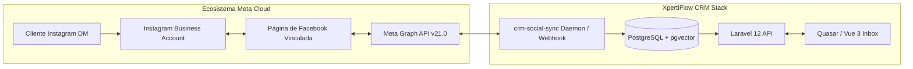

# Guía Maestra de Integración: Instagram Direct & Meta Graph API

Esta guía documenta la arquitectura técnica, configuración paso a paso, solución de problemas y el checklist para llevar la integración de **Instagram Direct** a producción (100% funcional) en **XpertiFlow CRM**.

---

## 1. Arquitectura de Integración

Meta administra los accesos a Instagram Business a través del ecosistema de **Páginas de Facebook (Fanpages)** y el protocolo **Meta Graph API v21.0+**.



### Contratos de Endpoints Utilizados:
- **Lectura / Sincronización de Conversaciones**:
  `GET https://graph.facebook.com/v21.0/{page_id}/conversations?platform=instagram&fields=id,updated_time,participants{id,username},messages{id,message,from,created_time}&access_token={page_token}`
  *(Nota crítica: Las conversaciones de Instagram SIEMPRE se consultan a través del ID de la Página de Facebook con `?platform=instagram`, no directamente sobre el ID de Instagram).*
- **Envío de Respuestas Salientes (Outbound DM)**:
  `POST https://graph.facebook.com/v21.0/me/messages?access_token={page_token}`
  Payload:
  ```json
  {
    "recipient": { "id": "<customer_instagram_scoped_id>" },
    "message": { "text": "Texto de respuesta" }
  }
  ```

---

## 2. Requisitos Previos en Instagram

### A. Convertir la cuenta a Profesional
1. En la app móvil de Instagram, ve a tu **Perfil** $\rightarrow$ Menú `☰` $\rightarrow$ **Configuración y privacidad**.
2. Entra a **Tipo de cuenta y herramientas** $\rightarrow$ **Cambiar a cuenta profesional** (Categoría: *Empresa* o *Creador*).

### B. Activar "Permitir acceso a los mensajes" (CRÍTICO)
> [!CAUTION]
> **Por defecto, Instagram desactiva el acceso de terceros a los mensajes.** Si este interruptor no está activo, Meta devuelve listas vacías `{"data": []}` y bloquea los Webhooks ante cualquier llamada externa.

1. En la app móvil de Instagram con la cuenta comercial:
2. Ve a **Configuración y privacidad** $\rightarrow$ **Mensajes y respuestas a historias** $\rightarrow$ **Solicitudes de mensajes**.
3. En la sección **Herramientas conectadas**, activa el interruptor:  
   👉 **"Permitir acceso a los mensajes"** (en azul).

---

## 3. Configuración en Meta (Facebook & Developers)

### A. Vincular Instagram a la Fanpage de Facebook
1. Entra a Facebook desde la PC y abre tu **Página de Facebook** (*Fanpage*).
2. Ve a **Configuración** $\rightarrow$ **Cuentas vinculadas** $\rightarrow$ **Instagram**.
3. Haz clic en **Conectar cuenta**, inicia sesión con la cuenta de Instagram y confirma.
4. Asegúrate de que el interruptor **"Permitir acceso a los mensajes de Instagram en la bandeja de entrada"** quede **Activado**.

### B. Crear la Aplicación en Meta for Developers
1. Entra a [developers.facebook.com](https://developers.facebook.com).
2. Haz clic en **Crear aplicación**:
   - Tipo de aplicación: **Empresa** (Business).
   - Nombre: `crm_production` o `crm_test`.
3. En el panel de la app, añade los siguientes **Productos**:
   - **Messenger**
   - **Instagram** (Instagram Graph API)
   - **Webhooks**

### C. Permisos Requeridos (Scopes)
Al generar el token de acceso o solicitar permisos en Meta, se requieren:
- `pages_show_list`
- `pages_messaging`
- `instagram_basic`
- `instagram_manage_messages`
- `pages_read_engagement`
- `pages_utility_messaging`

---

## 4. Modo Desarrollo vs. Modo Producción (100% Funcional)

Actualmente la integración funciona con las siguientes distinciones:

| Característica | Modo Desarrollo (Actual) | Modo Producción (100% Público) |
|---|---|---|
| **Quién puede enviar mensajes** | Solo cuentas agregadas como **Evaluadores de Instagram** | **Cualquier cliente / usuario del mundo** |
| **Revisión de Meta (App Review)** | No requerida | **Obligatoria** para permisos de mensajes |
| **Verificación de Negocio** | Opcional | Requerida por Meta para empresas |
| **Recepción de mensajes** | Demonio de polling cada 3s (`crm-social-sync`) | **Webhooks en tiempo real** (HTTPS público) |

---

## 5. Checklist para que esté 100% Funcional en Producción

Para que el sistema quede disponible para clientes reales a nivel global sin ninguna restricción:

### 1. Despliegue en Servidor con Dominio HTTPS
En local (localhost), Meta no puede enviar eventos push directos sin un túnel. En el servidor VPS o de producción:
- Configurar un dominio válido con certificado SSL (ej. `https://crm.tuempresa.com`).
- En [Meta Developers](https://developers.facebook.com) $\rightarrow$ **Webhooks** $\rightarrow$ **Instagram**:
  - **URL de devolución de llamada**: `https://crm.tuempresa.com/api/social/comments/webhook`
  - **Identificador de verificación (Verify Token)**: El token configurado en la tarjeta del canal en el CRM.
  - **Campos de suscripción**: Marcar `messages`, `messaging_postbacks`, `comments`.

### 2. Proceso de App Review en Meta Developers
1. En tu app de Meta Developers, ve a **Revisión de la aplicación** $\rightarrow$ **Permisos y funciones**.
2. Solicita **Acceso avanzado** para:
   - `instagram_manage_messages`
   - `instagram_basic`
   - `pages_messaging`
3. Sube un breve video demostrativo mostrando cómo un agente recibe y responde mensajes desde la bandeja del CRM.

### 3. Activar "En producción" (Live Mode)
En la barra superior de Meta Developers, cambia el interruptor general:
- De **En desarrollo** $\rightarrow$ a **En producción** (Live).
- A partir de ese segundo, cualquier persona que escriba al Instagram de la empresa entrará automáticamente al CRM.

### 4. Soporte de Archivos Multimedia (Opcional - Fase Siguiente)
- Soportar recepción y envío de imágenes/audios en Instagram Direct procesando el array `attachments` en el webhook y en `InstagramController@sendMessage`.

---

## 6. Guía de Solución de Problemas (Troubleshooting)

### Problema 1: `(#3) Application does not have the capability to make this API call`
- **Causa**: Consultar conversaciones llamando directamente al ID de Instagram (`GET /{ig_id}/conversations`).
- **Solución**: Debe consultarse siempre a través del nodo de la Página de Facebook: `GET /{page_id}/conversations?platform=instagram`.

### Problema 2: `Error validating access token: Session has expired`
- **Causa**: Usar un token de usuario temporal generado en Graph Explorer (expira en 1-2 horas).
- **Solución**: Obtener un **Page Access Token** permanente asociado a la página de Facebook o intercambiar el User Token por un Long-Lived Token (`fb_exchange_token`).

### Problema 3: Meta responde `{"data": []}` aunque se enviaron mensajes
- **Causas y soluciones**:
  1. **Interruptor apagado en el móvil**: Activar *"Permitir acceso a los mensajes"* en Instagram móvil.
  2. **Modo Desarrollo**: Si la app está en desarrollo, la cuenta remitente debe ser agregada en *Roles de la aplicación* $\rightarrow$ *Evaluadores de Instagram* y aceptar la invitación en `instagram.com/accounts/manage_access/`.
  3. **Solicitud de mensaje**: Si el mensaje cayó en "Solicitudes", debe ser aceptado en la bandeja de la app para pasar al buzón principal.

---

## 7. Comandos de Verificación en el Repositorio

- **Ejecutar sincronización manual desde CLI**:
  ```bash
  docker compose exec api php artisan social:sync
  ```
- **Monitorear el demonio en segundo plano**:
  ```bash
  docker compose logs -f crm-social-sync
  ```
- **Ejecutar suite de pruebas de integración social**:
  ```bash
  docker compose exec -e APP_ENV=testing api php artisan test tests/Feature/Phase5HentleAiAndSocialCommentsTest.php
  ```
