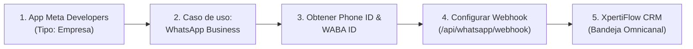

# 📗 Guía Paso a Paso: Integración de WhatsApp Cloud API (Meta Oficial) y QR con XpertiFlow CRM

Esta guía documenta el procedimiento completo, detallado y probado para registrar y vincular **WhatsApp Cloud API Oficial** y **WhatsApp Web QR** con **XpertiFlow CRM**.

---

## 📋 Resumen del Flujo de Conexión (WhatsApp Cloud API)

---

## 🟢 Modalidad 1: WhatsApp Cloud API Oficial de Meta *(Recomendado)*

### 🛠️ Paso 1: Crear la App de Meta con Caso de Uso WhatsApp

1. Ingresa a **[developers.facebook.com/apps](https://developers.facebook.com/apps)** y haz clic en **"Crear aplicación"**.
2. **Detalles de la aplicación:**
   - **Nombre de la app:** `XpertiFlow CRM Suite` (o `MiEmpresa CRM`).  
     *(⚠️ Nunca uses la palabra protegida "WhatsApp" en el nombre o Meta la rechazará).*
   - **Correo de contacto:** Tu correo electrónico.
3. **Casos de uso:**
   - Selecciona la opción: ☑️ **"Conecta con los clientes a través de WhatsApp"** (ícono verde).
4. **Empresa (Portafolio empresarial):**
   - Selecciona tu portafolio empresarial (Business Account) o crea uno nuevo si no tienes.
5. Haz clic en **"Crear aplicación"** e ingresa tu contraseña de Facebook para confirmar.

---

### 🔑 Paso 2: Obtener las Credenciales de WhatsApp Cloud

1. Dentro de tu App, ve a **WhatsApp** > **Configuración de la API** (o haz clic en *"Empezar a usar la API"*).
2. En esa pantalla encontrarás los 3 datos fundamentales:
   - **Identificador del número de teléfono (Phone Number ID):** Ej. `1264270856780499`.
   - **Identificador de la cuenta de WhatsApp Business (WABA ID):** Ej. `1493061142647411`.
   - **Identificador de acceso (Token):** Haz clic en el botón azul **"Generar identificador de acceso"** y luego en **"Copiar"**.

---

### 💻 Paso 3: Registrar el Canal en XpertiFlow CRM

1. En el CRM, ve a **Canales & Conexiones** (`/app/whatsapp` o `/app/channels`).
2. Haz clic en **"+ Vincular Nuevo Canal"** > pestaña **WhatsApp Cloud**.
3. Completa los campos:
   - **Nombre de la Conexión:** `WhatsApp Cloud Oficial`
   - **Phone Number ID:** Pega el Phone Number ID copiado de Meta (ej. `1264270856780499`).
   - **WABA Account ID:** Pega el Identificador de la cuenta de WhatsApp Business (ej. `1493061142647411`).
   - **Permanent Access Token (Meta):** Pega el Token generado en Meta.
4. Haz clic en **Guardar y Vincular Canal**.

---

### 🌐 Paso 4: Configurar los Webhooks en Meta para Tiempo Real

1. En la pantalla de **Configuración de la API** de Meta Developers, baja hasta:
   👉 **Paso 3: Configura webhooks para recibir mensajes** y haz clic en **"Configurar webhooks"**.
2. En la sección de Webhook de WhatsApp, haz clic en **Editar**:
   - **URL de devolución de llamada (Callback URL):**  
     `https://tu-dominio.com/api/whatsapp/webhook`  
     *(O la URL del túnel Cloudflare: `https://...trycloudflare.com/api/whatsapp/webhook`)*
   - **Token de verificación (Verify Token):**  
     Pega tu *Verify Token* (el que aparece al hacer clic en el botón "Webhook" en la tarjeta de WhatsApp en el CRM, o `xpertiflow_whatsapp_verify_token`).
3. Haz clic en **Verificar y guardar**.
4. En **Campos de webhook**, haz clic en **Administrar** y suscríbete obligatoriamente al campo:
   - ☑️ **`messages`** *(para recibir los mensajes entrantes de clientes en tiempo real)*.

---

### 🧪 Paso 5: Probar Mensaje de Prueba a tu Celular

1. En Meta Developers > **Configuración de la API**:
   - En **"A" (Selecciona un número de teléfono de destinatario)**:
   - Selecciona **"Administrar lista de números de teléfono"**.
   - Agrega tu número de celular personal (ej. Bolivia `+591 63921086`) e ingresa el código de 6 dígitos que te llegará por WhatsApp a tu teléfono.
2. Una vez añadido tu celular:
   - Puedes hacer clic en **"Enviar mensaje"** en Meta para recibir el mensaje de bienvenida `hello_world`.
   - O enviar y responder directamente desde la **Bandeja Omnicanal** de **XpertiFlow CRM**.

---

---

### 💡 Notas Técnicas y Resolución de Problemas (Troubleshooting)

1. **Tokens Encriptados en Backend:**
   - En XpertiFlow CRM, el `access_token` de WhatsApp se almacena de forma encriptada en la base de datos mediante el cast `'access_token' => 'encrypted'` de Laravel. Siempre debe guardarse a través de la interfaz web del CRM o mediante Eloquent (`$account->access_token = $token; $account->save();`) para que se encripte con la `APP_KEY`.
2. **Bloqueo de SMS Internacionales en Bolivia (Entel, Tigo, Viva):**
   - Cuando Meta solicita verificar tu identidad mediante un código de 6 dígitos por SMS (checkpoint `facebook.com/checkpoint`), los operadores bolivianos suelen bloquear o no entregar los SMS internacionales.
   - **Solución comprobada:** 
     1. Abre Facebook en tu celular (donde tu sesión esté activa) y ve a *Settings > Accounts Center > Login and security > Where you're logged in* para aprobar la sesión de la computadora.
     2. O al registrar un número en WhatsApp, solicita el código mediante **"Llamarme"** (llamada de voz automatizada), la cual sí ingresa sin problemas en Bolivia. Una vez activo WhatsApp, Meta permite enviar códigos de seguridad directamente por chat de WhatsApp.
3. **Flujo de Recepción en Tiempo Real (Inbound):**
   - Meta envía el payload al Webhook `/api/whatsapp/webhook`.
   - El sistema busca la cuenta por `phone_number_id`, registra el evento en `whatsapp_webhook_events`, crea el contacto si no existe y genera o actualiza la conversación en la bandeja omnicanal (`/app/conversations`).

---

## 🟢 Modalidad 2: WhatsApp Web (Código QR)

*Ideal para probar flujos locales o conectar un número personal sin pasar por Meta Cloud API.*

1. En el CRM, ve a **Canales & Conexiones** > **"+ Vincular Nuevo Canal"** > pestaña **WhatsApp (QR)**.
2. Ingresa el nombre de la línea y tu número.
3. Haz clic en **"Guardar y Vincular Canal"**.
4. En el modal emergente, haz clic en **"Simular Escaneo Exitoso"** para activar la línea en estado `CONECTADO`.
5. En la tarjeta creada, haz clic en **"Simular Entrada"** para enviar mensajes de prueba directamente a la **Bandeja Omnicanal**.
