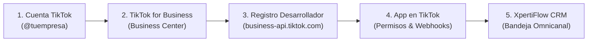

# 🔷 Guía Paso a Paso: Integración de TikTok for Business API con XpertiFlow CRM

Esta guía documenta el procedimiento completo, detallado y probado para registrar y vincular **TikTok for Business** con **XpertiFlow CRM**, desde la creación de la cuenta inicial hasta el despliegue del Webhook y la atención de mensajes en la bandeja omnicanal.

---

## 📋 Resumen del Flujo de Integración



---

## 📌 Requisitos Previos

1. **Número de teléfono o celular** para el registro inicial de TikTok.
2. **Correo institucional o corporativo** (ej. `@tuempresa.com` o `@universidad.edu.bo`).  
   > ⚠️ **Importante:** TikTok for Business Developers **no acepta correos públicos gratuitos** (`@gmail.com`, `@yahoo.com`, `@hotmail.com`).
3. URL segura con HTTPS (ej. tu dominio o túnel Cloudflare: `https://tu-dominio.com`).

---

## 🛠️ Paso 1: Crear la Cuenta de TikTok y Convertirla a Empresa

1. **Creación de la cuenta:**
   - Ingresa a [tiktok.com/signup](https://www.tiktok.com/signup) o desde la app móvil.
   - Elige **"Usar teléfono o correo electrónico"**.
   - Coloca fecha de nacimiento (mayor de 18 años).
   - Escribe tu número, recibe el SMS de confirmación y define tu nombre de usuario (ej. `@tuempresa_crm`).
2. **Ajuste de Privacidad de Mensajes (Vital):**
   - En la app de TikTok: **Perfil** > menú 3 líneas > **Ajustes y privacidad** > **Privacidad** > **Mensajes directos**.
   - Cambia la opción a **"Todos"** (*Everyone*) para permitir que cualquier cliente pueda enviar mensajes.

---

## 🏢 Paso 2: Crear el Centro de Negocios (TikTok Business Center)

1. Ingresa a **[business.tiktok.com](https://business.tiktok.com/)** con tu sesión de TikTok iniciada.
2. Autoriza los permisos para TikTok for Business (incluye el permiso de gestión de mensajes y bandeja).
3. **Información de la empresa:**
   - **Sitio web:** `https://tuempresa.com` (debe incluir `https://`).
   - **País o región:** Si tu país (ej. Bolivia) no figura en la lista de facturación de Ads, selecciona **Perú** o **Estados Unidos** (no afecta a la API).
   - **Industria:** `Software y aplicaciones` o `Servicios de TI`.
   - **Teléfono:** Si pide prefijo de Perú (`+51`), puedes ingresar un número de 9 dígitos de referencia (la validación principal es por correo).
4. **Información del Centro de Negocios:**
   - **Nombre:** `TuEmpresa Negocios`.
   - **Huso horario:** `(UTC-04:00)` o `(UTC-05:00) Hora de Lima`.
   - **Divisa:** ⚠️ Seleccionar **USD - Dólar estadounidense** (evitar *Chelín* o monedas africanas que a veces vienen por defecto).
5. En los pasos de vincular cuentas de anuncios y configuración de pago, haz clic en **"Saltar por ahora"** (*Skip for now*).

---

## 💻 Paso 3: Registrarse como Desarrollador en TikTok for Business

1. Ingresa al portal oficial: **[business-api.tiktok.com/portal](https://business-api.tiktok.com/portal)**.
2. Haz clic en **"Become a Developer"** (Convertirme en desarrollador).
3. **Formulario 1 - Business Information:**
   - **First Name / Last Name:** Tu nombre y apellido.
   - **Communication Email:** Tu correo corporativo o institucional (`@empresa.com` o `.edu.bo`).
   - Haz clic en **"Send Code"**, copia el código de verificación que llega a tu bandeja (revisar carpeta *Spam/Otros*) y pégalo.
   - ⚠️ **Phone Number:** **DÉJALO EN BLANCO**. Este campo **no tiene punto rojo** (es opcional). Si lo dejas vacío, evitas problemas con SMS internacionales bloqueados por operadoras locales.
   - **What best describes you?:** Selecciona **Technology Company**.
   - Clic en **Next**.
4. **Formulario 2 - Additional Information:**
   - **Company Name:** `TuEmpresa CRM`.
   - **Company Website:** `https://tuempresa.com`.
   - **Primary Developer Location:** Selecciona tu país (ej. Bolivia o Perú).
   - **What services do you provide?:** `CRM / Lead Management` o `Customer Service / Messaging`.
   - **What verticals do you specialize in?:** `Technology / Software`.
   - **Please list our top 5 mutual clients:** `Internal enterprise development, SMB clients, lead generation partners.`
   - **What region(s) do you serve?:** `Latin America` o `South America`.
   - **Estimated yearly revenue:** `1000` (USD).
   - **Descripción en inglés (Copy & Paste):**
     ```text
     We are developing an omnichannel CRM platform (XpertiFlow) to manage customer inquiries and lead generation from our official TikTok Business accounts. We plan to use the Webhook and Direct Messaging APIs to synchronize incoming customer inquiries, video comments, and ad leads directly into our support inbox, allowing authorized agents to provide real-time customer service and respond to user questions. All data will be handled securely and strictly for customer support.
     ```
   - Clic en **Submit**.

---

## 🚀 Paso 4: Crear la Aplicación en TikTok

1. En el portal de desarrolladores, ve a **My Apps** > **Create App**.
2. **App Name:** `XpertiFlow CRM Connector`.
3. **App Description:** `Omnichannel CRM integration for lead management, customer support, and interaction tracking for TikTok business accounts.`
4. **Advertiser redirect URL:** `https://tu-dominio.com/api/social/tiktok/callback`.
5. **Scope of permission (Permisos indispensables):**
   - ☑️ **Lead management** (Captura de clientes potenciales de formularios y anuncios).
   - ☑️ **Ad comments** (Lectura y respuesta de comentarios en videos y anuncios).
   - ☑️ **Ad account management** (Gestión de la cuenta comercial).
   - ☑️ **Reporting** (Métricas de rendimiento).
6. Clic en **Submit**.

> ⏳ **Tiempo de Aprobación:** La aplicación quedará en estado **`Pending approval`**. El equipo de TikTok suele aprobarla en **24 a 48 horas hábiles**. Una vez aprobada, se generarán tu **App ID** y **App Secret**.

---

## 🔗 Paso 5: Vincular el Canal en XpertiFlow CRM

1. En el CRM, ve a **Canales & Conexiones** (`/app/whatsapp` o `/app/channels`).
2. Haz clic en **"+ Vincular Nuevo Canal"** > pestaña **TikTok Business** (distintivo cyan).
3. Completa los campos:
   - **Nombre del Canal:** `TikTok @tuempresa`
   - **TikTok Client Key / App ID:** Tu *App ID* (o tu ID del Business Center temporal: `7692639741543530497`).
   - **Usuario de TikTok:** `@tuempresa_tiktok`
   - **Access Token:** Tu token de TikTok (o token temporal de prueba).
4. Haz clic en **Guardar y Vincular Canal**.

---

## 🧪 Paso 6: Simulación y Pruebas en Vivo

1. En la tarjeta de TikTok en el CRM, haz clic en el botón **"Simular Entrada"**.
2. Ingresa un usuario simulado (ej. `@cliente_demo`) y un mensaje de consulta.
3. El ticket entrará inmediatamente a la **Bandeja Omnicanal** (`/app/conversations`) con la etiqueta **cyan de TikTok** (ícono de nota musical `🎵`).
4. El operador puede hacer clic en **"Aceptar"** para tomar el ticket y responderle directamente desde el chat. La respuesta quedará registrada y enviada a través de `sendTikTokMessage`.
