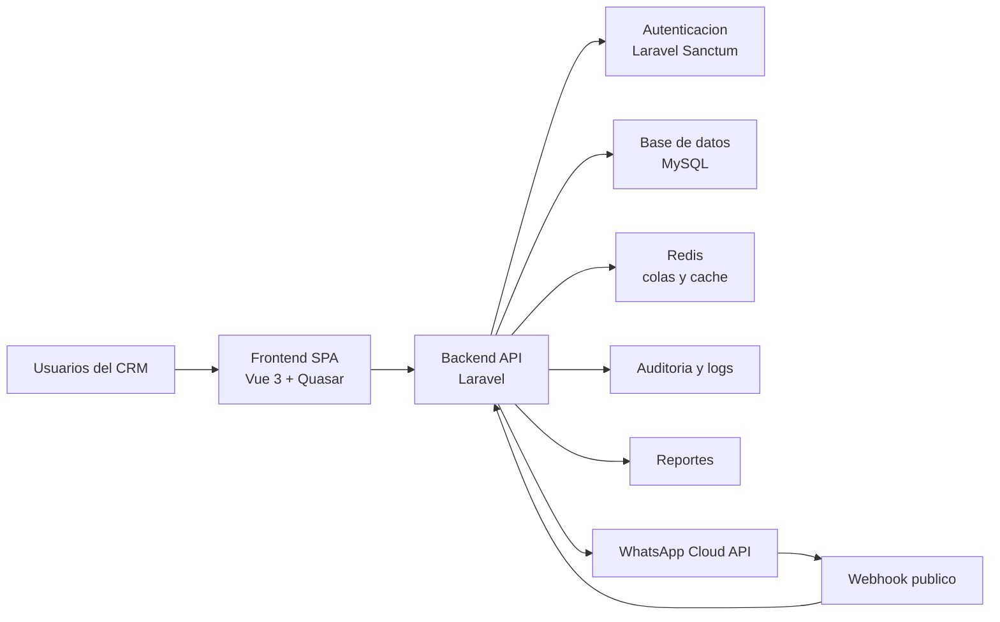
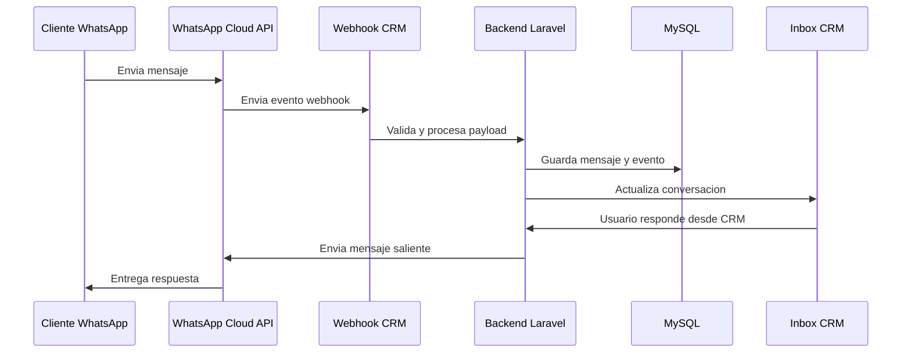
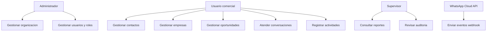
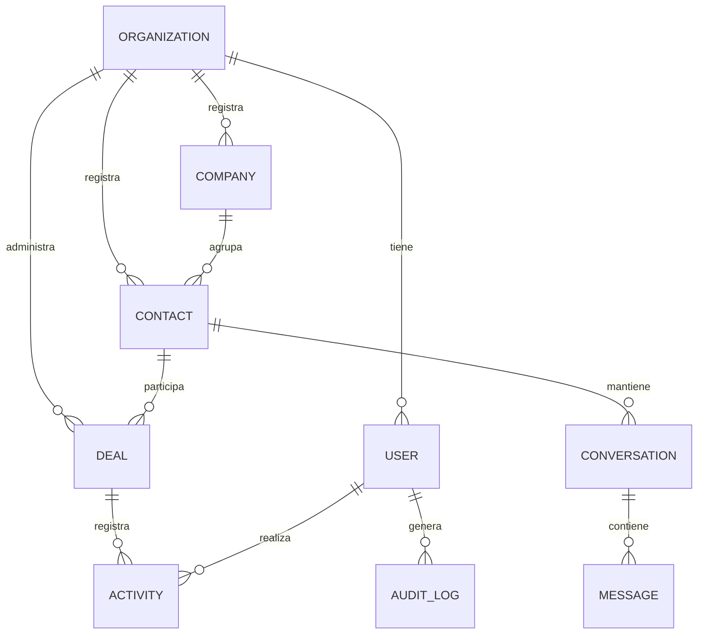
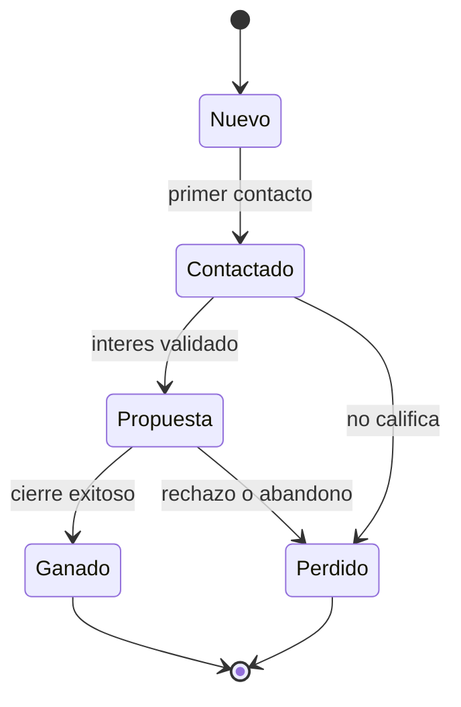

# Perfil de Proyecto de Grado

## Titulo tentativo

**Desarrollo de un sistema CRM conversacional multiempresa con integracion a WhatsApp Cloud API para la gestion de clientes y oportunidades comerciales**

## 1. Antecedentes

La gestion de relaciones con clientes ha evolucionado desde registros manuales y bases de datos aisladas hacia plataformas integradas que permiten organizar informacion comercial, historiales de interaccion, oportunidades de venta y procesos de seguimiento. En este contexto, el Customer Relationship Management (CRM) se entiende como una estrategia apoyada por procesos y tecnologias que busca crear, mantener y fortalecer relaciones de valor entre una organizacion y sus clientes. Prior, Buttle y Maklan (2024) sostienen que el CRM integra conceptos, aplicaciones y tecnologias orientadas a gestionar relaciones mutuamente beneficiosas con los clientes, lo cual permite entender que un sistema CRM no debe limitarse al almacenamiento de datos, sino apoyar la toma de decisiones y la coordinacion operativa.

Desde una perspectiva organizacional, Payne (2006) plantea que la gestion de clientes requiere alinear procesos, personas, informacion y tecnologia para mejorar el desempeno comercial. Esta idea resulta relevante para empresas que dependen del contacto continuo con prospectos y clientes, ya que la informacion dispersa reduce la capacidad de seguimiento y afecta la continuidad de las oportunidades comerciales. En pequenas y medianas empresas, esta situacion suele manifestarse mediante el uso de hojas de calculo, agendas personales, conversaciones en telefonos individuales y registros sin estandarizacion.

El crecimiento de los canales conversacionales ha incrementado la necesidad de integrar la comunicacion con los procesos comerciales. WhatsApp se ha convertido en un canal frecuente de atencion, prospeccion y seguimiento; sin embargo, cuando las conversaciones se gestionan sin una plataforma centralizada, la empresa pierde trazabilidad sobre el historial de contacto, responsables, estados de oportunidad y resultados comerciales. La documentacion de Meta (2026) sobre WhatsApp Cloud API establece que la integracion de mensajes se apoya de forma importante en webhooks, lo cual permite recibir eventos y estados de comunicacion desde la plataforma hacia sistemas externos.

En el area de Ingenieria de Sistemas, el desarrollo de un CRM conversacional requiere aplicar principios de ingenieria de software, arquitectura, calidad, seguridad e integracion de servicios. Sommerville (2016) senala que el desarrollo de software debe considerar actividades sistematicas de especificacion, diseno, implementacion, validacion y evolucion. Del mismo modo, Pressman y Maxim (2020) destacan la importancia de estructurar el proceso de desarrollo mediante modelos, requisitos, diseno y pruebas que permitan obtener un producto confiable y mantenible.

Con base en estos antecedentes, el presente perfil propone el desarrollo de un sistema CRM conversacional multiempresa orientado a centralizar clientes, contactos, empresas, oportunidades comerciales, conversaciones por WhatsApp, automatizaciones, reportes y auditoria. El proyecto se plantea como una propuesta tecnologica aplicable al contexto de pequenas y medianas empresas que requieren mejorar su gestion comercial y su relacion con clientes mediante una plataforma web modular.

**Figura sugerida 1. Evolucion de la gestion de clientes hacia un CRM conversacional**

Proposito: mostrar la transicion desde registros manuales hasta una plataforma CRM integrada con canales conversacionales.

Prompt sugerido:

```text
Generar una figura academica en espanol que muestre la evolucion de la gestion de clientes en cuatro etapas: registros manuales, hojas de calculo, CRM tradicional y CRM conversacional integrado con WhatsApp. Usar estilo profesional, fondo claro, iconos simples, flechas horizontales y textos breves. No usar decoracion excesiva.
```

## 2. Planteamiento del problema de investigacion

### 2.1 Descripcion del problema

En muchas pequenas y medianas empresas, la gestion de clientes y oportunidades comerciales se realiza mediante herramientas dispersas. Los datos de clientes pueden encontrarse en hojas de calculo, telefonos personales, conversaciones de WhatsApp, correos electronicos, notas individuales o aplicaciones no conectadas entre si. Esta forma de trabajo dificulta mantener un historial unificado de interacciones, identificar el estado real de cada oportunidad comercial y asignar responsabilidades claras dentro del equipo.

La ausencia de un sistema centralizado provoca perdida de informacion, duplicidad de registros, seguimiento irregular de prospectos, falta de reportes comerciales y dificultad para medir el desempeno del proceso de ventas. Cuando una oportunidad comercial depende de conversaciones aisladas, el cambio de responsable, la perdida de un telefono o la falta de registro de acuerdos puede ocasionar que el cliente no reciba seguimiento oportuno. Esta situacion afecta la eficiencia operativa y reduce la capacidad de la empresa para tomar decisiones basadas en informacion confiable.

El problema tambien se relaciona con la seguridad y el control de acceso. La informacion comercial contiene datos de clientes, conversaciones, montos de oportunidades y decisiones internas. OWASP Foundation (2021) identifica el control de acceso roto como uno de los riesgos criticos en aplicaciones web, mientras que OWASP Foundation (2023) advierte sobre riesgos especificos en APIs, como autorizacion inadecuada, exposicion excesiva de datos y falta de control sobre recursos. Por ello, un CRM conversacional debe considerar autenticacion, autorizacion, separacion de datos por empresa y auditoria desde su diseno.

Desde el punto de vista tecnico, la integracion con WhatsApp Cloud API requiere procesar webhooks, almacenar eventos, relacionar mensajes con contactos y mantener trazabilidad de estados de envio y recepcion. Si esta integracion no se disena adecuadamente, pueden producirse inconsistencias entre las conversaciones y los procesos comerciales. La ingenieria de requisitos propuesta por ISO/IEC/IEEE 29148:2018 permite organizar y validar necesidades funcionales y no funcionales, lo cual resulta necesario para que el sistema responda a un problema real y no solo a una implementacion tecnologica aislada.

En consecuencia, se identifica la necesidad de desarrollar una plataforma CRM conversacional multiempresa que centralice la informacion de clientes, contactos, conversaciones y oportunidades comerciales, permitiendo mejorar la trazabilidad, el seguimiento, la seguridad y la toma de decisiones.

### 2.2 Formulacion del problema

De que manera el desarrollo de un sistema CRM conversacional multiempresa con integracion a WhatsApp Cloud API permitira mejorar la gestion de clientes, oportunidades comerciales y procesos de seguimiento en pequenas y medianas empresas?

### Tabla 1. Matriz de problemas, causas y efectos

| Problema identificado | Causas principales | Efectos en la organizacion | Necesidad asociada |
| --- | --- | --- | --- |
| Informacion de clientes dispersa | Uso de hojas de calculo, telefonos personales y registros no integrados | Duplicidad de datos, perdida de historial y baja trazabilidad | Centralizar clientes, contactos y empresas |
| Seguimiento comercial irregular | Falta de pipeline y responsables definidos | Oportunidades olvidadas, retrasos y menor conversion | Gestionar oportunidades por etapas comerciales |
| Conversaciones no vinculadas al proceso comercial | Uso de WhatsApp sin integracion al CRM | Dificultad para conocer acuerdos, solicitudes y estado del cliente | Integrar WhatsApp Cloud API mediante webhooks |
| Falta de reportes | Datos no estructurados o incompletos | Decisiones basadas en percepciones y no en indicadores | Generar reportes comerciales y operativos |
| Riesgo de acceso no controlado | Ausencia de roles, permisos y separacion multiempresa | Exposicion de informacion sensible | Incorporar autenticacion, autorizacion y auditoria |

**Figura sugerida 2. Arbol de problemas**

Proposito: representar la relacion entre causas, problema central y efectos.

Prompt sugerido:

```text
Generar un arbol de problemas academico en espanol para un proyecto de sistema CRM conversacional. En el tronco colocar: gestion dispersa de clientes, conversaciones y oportunidades comerciales. En las raices colocar causas: uso de hojas de calculo, WhatsApp no integrado, ausencia de pipeline, falta de roles, informacion duplicada. En las ramas colocar efectos: perdida de seguimiento, baja trazabilidad, falta de reportes, menor eficiencia comercial y riesgo de exposicion de datos. Estilo claro, formal y apto para documento universitario.
```

## 3. Objetivos

### 3.1 Objetivo general

Desarrollar un sistema CRM conversacional multiempresa con integracion a WhatsApp Cloud API para mejorar la gestion de clientes, oportunidades comerciales y procesos de seguimiento en pequenas y medianas empresas.

### 3.2 Objetivos especificos

1. Diagnosticar los procesos actuales de gestion de clientes, contactos, conversaciones y oportunidades comerciales, identificando necesidades funcionales y no funcionales del sistema.
2. Disenar la arquitectura, modelo de datos y estructura modular del sistema CRM conversacional multiempresa, considerando requisitos de seguridad, escalabilidad, mantenibilidad e integracion.
3. Implementar los modulos principales del sistema, incluyendo autenticacion, organizaciones, contactos, empresas, pipeline comercial, inbox conversacional, integracion con WhatsApp Cloud API, reportes y auditoria.
4. Validar el funcionamiento del sistema mediante pruebas funcionales, revision de requisitos y criterios de calidad de software aplicables al proyecto.

### Tabla 2. Objetivos especificos y resultados esperados

| Objetivo especifico | Resultado esperado | Evidencia propuesta |
| --- | --- | --- |
| Diagnosticar procesos y necesidades | Requerimientos funcionales y no funcionales definidos | Matriz de requerimientos, entrevistas, ficha de observacion |
| Disenar arquitectura y modelo de datos | Diseno tecnico del sistema CRM | Diagramas de arquitectura, entidad-relacion y modulos |
| Implementar modulos principales | Prototipo funcional del sistema | Codigo fuente, capturas, endpoints, interfaces y manual tecnico |
| Validar el funcionamiento | Resultados de pruebas y cumplimiento de requisitos | Casos de prueba, checklist de calidad y reporte de resultados |

## 4. Justificacion

### 4.1 Justificacion practica

El proyecto se justifica practicamente porque propone una solucion tecnologica a un problema frecuente en pequenas y medianas empresas: la gestion dispersa de clientes, conversaciones y oportunidades comerciales. Un sistema CRM conversacional permitira centralizar informacion, registrar interacciones, administrar etapas de venta y facilitar el seguimiento de cada prospecto o cliente. Esta centralizacion puede contribuir a reducir perdida de informacion, mejorar la coordinacion interna y disponer de reportes para la toma de decisiones.

La integracion con WhatsApp Cloud API resulta pertinente porque muchas empresas utilizan WhatsApp como canal principal de comunicacion con clientes. Al vincular las conversaciones con contactos y oportunidades comerciales, el sistema permitira conservar historial, asociar mensajes a procesos de venta y mantener mayor control sobre la atencion. Esta integracion transforma un canal conversacional cotidiano en una fuente estructurada de informacion comercial.

### 4.2 Justificacion teorica

La propuesta se apoya en fundamentos de CRM, gestion comercial e ingenieria de software. Prior, Buttle y Maklan (2024) explican que el CRM integra aspectos estrategicos, operativos y analiticos para crear valor en la relacion con clientes. Payne (2006) complementa esta vision al resaltar la importancia de procesos orientados al cliente y de la coordinacion organizacional. Por ello, el proyecto no se limita a construir una aplicacion, sino que busca representar un proceso comercial organizado mediante una herramienta tecnologica.

Desde la Ingenieria de Sistemas, el proyecto se sustenta en principios de especificacion, diseno, implementacion y validacion de software. Sommerville (2016) y Pressman y Maxim (2020) coinciden en que el desarrollo de sistemas debe responder a requisitos definidos, modelos de diseno, pruebas y control de calidad. Asimismo, Bass, Clements y Kazman (2022) permiten fundamentar la importancia de la arquitectura de software como base para lograr atributos de calidad como mantenibilidad, seguridad, modificabilidad y escalabilidad.

### 4.3 Justificacion metodologica

Metodologicamente, el proyecto se justifica porque aplicara un proceso sistematico de investigacion aplicada y desarrollo tecnologico. Se realizara levantamiento de informacion, analisis de requerimientos, diseno de arquitectura, implementacion modular y validacion mediante pruebas. ISO/IEC/IEEE 29148:2018 servira como referencia para la definicion y gestion de requisitos, mientras que ISO/IEC 25010:2023 permitira orientar criterios de calidad del producto de software.

Adicionalmente, se considerara una organizacion iterativa del trabajo inspirada en Scrum, tomando como referencia la guia de Schwaber y Sutherland (2020). Esta aproximacion permite dividir el desarrollo en incrementos funcionales, revisar avances y ajustar el producto de acuerdo con los objetivos del proyecto.

## 5. Delimitacion

### 5.1 Delimitacion temporal

El proyecto se planificara para un periodo referencial de seis meses, considerando actividades de revision bibliografica, diagnostico, levantamiento de requerimientos, diseno, implementacion, pruebas, correcciones y redaccion del documento final. Esta planificacion se mantiene dentro del marco institucional, que establece una duracion minima de tres meses y maxima de una gestion academica para el desarrollo del proyecto de grado.

### 5.2 Delimitacion espacial

El proyecto se desarrollara en un contexto academico y se orientara como prototipo funcional aplicable a pequenas y medianas empresas que requieren gestionar clientes, contactos, conversaciones y oportunidades comerciales. No se limitara a una unica empresa especifica en esta etapa, sino que se planteara como una plataforma multiempresa adaptable a organizaciones con procesos comerciales similares.

### 5.3 Delimitacion de recursos financieros

La delimitacion financiera considerara recursos de desarrollo, infraestructura de prueba, servicios externos y herramientas necesarias para implementar y validar el sistema. Los costos podran ajustarse durante el desarrollo segun el alcance final y las condiciones de despliegue.

### Tabla 3. Delimitacion del proyecto

| Dimension | Alcance definido |
| --- | --- |
| Temporal | Seis meses de trabajo referencial |
| Espacial | Prototipo academico aplicable a pequenas y medianas empresas |
| Funcional | Clientes, contactos, empresas, pipeline, inbox, WhatsApp, reportes, auditoria y automatizaciones basicas |
| Tecnica | Laravel, MySQL, Redis, Vue 3, Quasar, Laravel Sanctum y WhatsApp Cloud API |
| Seguridad | Autenticacion, autorizacion, roles, separacion multiempresa y buenas practicas OWASP |
| Evaluacion | Pruebas funcionales, validacion de requisitos y criterios de calidad ISO/IEC 25010 |

### Tabla 4. Presupuesto estimado

| Recurso | Descripcion | Costo estimado Bs. |
| --- | --- | ---: |
| Equipo de desarrollo | Computadora personal, perifericos y entorno local | 0 |
| Dominio | Dominio referencial para despliegue o pruebas externas | 100 |
| Hosting o VPS de prueba | Servidor para publicar prototipo, API y base de datos | 500 |
| Servicios de mensajeria | Pruebas con WhatsApp Cloud API o proveedor asociado | 200 |
| Internet y energia | Consumo asociado al desarrollo y pruebas | 300 |
| Herramientas de documentacion | Edicion, diagramacion y preparacion de anexos | 100 |
| Material bibliografico | Consulta, adquisicion o acceso a fuentes | 300 |
| Contingencia | Ajustes, pruebas adicionales o recursos imprevistos | 300 |
| **Total estimado** |  | **1.800** |

## 6. Marco de referencia

### 6.1 Marco contextual

El proyecto se contextualiza en pequenas y medianas empresas que gestionan clientes mediante procesos comerciales de prospeccion, contacto, propuesta, cierre y seguimiento. En este tipo de organizaciones, la atencion al cliente suele depender de canales digitales de uso cotidiano, especialmente WhatsApp, correo electronico y llamadas telefonicas. Sin embargo, cuando estos canales no se integran a una plataforma central, la informacion queda fragmentada y depende del criterio individual de cada responsable.

Un CRM conversacional multiempresa responde a este contexto porque permite que distintas organizaciones utilicen una misma plataforma manteniendo separacion de datos, usuarios, roles y configuraciones. Esta caracteristica es importante cuando se busca un sistema escalable, capaz de administrar informacion de varias empresas sin mezclar sus registros. A nivel operativo, el sistema permitira que cada empresa gestione su cartera de contactos, empresas, oportunidades y conversaciones desde un entorno web comun.

### 6.2 Marco teorico

#### 6.2.1 CRM y gestion de relaciones con clientes

El CRM comprende estrategias, procesos y tecnologias orientadas a gestionar la relacion con clientes durante todo su ciclo de vida. Prior, Buttle y Maklan (2024) describen el CRM como un campo que integra aplicaciones y tecnologias para crear relaciones beneficiosas entre empresas y clientes. En el proyecto, esta perspectiva se aplicara mediante modulos que permitan registrar informacion de contactos, empresas, oportunidades y comunicaciones.

Payne (2006) senala que la excelencia en gestion de clientes requiere integrar procesos internos con informacion relevante sobre el cliente. Esta idea fundamenta la necesidad de que el CRM no solo almacene datos, sino que permita organizar procesos comerciales, identificar oportunidades, registrar actividades y medir resultados.

#### 6.2.2 CRM operativo, analitico y colaborativo

El CRM operativo se relaciona con actividades de ventas, marketing y servicio al cliente; el CRM analitico se orienta al uso de datos para generar informacion de apoyo a la decision; y el CRM colaborativo facilita la comunicacion entre la empresa y sus clientes mediante distintos canales. El sistema propuesto incorporara elementos operativos a traves del pipeline comercial, elementos analiticos mediante reportes y elementos colaborativos mediante el inbox conversacional integrado con WhatsApp.

#### 6.2.3 Pipeline comercial

El pipeline comercial representa las etapas por las que atraviesa una oportunidad desde su identificacion hasta su cierre. En el sistema propuesto, las oportunidades podran avanzar por estados como nuevo, contactado, propuesta, ganado o perdido. Este flujo permitira visualizar el estado de la gestion comercial y priorizar acciones de seguimiento.

#### 6.2.4 Comunicacion conversacional y WhatsApp Business

La comunicacion conversacional permite que la empresa interactue con clientes mediante canales de mensajeria. En el caso de WhatsApp Cloud API, Meta (2026) documenta el uso de webhooks para recibir mensajes y actualizaciones de estado en endpoints publicos. Esta caracteristica resulta esencial para construir un inbox conversacional que registre conversaciones y las relacione con contactos y oportunidades.

#### 6.2.5 Ingenieria de requisitos

La ingenieria de requisitos permite identificar, documentar, analizar y validar las necesidades que debe satisfacer un sistema. ISO/IEC/IEEE 29148:2018 establece procesos e informacion requerida para desarrollar requisitos de sistemas y software durante su ciclo de vida. En el proyecto, esta referencia se utilizara para organizar requerimientos funcionales, no funcionales y criterios de aceptacion.

#### 6.2.6 Arquitectura de software

La arquitectura de software define la organizacion principal de un sistema, sus componentes, responsabilidades, relaciones y decisiones tecnicas. Bass, Clements y Kazman (2022) resaltan que la arquitectura influye directamente en atributos de calidad como modificabilidad, rendimiento, seguridad y disponibilidad. Para el CRM se planteara una arquitectura web modular con frontend SPA, backend API, base de datos relacional, cache/procesos en segundo plano e integracion externa con WhatsApp.

#### 6.2.7 Aplicaciones web SPA

Una Single Page Application (SPA) permite construir interfaces dinamicas que actualizan vistas sin recargar completamente la pagina. Vue.js (2026) define Vue como un framework JavaScript para construir interfaces de usuario sobre HTML, CSS y JavaScript mediante un modelo declarativo y basado en componentes. Quasar Framework (2026) complementa este enfoque al proporcionar componentes y estructura para desarrollar interfaces web modernas con Vue.

#### 6.2.8 Calidad de software

La calidad de software se relaciona con la capacidad del producto para satisfacer necesidades funcionales y no funcionales. ISO/IEC 25010:2023 propone un modelo de calidad aplicable a productos de software e ICT, con caracteristicas que pueden usarse para especificar, medir y evaluar calidad. En el proyecto, se consideraran criterios como adecuacion funcional, seguridad, mantenibilidad, usabilidad, fiabilidad y eficiencia.

#### 6.2.9 Seguridad en aplicaciones web y APIs

La seguridad sera un aspecto central debido a que el CRM administrara datos de clientes, conversaciones y oportunidades comerciales. OWASP Foundation (2021) proporciona una referencia sobre riesgos criticos en aplicaciones web, mientras que OWASP Foundation (2023) aborda riesgos especificos en APIs. Estas guias se utilizaran para orientar medidas como control de acceso, proteccion de endpoints, validacion de datos, manejo de autenticacion y reduccion de exposicion de informacion.

#### 6.2.10 Integracion mediante webhooks

Los webhooks permiten que un sistema externo envie eventos a una aplicacion mediante solicitudes HTTP. En la integracion con WhatsApp Cloud API, los webhooks permitiran recibir mensajes entrantes y estados de mensajes salientes para procesarlos dentro del CRM. Esta integracion debera contemplar validacion, almacenamiento del payload, idempotencia y asociacion con contactos.

#### 6.2.11 Desarrollo agil o iterativo

El proyecto se organizara mediante iteraciones de analisis, diseno, implementacion y prueba. La guia de Scrum define un marco liviano para generar valor mediante soluciones adaptativas (Schwaber & Sutherland, 2020). Para este proyecto, se tomaran principios de planificacion incremental, revision de avances y mejora continua, adaptados al contexto academico.

### 6.3 Marco conceptual

| Termino | Definicion operativa para el proyecto |
| --- | --- |
| CRM | Sistema y estrategia para gestionar relaciones con clientes, procesos comerciales e informacion asociada. |
| Cliente | Persona u organizacion que mantiene o puede mantener una relacion comercial con la empresa. |
| Contacto | Persona individual registrada con datos de comunicacion y relacion con una empresa. |
| Empresa | Organizacion cliente o prospecto relacionada con contactos y oportunidades. |
| Lead | Prospecto inicial con posible interes comercial. |
| Oportunidad comercial | Registro de una posible venta o acuerdo que atraviesa etapas del pipeline. |
| Pipeline | Flujo de etapas comerciales que permite organizar y visualizar oportunidades. |
| Etapa comercial | Estado dentro del pipeline, como nuevo, contactado, propuesta, ganado o perdido. |
| Inbox conversacional | Bandeja de conversaciones asociada a contactos y canales de mensajeria. |
| Webhook | Mecanismo mediante el cual un servicio externo envia eventos a una aplicacion por HTTP. |
| API | Interfaz que permite la comunicacion entre sistemas de software. |
| Multiempresa | Capacidad del sistema para administrar datos separados de varias organizaciones. |
| Autenticacion | Proceso para verificar la identidad de un usuario. |
| Autorizacion | Proceso para determinar que acciones puede realizar un usuario autenticado. |
| Auditoria | Registro de acciones relevantes realizadas en el sistema. |
| Automatizacion | Ejecucion de acciones predefinidas a partir de reglas o eventos. |
| Reporte | Presentacion estructurada de informacion para analisis y toma de decisiones. |
| SPA | Aplicacion web de pagina unica que actualiza vistas dinamicamente. |
| Backend | Capa del sistema encargada de logica de negocio, datos, API y seguridad. |
| Frontend | Capa visual e interactiva utilizada por los usuarios finales. |

## 7. Diseno metodologico

### 7.1 Enfoque de investigacion

El enfoque de investigacion sera mixto con predominio cualitativo. Sera cualitativo porque buscara comprender procesos actuales de gestion de clientes, seguimiento comercial y comunicacion con usuarios involucrados. Tambien incorporara apoyo cuantitativo mediante conteo de requerimientos, resultados de pruebas, cumplimiento de casos de uso y mediciones basicas de validacion funcional.

### 7.2 Tipo de investigacion

La investigacion sera aplicada, descriptiva y propositiva. Sera aplicada porque buscara resolver un problema practico mediante el desarrollo de un sistema tecnologico. Sera descriptiva porque analizara la situacion actual de la gestion comercial y conversacional. Sera propositiva porque planteara como solucion el diseno e implementacion de un CRM conversacional multiempresa.

### 7.3 Metodos de investigacion

Se empleara el metodo analitico-sintetico para descomponer el problema en procesos, actores, datos y funcionalidades, y luego integrarlos en una propuesta de sistema. Tambien se utilizara el metodo inductivo-deductivo, ya que se partiran de observaciones y necesidades concretas para formular requerimientos, y posteriormente se aplicaran principios de ingenieria de software para disenar la solucion. Finalmente, se aplicara modelado de sistemas para representar arquitectura, procesos, entidades y casos de uso.

### 7.4 Tecnicas de investigacion

Las tecnicas previstas son revision documental, observacion, entrevista semiestructurada, analisis de requerimientos y pruebas funcionales. La revision documental permitira fundamentar el proyecto con bibliografia academica y documentacion tecnica. La observacion y entrevista ayudaran a identificar necesidades operativas. El analisis de requerimientos permitira formalizar funcionalidades y restricciones. Las pruebas funcionales verificaran que los modulos implementados cumplan los criterios definidos.

### 7.5 Fuentes de informacion

Las fuentes primarias seran usuarios o responsables relacionados con ventas, atencion al cliente, administracion y seguimiento comercial. Las fuentes secundarias incluiran libros de CRM e ingenieria de software, normas ISO/IEC, guias OWASP y documentacion oficial de Laravel, Vue, Quasar y Meta.

### 7.6 Poblacion y muestra

La poblacion estara conformada por usuarios potenciales de pequenas y medianas empresas que participan en procesos de gestion comercial y atencion al cliente. La muestra sera no probabilistica por conveniencia, considerando personas con experiencia directa en registro de clientes, uso de WhatsApp para comunicacion comercial, seguimiento de oportunidades y generacion de reportes.

### 7.7 Instrumentos de investigacion

Los instrumentos previstos son guia de entrevista, ficha de observacion, matriz de requerimientos, diagramas de modelado, lista de verificacion de seguridad basica y casos de prueba funcional. Estos instrumentos permitiran relacionar el diagnostico con el diseno e implementacion del sistema.

### Tabla 5. Tecnicas e instrumentos de investigacion

| Tecnica | Instrumento | Proposito |
| --- | --- | --- |
| Revision documental | Ficha bibliografica | Sustentar marco teorico y metodologia |
| Observacion | Ficha de observacion | Identificar procesos actuales y problemas operativos |
| Entrevista semiestructurada | Guia de entrevista | Recoger necesidades de usuarios y responsables |
| Analisis de requerimientos | Matriz de requerimientos | Definir funcionalidades, restricciones y criterios |
| Modelado de sistemas | Diagramas UML y arquitectura | Representar la solucion propuesta |
| Pruebas funcionales | Casos de prueba | Validar cumplimiento de funcionalidades |
| Revision de seguridad | Checklist OWASP | Verificar controles basicos de seguridad |

### 7.8 Procedimiento de investigacion

El procedimiento se organizara en fases alineadas con los objetivos especificos. En la primera fase se realizara revision bibliografica y diagnostico del problema. En la segunda fase se levantaran y documentaran requerimientos funcionales y no funcionales tomando como referencia ISO/IEC/IEEE 29148:2018. En la tercera fase se disenara la arquitectura del sistema, el modelo de datos, los modulos principales y los flujos de integracion.

En la cuarta fase se implementaran los modulos principales del CRM, iniciando por autenticacion, organizaciones y gestion de usuarios, para luego desarrollar contactos, empresas, pipeline, inbox conversacional e integracion con WhatsApp Cloud API. En la quinta fase se incorporaran reportes, auditoria y automatizaciones basicas. Finalmente, se ejecutaran pruebas funcionales y se evaluara el cumplimiento de requisitos y criterios de calidad apoyados en ISO/IEC 25010:2023.

**Figura sugerida 3. Proceso metodologico del proyecto**

Proposito: representar las fases de trabajo desde diagnostico hasta validacion.

Prompt sugerido:

```text
Generar un diagrama de proceso academico en espanol para un proyecto de grado de Ingenieria de Sistemas. Mostrar seis fases: revision bibliografica, diagnostico y requerimientos, diseno arquitectonico, implementacion modular, integracion y pruebas, documentacion y defensa. Usar cajas rectangulares, flechas simples, fondo claro y estilo profesional.
```

## 8. Diseno preliminar de la propuesta tecnologica

Aunque el perfil no corresponde al documento final, se plantea un diseno preliminar que guiara el desarrollo. El sistema se estructurara como una aplicacion web compuesta por frontend SPA, backend API, base de datos relacional, servicios de cache o colas e integracion externa con WhatsApp Cloud API.

### 8.1 Arquitectura general



**Figura sugerida 4. Arquitectura general del sistema CRM**

Proposito: mostrar componentes principales y relaciones tecnicas.

Prompt sugerido:

```text
Generar un diagrama academico limpio en espanol que muestre la arquitectura de un sistema CRM conversacional multiempresa. Incluir frontend Vue/Quasar, backend Laravel API, autenticacion Laravel Sanctum, base de datos MySQL, Redis, WhatsApp Cloud API mediante webhooks, modulo de contactos, pipeline, inbox, automatizaciones, reportes y auditoria. Estilo profesional, fondo claro, cajas rectangulares, flechas simples, sin decoracion excesiva.
```

### 8.2 Flujo de integracion con WhatsApp Cloud API



**Figura sugerida 5. Flujo de integracion con WhatsApp Cloud API**

Proposito: explicar como entran y salen mensajes desde el CRM.

Prompt sugerido:

```text
Generar un diagrama de secuencia en espanol sobre la integracion de un CRM con WhatsApp Cloud API. Mostrar: cliente envia mensaje, WhatsApp Cloud API envia webhook al CRM, backend valida payload, guarda evento en base de datos, actualiza inbox, usuario responde desde el CRM y la API envia el mensaje de respuesta a WhatsApp. Usar estilo tecnico, claro y apto para tesis.
```

### 8.3 Casos de uso principales



**Diagrama sugerido 1. Casos de uso principales**

Proposito: identificar actores y funcionalidades de alto nivel.

Prompt sugerido:

```text
Generar un diagrama de casos de uso UML en espanol para un CRM conversacional multiempresa. Actores: administrador, usuario comercial, supervisor y WhatsApp Cloud API. Casos de uso: gestionar organizacion, usuarios y roles, contactos, empresas, oportunidades, conversaciones, actividades, reportes, auditoria y recepcion de webhooks. Estilo academico, blanco y negro, claro para documento universitario.
```

### 8.4 Modelo entidad-relacion conceptual



**Diagrama sugerido 2. Modelo entidad-relacion conceptual**

Proposito: representar las entidades centrales del sistema.

Prompt sugerido:

```text
Generar un modelo entidad-relacion conceptual para un CRM conversacional multiempresa. Incluir entidades: organizacion, usuario, contacto, empresa, oportunidad, conversacion, mensaje, actividad y auditoria. Mostrar relaciones principales: una organizacion tiene usuarios, contactos, empresas y oportunidades; una empresa agrupa contactos; un contacto mantiene conversaciones; una conversacion contiene mensajes; una oportunidad registra actividades. Estilo academico y claro.
```

### 8.5 Flujo del pipeline comercial



**Diagrama sugerido 3. Flujo del pipeline comercial**

Proposito: mostrar el recorrido de una oportunidad comercial.

Prompt sugerido:

```text
Generar un diagrama de flujo academico en espanol para un pipeline comercial de CRM. Incluir etapas: Nuevo, Contactado, Propuesta, Ganado y Perdido. Mostrar flechas de avance y cierre. Usar colores sobrios, estilo profesional y etiquetas breves.
```

### 8.6 Modelo conceptual de modulos del CRM

**Figura sugerida 6. Modelo conceptual de modulos del CRM**

Proposito: presentar los modulos funcionales que formaran el sistema.

Prompt sugerido:

```text
Generar un diagrama modular academico en espanol de un sistema CRM conversacional multiempresa. Colocar al centro "CRM Conversacional Multiempresa" y alrededor los modulos: autenticacion y organizaciones, usuarios y roles, contactos, empresas, pipeline comercial, inbox conversacional, WhatsApp Cloud API, automatizaciones, reportes, auditoria y configuracion. Usar fondo claro, estilo profesional y conectores simples.
```

## 9. Cronograma

El cronograma se plantea para seis meses de trabajo, considerando una secuencia logica desde la fundamentacion y diagnostico hasta la validacion y preparacion de defensa.

### Tabla 6. Cronograma tipo Gantt

| Actividad | Mes 1 | Mes 2 | Mes 3 | Mes 4 | Mes 5 | Mes 6 |
| --- | :---: | :---: | :---: | :---: | :---: | :---: |
| Revision bibliografica | X | X |  |  |  |  |
| Diagnostico del problema | X |  |  |  |  |  |
| Levantamiento de requerimientos | X | X |  |  |  |  |
| Diseno de arquitectura |  | X |  |  |  |  |
| Diseno de base de datos |  | X | X |  |  |  |
| Desarrollo backend |  |  | X | X |  |  |
| Desarrollo frontend |  |  | X | X |  |  |
| Modulo de autenticacion y organizaciones |  |  | X |  |  |  |
| Modulos de contactos, empresas y pipeline |  |  | X | X |  |  |
| Inbox conversacional |  |  |  | X | X |  |
| Integracion WhatsApp Cloud API |  |  |  | X | X |  |
| Automatizaciones y reportes |  |  |  |  | X |  |
| Auditoria y seguridad basica |  |  |  | X | X |  |
| Pruebas funcionales |  |  |  |  | X | X |
| Correcciones y ajustes |  |  |  |  | X | X |
| Redaccion del documento final | X | X | X | X | X | X |
| Preparacion de defensa |  |  |  |  |  | X |

## 10. Indice tentativo del documento final

### Portada

### Dedicatoria

### Agradecimientos

### Resumen

### Indice general

### Indice de tablas

### Indice de figuras

### Introduccion

### Capitulo I. Presentacion de la tematica de investigacion

1.1 Antecedentes  
1.2 Planteamiento del problema  
1.2.1 Descripcion del problema  
1.2.2 Formulacion del problema  
1.3 Objetivos  
1.3.1 Objetivo general  
1.3.2 Objetivos especificos  
1.4 Justificacion  
1.4.1 Justificacion practica  
1.4.2 Justificacion teorica  
1.4.3 Justificacion metodologica  
1.5 Delimitacion  

### Capitulo II. Marco contextual

2.1 Contexto de pequenas y medianas empresas  
2.2 Procesos de gestion comercial  
2.3 Canales de comunicacion con clientes  
2.4 Situacion actual del uso de WhatsApp en procesos comerciales  

### Capitulo III. Marco teorico

3.1 Customer Relationship Management  
3.2 CRM operativo, analitico y colaborativo  
3.3 Gestion de oportunidades comerciales  
3.4 Comunicacion conversacional  
3.5 WhatsApp Cloud API  
3.6 Ingenieria de requisitos  
3.7 Arquitectura de software  
3.8 Aplicaciones web SPA  
3.9 Seguridad en aplicaciones web y APIs  
3.10 Calidad de software  
3.11 Desarrollo agil e iterativo  

### Capitulo IV. Diseno metodologico

4.1 Enfoque de investigacion  
4.2 Tipo de investigacion  
4.3 Metodos de investigacion  
4.4 Tecnicas e instrumentos  
4.5 Fuentes de informacion  
4.6 Poblacion y muestra  
4.7 Procedimiento de investigacion  

### Capitulo V. Diseno de ingenieria o presentacion de la propuesta

5.1 Descripcion general de la propuesta  
5.2 Requerimientos funcionales  
5.3 Requerimientos no funcionales  
5.4 Arquitectura del sistema  
5.5 Modelo de datos  
5.6 Diseno de modulos  
5.7 Diseno de interfaz de usuario  
5.8 Integracion con WhatsApp Cloud API  
5.9 Seguridad, roles y auditoria  
5.10 Implementacion del prototipo  

### Capitulo VI. Analisis e interpretacion de resultados

6.1 Plan de pruebas  
6.2 Resultados de pruebas funcionales  
6.3 Validacion de requerimientos  
6.4 Evaluacion de calidad del sistema  
6.5 Analisis de resultados obtenidos  

### Conclusiones

### Recomendaciones

### Bibliografia

### Anexos

## 11. Figuras, diagramas y tablas sugeridas

| Elemento | Titulo sugerido | Ubicacion recomendada | Proposito |
| --- | --- | --- | --- |
| Tabla 1 | Matriz de problemas, causas y efectos | Planteamiento del problema | Relacionar causas, problema y efectos |
| Tabla 2 | Objetivos especificos y resultados esperados | Objetivos | Mostrar correspondencia entre objetivos y evidencias |
| Tabla 3 | Delimitacion del proyecto | Delimitacion | Definir alcance temporal, espacial, funcional y tecnico |
| Tabla 4 | Presupuesto estimado | Delimitacion financiera | Presentar recursos economicos |
| Tabla 5 | Tecnicas e instrumentos de investigacion | Diseno metodologico | Relacionar tecnicas con instrumentos |
| Tabla 6 | Cronograma tipo Gantt | Cronograma | Planificar actividades en seis meses |
| Figura 1 | Evolucion de la gestion de clientes hacia un CRM conversacional | Antecedentes | Contextualizar el tema |
| Figura 2 | Arbol de problemas | Planteamiento del problema | Visualizar causas y efectos |
| Figura 3 | Proceso metodologico del proyecto | Diseno metodologico | Mostrar fases de investigacion |
| Figura 4 | Arquitectura general del sistema CRM | Diseno preliminar | Representar componentes tecnicos |
| Figura 5 | Flujo de integracion con WhatsApp Cloud API | Diseno preliminar | Explicar la comunicacion por webhooks |
| Figura 6 | Modelo conceptual de modulos del CRM | Diseno preliminar | Mostrar los modulos funcionales |
| Diagrama 1 | Casos de uso principales | Diseno preliminar | Identificar actores y funcionalidades |
| Diagrama 2 | Modelo entidad-relacion conceptual | Diseno preliminar | Representar entidades principales |
| Diagrama 3 | Flujo del pipeline comercial | Diseno preliminar | Mostrar estados de oportunidad |

## 12. Observaciones para defensa del perfil

El problema puede defenderse indicando que la gestion comercial dispersa afecta la trazabilidad, el seguimiento y la toma de decisiones. No se plantea un CRM generico, sino una plataforma conversacional multiempresa que integra informacion comercial con conversaciones de WhatsApp, lo cual responde a un uso real de canales digitales en pequenas y medianas empresas.

La eleccion de tecnologias puede justificarse por su pertinencia tecnica. Laravel permite construir APIs y logica de negocio robusta; Laravel Sanctum facilita autenticacion para SPA; Vue 3 y Quasar permiten desarrollar una interfaz web modular; MySQL es adecuado para datos relacionales del CRM; Redis apoya colas y procesos en segundo plano; y WhatsApp Cloud API permite integrar el canal conversacional mediante servicios oficiales.

La viabilidad del proyecto se sostiene en un alcance modular y progresivo. El sistema no pretende cubrir todos los procesos empresariales, sino enfocarse en gestion de clientes, contactos, empresas, oportunidades, inbox conversacional, reportes y auditoria. Este alcance es razonable para un periodo de seis meses si se desarrolla por etapas y se priorizan los modulos principales.

La innovacion debe explicarse con prudencia. El aporte no consiste en afirmar que el CRM es una tecnologia nueva, sino en integrar CRM, pipeline comercial y comunicacion conversacional mediante WhatsApp Cloud API en una plataforma multiempresa orientada a trazabilidad, seguimiento y mejora de procesos comerciales.

Los riesgos metodologicos y tecnicos principales seran la definicion incompleta de requisitos, el exceso de alcance, la complejidad de la integracion con WhatsApp, el control de seguridad multiempresa y la falta de pruebas suficientes. Estos riesgos se controlaran mediante matriz de requerimientos, arquitectura modular, validacion funcional, buenas practicas OWASP y criterios de calidad basados en ISO/IEC 25010.

## 13. Bibliografia

Bass, L., Clements, P., & Kazman, R. (2022). *Software architecture in practice* (4th ed.). Addison-Wesley Professional.

ISO/IEC. (2023). *ISO/IEC 25010:2023 Systems and software engineering - Systems and software Quality Requirements and Evaluation (SQuaRE) - Product quality model*. International Organization for Standardization.

ISO/IEC/IEEE. (2018). *ISO/IEC/IEEE 29148:2018 Systems and software engineering - Life cycle processes - Requirements engineering*. International Organization for Standardization.

Laravel. (2026). *Laravel 12.x documentation*. https://laravel.com/docs/12.x

Meta. (2026). *WhatsApp Cloud API documentation*. https://www.postman.com/meta/whatsapp-business-platform/documentation/wlk6lh4/whatsapp-cloud-api

Open Worldwide Application Security Project. (2021). *OWASP Top 10:2021*. https://owasp.org/Top10/2021/

Open Worldwide Application Security Project. (2023). *OWASP API Security Top 10 - 2023*. https://owasp.org/API-Security/

Payne, A. (2006). *Handbook of CRM: Achieving excellence in customer management*. Elsevier Butterworth-Heinemann.

Pressman, R. S., & Maxim, B. R. (2020). *Software engineering: A practitioner's approach* (9th ed.). McGraw-Hill Education.

Prior, D. D., Buttle, F., & Maklan, S. (2024). *Customer relationship management: Concepts, applications and technologies* (5th ed.). Routledge.

Quasar Framework. (2026). *Quasar Framework documentation*. https://quasar.dev/docs/

Schwaber, K., & Sutherland, J. (2020). *The Scrum Guide: The definitive guide to Scrum*. Scrum Guides. https://scrumguides.org/download.html

Sommerville, I. (2016). *Software engineering* (10th ed.). Pearson.

Vue.js. (2026). *Vue.js guide: Introduction*. https://vuejs.org/guide/introduction.html
