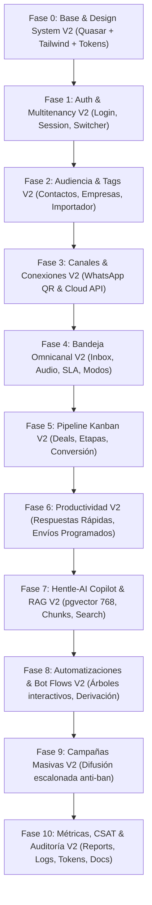

# 🏛️ XpertiFlow CRM V2 — Master Blueprint & Rebuild Specification (Menu por Menu)

> **Metodología Gentle AI™ — SDD (Spec-Driven Development) & TDD**  
> **Objetivo:** Guía maestra exhaustiva para la reconstrucción modular desde cero de **XpertiFlow CRM V2**, absorbiendo todas las bondades y capacidades técnicas probadas del monolito actual (PostgreSQL 16 + pgvector, Redis, Laravel 12, Quasar / Vue 3 / Vite), elevando el acabado visual (UI/UX) al máximo estándar de calidad corporativa, e implementando pruebas unitarias y funcionales a cada paso.

---

## 📌 1. Visión y Estrategia de Reconstrucción V2

### 1.1 ¿Por qué reconstruir hacia V2?
El sistema actual cuenta con un **núcleo de dominio sólido y validado** (68 pruebas automáticas pasando, modelo relacional con pgvector, WebSockets, integración multicanal de WhatsApp, bot flows y RAG cognitivo con Hentle-AI). Sin embargo, la interfaz actual requiere un salto cualitativo en:
- **Consistencia Visual:** Diseño de alta gama (Design System unificado, microinteracciones fluidas, estados de carga esqueletales, manejo armónico de densidades y modo oscuro/claro real).
- **Ergonomía de Operación:** Reducción de fricción para agentes que atienden múltiples conversaciones en paralelo.
- **TDD Paso a Paso:** Cada menú se reconstruye como una unidad atómica respaldada por pruebas unitarias de backend, tests de componentes de frontend y contratos verificables.

### 1.2 Reglas de Oro de Implementación (Gentle AI™)
1. **Un menú / submódulo a la vez:** Ningún menú se avanza sin tener su contrato de API, UI pulida y tests pasando.
2. **Presupuesto Cognitivo (~400 líneas / unidad de trabajo):** Separar componentes atómicos (`TicketList`, `ChatTimeline`, `AudioPlayer`, `CopilotPanel`) en lugar de vistas monolíticas gigantes.
3. **Tests alongside code:** Cada endpoint nuevo o refactorizado va acompañado de su test en `tests/Feature/` y `tests/Unit/`.
4. **Respeto al Modelo de Datos:** Se conserva la estructura de base de datos probada (PostgreSQL 16 con `pgvector`, índices IVFFLAT, partición multitenant por `organization_id`).

---

## 🗺️ 2. Mapa Integral de Menús y Navegación V2

```text
XpertiFlow CRM V2 (SPA)
│
├── 🔐 0. Acceso & Sesión
│   ├── Login con Branded Showcase
│   ├── Selector de Organización (Multitenancy)
│   └── Recuperación de Sesión & CSRF Seguro
│
├── 📊 1. Dashboard Ejecutivo & Operativo (/app/dashboard)
│   ├── KPIs en Tiempo Real (SLA, Tickets, Deals, CSAT)
│   ├── Gráficos de Volumen por Canal y Horario
│   └── Feed de Actividad y Presencia de Operadores
│
├── 💬 2. Bandeja Omnicanal de Atención (/app/conversations) [CORE]
│   ├── Lista de Conversaciones (Filtros: Pendientes, Atendiendo, Cerrados, Canales)
│   ├── Panel Central de Mensajería (Timeline WhatsApp, Redes, Audio Voice-to-Text)
│   ├── Panel Lateral de Contacto 360° (Datos, Empresa, Deals, Tags, Notas Internas)
│   └── Copiloto Hentle-AI (Sugerencias 1-clic con similitud semántica y Resúmenes)
│
├── 📱 3. Conexiones & Canales (/app/whatsapp)
│   ├── WhatsApp Web QR (Generación, Timeout en vivo, Reconexión automática)
│   ├── WhatsApp Cloud API (Configuración Meta Graph API v23.0)
│   └── Canales Sociales (Facebook Messenger, Instagram DM, Webchat)
│
├── 👥 4. Audiencia & Contactos (/app/contacts)
│   ├── Directorio de Contactos con Búsqueda Instantánea
│   ├── Perfil 360° del Contacto (Historial conversacional y comercial)
│   └── Importador Masivo (CSV/Excel con mapeo de columnas y tags)
│
├── 🏷️ 5. Etiquetas & Segmentación (/app/tags)
│   ├── Gestión de Tags con Paleta Hexadecimal
│   └── Segmentación de Audiencia para Campañas y Filtros de Bandeja
│
├── 💼 6. Pipeline Comercial & Kanban (/app/deals)
│   ├── Tablero Kanban Drag & Drop por Etapas (Lead, Contactado, Propuesta, Ganado)
│   ├── Creación Rápida de Deals desde el Chat de WhatsApp
│   └── Historial de Transición de Etapas y Proyecciones de Ingreso
│
├── 🏢 7. Empresas & Cuentas B2B (/app/companies)
│   ├── Directorio Corporativo (Razón social, NIT, Teléfono, Dirección)
│   └── Agrupación de Contactos y Deals por Cuenta Empresarial
│
├── ⚡ 8. Respuestas Rápidas (/app/quick-messages)
│   ├── Biblioteca de Snippets con Atajo (`/saludo`, `/precios`, `/ubicacion`)
│   └── Variables Dinámicas (`{{nombre}}`, `{{empresa}}`, `{{agente}}`)
│
├── ⏰ 9. Envíos Programados (/app/scheduled-messages)
│   ├── Programación de Mensajes Diferidos con Fecha y Hora
│   └── Monitor de Estado (Pendiente, Enviado, Fallido)
│
├── 🧠 10. Copiloto Hentle-AI & Base RAG (/app/wabot)
│   ├── Gestor de Bases de Conocimiento (`ai_knowledge_bases`)
│   ├── Ingestor de Documentos y Chunks Vectorizados (`pgvector` 768 dims)
│   └── Sandbox de Pruebas Semánticas (Similitud Coseno y Calidad de Respuesta)
│
├── 📢 11. Campañas Masivas (/app/campaigns)
│   ├── Creador de Campañas Segmentadas por Etiquetas
│   ├── Algoritmo de Envío Escalonado Anti-Baneo (Jitter aleatorio)
│   └── Métricas de Entrega, Lectura y Respuestas
│
├── 🔀 12. Filas de Atención & Enrutamiento (/app/departments)
│   ├── Configuración de Departamentos (Admisiones, Soporte, Facturación)
│   └── Asignación de Operadores y Reglas de Desborde
│
├── 🤖 13. Automatizaciones & Bot Flows (/app/automations)
│   ├── Diseñador de Flujos Interactivos (Menú con opciones 1, 2, 3...)
│   ├── Reglas Basadas en Eventos (Auto-asignación, Mensaje de bienvenida)
│   └── Derivación Híbrida: Opciones fijas a Cola + Pregunta abierta a Hentle-AI
│
├── 👨‍💻 14. Equipo & Operadores (/app/users)
│   ├── Gestión de Usuarios y Matriz RBAC (Owner, Admin, Agent, Member, Viewer)
│   ├── Estado de Presencia en Tiempo Real (En línea, Ocupado, Desconectado)
│   └── Asignación de Permisos de Canales y Colas
│
├── 📈 15. Métricas, Reportes & CSAT (/app/reports)
│   ├── Reportes de SLA (Tiempo de Primera Respuesta, Tiempo de Resolución)
│   ├── Encuestas de Satisfacción CSAT (Calificación 1-5 estrellas + Feedback)
│   └── Exportación de Reportes a CSV/PDF
│
├── 🛡️ 16. Auditoría Forense & Seguridad (/app/audit)
│   ├── Registro Inmutable de Auditoría (`audit_logs`)
│   └── Trazabilidad de Acciones Sensibles, Descargas e Inicios de Sesión
│
├── ⚙️ 17. Ajustes de Espacio & Tokens (/app/settings & /app/tokens)
│   ├── Horarios de Atención Comercial & Mensaje de Fuera de Horario
│   └── Gestión de Personal Access Tokens (Sanctum) para Integraciones
│
└── 📖 18. Documentación OpenAPI & Ayuda (/app/docs)
    └── Explorador Interactivo Swagger/OpenAPI con Pruebas de Endpoints
```

---

## 🔍 3. Especificación Detallada Punto por Punto (Cada Menú)

---

### Menú 0: Acceso, Sesión & Multitenancy (`/login`)

#### 1. Propósito y Valor
Puerta de entrada unificada y segura al CRM. Identifica al usuario, valida sus credenciales con protección contra ataques de fuerza bruta (rate limiting) y establece el contexto de la organización activa (`current_organization_id`).

#### 2. Flujo de Usuario en V2
1. El usuario visualiza una pantalla dividida (Hero corporativo con resumen de valor a la izquierda, formulario de acceso limpio y moderno a la derecha).
2. Ingresa email y contraseña. El formulario valida formato en tiempo real sin recargas.
3. El botón muestra un estado de carga esqueletal mientras se ejecuta `getCsrfCookie()` y `login()`.
4. Al autenticar, si el usuario pertenece a más de una organización, se le permite seleccionar o alternar su espacio de trabajo sin cerrar sesión.

#### 3. Requerimientos de UI/UX en V2
- Animación de transición suave al validar credenciales.
- Mensajes de error contextuales y amigables ("Credenciales no coincidentes", "Demasiados intentos, espere 60 segundos").
- Recordar última organización seleccionada en almacenamiento local reactivo.

#### 4. Endpoints Backend & Contratos
- `GET /sanctum/csrf-cookie`: Establece cookies `XSRF-TOKEN` y `laravel_session`.
- `POST /api/login`:
  - **Input:** `{ "email": "admin@crm.local", "password": "password" }`
  - **Output (200 OK):**
    ```json
    {
      "data": {
        "id": "01m3wey7xcf8dagc4n1tjeq29a",
        "name": "Administrador CRM",
        "email": "admin@crm.local",
        "current_role": "owner",
        "permissions": ["dashboard.view", "conversations.view", "ai.use"],
        "current_organization": { "id": "01m3wey...", "name": "CRM Demo", "slug": "crm-demo" },
        "organizations": [{ "id": "01m3...", "name": "CRM Demo", "role": "owner" }]
      },
      "message": "Sesion iniciada correctamente."
    }
    ```
- `GET /api/me`: Consulta el perfil y estado de sesión actual.
- `PUT /api/organizations/current`: Cambia de espacio de trabajo activo.

#### 5. Batería de Pruebas TDD (V2)
- [ ] `LoginTest::test_user_can_login_with_valid_credentials()`
- [ ] `LoginTest::test_invalid_credentials_returns_422_or_401()`
- [ ] `RateLimitTest::test_login_endpoint_throttles_after_5_failed_attempts()`
- [ ] `CurrentUserTest::test_user_can_switch_current_organization()`

---

### Menú 1: Dashboard Ejecutivo & Operativo (`/app/dashboard`)

#### 1. Propósito y Valor
Ofrecer al supervisor o directivo una visión de 360 grados instantánea del pulso del negocio: cuántos tickets esperan respuesta, cumplimiento de SLA, valor acumulado de oportunidades en el pipeline y volumen horario de mensajes.

#### 2. Flujo de Usuario en V2
1. El usuario accede y observa 4 tarjetas KPI principales con indicadores de tendencia (+12% vs. semana pasada).
2. Gráfico interactivo de barras/líneas: mensajes entrantes vs. salientes distribuidos por hora del día.
3. Lista rápida de "Atención Urgente": los 5 tickets con mayor tiempo de espera que están a punto de romper el SLA.
4. Widget de "Operadores Activos": estado de conexión en vivo (online, atendiendo, offline).

#### 3. Requerimientos de UI/UX en V2
- Gráficos renderizados con ApexCharts o Chart.js con paleta adaptada al modo oscuro/claro.
- Filtro rápido de rango de fecha: Hoy, Últimos 7 días, Este mes.
- Actualización reactiva automática mediante polling suave o evento WebSocket.

#### 4. Endpoints Backend & Contratos
- `GET /api/reports/dashboard`:
  - **Output (200 OK):**
    ```json
    {
      "data": {
        "open_tickets_count": 26,
        "pending_tickets_count": 8,
        "avg_response_time_minutes": 4.2,
        "active_deals_total_amount": 145000.00,
        "hourly_volume": [{ "hour": "09:00", "inbound": 45, "outbound": 60 }],
        "sla_compliance_percentage": 94.5
      }
    }
    ```

#### 5. Batería de Pruebas TDD (V2)
- [ ] `DashboardReportTest::test_dashboard_metrics_are_scoped_to_active_organization()`
- [ ] `DashboardReportTest::test_sla_average_calculation_is_accurate()`

---

### Menú 2: Bandeja Omnicanal de Atención (`/app/conversations`) [CORE]

#### 1. Propósito y Valor
El corazón operativo del CRM. Permite a los agentes interactuar en tiempo real con clientes de WhatsApp, Instagram, Facebook y Webchat con herramientas avanzadas de productividad (transcripción de audio, notas internas, modo supervisor fantasma, sugerencias de IA y vinculación con ventas).

#### 2. Flujo de Usuario en V2
1. **Columna Izquierda (Bandeja):** Pestañas de filtrado (`Pendientes`, `Atendiendo`, `Cerrados`), buscador por texto/teléfono y filtro por etiquetas o colas. Cada item muestra avatar, nombre, último mensaje, badge de no leídos y canal (WhatsApp, IG, etc.).
2. **Columna Central (Timeline del Chat):**
   - Mensajes entrantes (burbujas a la izquierda) y salientes (a la derecha) con checks de lectura.
   - Mensajes de audio con reproductor moderno con onda de sonido (waveform) y botón **"Transcribir a Texto"**.
   - Mensajes internos (notas amarillas/doradas) visibles únicamente por el equipo, no enviadas al cliente.
   - Caja de entrada con selector de plantillas rápidas (`/`), envío de archivos adjuntos y botón de micrófono para nota de voz.
3. **Columna Derecha (Perfil 360° & Hentle-AI Copilot):**
   - Datos del contacto (nombre, teléfono, correo, empresa).
   - Botón **"Crear Deal"** directo a una etapa del pipeline.
   - Asignación de agente y cola.
   - Panel **Hentle-AI**: sugerencia inteligente generada con RAG basada en los últimos mensajes con botón **"Copiar al chat"** o **"Enviar directamente"**.

#### 3. Requerimientos de UI/UX en V2
- Arquitectura de 3 columnas elástica y responsive (permite colapsar el panel derecho en pantallas pequeñas).
- Desplazamiento automático al último mensaje con botón flotante "Nuevo mensaje abajo".
- Renderizado de estados de envío: Enviando (reloj), Enviado (check simple), Entregado (doble check), Leído (doble check azul).

#### 4. Endpoints Backend & Contratos
- `GET /api/conversations`: Lista paginada con filtros (`status`, `search`, `queue_id`, `tag_id`).
- `POST /api/conversations`: Creación manual de un ticket o conversación.
- `GET /api/conversations/{id}`: Detalle del ticket con historial de mensajes.
- `POST /api/conversations/{id}/messages/internal`: Creación de nota interna privada (`is_internal: true`).
- `POST /api/conversations/{id}/accept`: El agente toma el ticket pendiente (`status: 'open'`, asignado a sí mismo).
- `POST /api/conversations/{id}/close`: Cierre del ticket con opción de feedback/CSAT.
- `POST /api/conversations/{id}/transfer`: Transferencia del ticket a otro agente o a otra cola.
- `POST /api/conversations/{id}/messages/{messageId}/transcribe`: Transcribe una nota de voz a texto.
- `POST /api/hentle-ai/suggest`: Genera sugerencia RAG a partir del contexto del ticket.

#### 5. Batería de Pruebas TDD (V2)
- [ ] `ConversationInboxTest::test_agent_can_accept_and_close_ticket()`
- [ ] `ConversationInboxTest::test_internal_note_is_not_sent_as_whatsapp_outbound()`
- [ ] `VoiceTranscriptionTest::test_audio_note_transcribes_to_text()`
- [ ] `HentleAiCopilotTest::test_copilot_generates_reply_suggestion_with_rag_context()`

---

### Menú 3: Conexiones & Canales (`/app/whatsapp`)

#### 1. Propósito y Valor
Administración del puente de conectividad con WhatsApp (Web QR y Cloud API oficial de Meta) y otros canales omnicanales, garantizando reconexión automática y sincronización de sesiones.

#### 2. Flujo de Usuario en V2
1. El usuario visualiza las conexiones configuradas con su estado (Conectado, Escaneando QR, Desconectado).
2. Para conectar WhatsApp Web: presiona **"Generar Código QR"**. Aparece el modal con el código QR y un temporizador visual de caducidad (ej. 45 segundos).
3. Al escanear desde la app de WhatsApp del teléfono, la pantalla detecta la sesión activa automáticamente sin recargar y actualiza el estado a "Conectado".
4. Opción para configurar credenciales de WhatsApp Cloud API (Token de acceso, Phone Number ID, Webhook Verify Token).

#### 3. Requerimientos de UI/UX en V2
- Animación de escaneo sobre el código QR.
- Indicador visual de latencia y estado de batería del dispositivo vinculado (si aplica).
- Copia con un solo clic de la URL de Webhook para pegar en Meta Developer Portal.

#### 4. Endpoints Backend & Contratos
- `GET /api/whatsapp/accounts`: Lista de conexiones activas.
- `POST /api/whatsapp/accounts/{id}/qr`: Genera o regenera el string base64 del código QR con timestamp de expiración.
- `POST /api/whatsapp/webhook`: Endpoint receptor de mensajes, estados de entrega (sent, delivered, read) y eventos de Meta.

#### 5. Batería de Pruebas TDD (V2)
- [ ] `WhatsAppQrTest::test_qr_code_generation_includes_expiration()`
- [ ] `WhatsAppWebhookTest::test_incoming_message_creates_or_updates_conversation()`
- [ ] `WhatsAppWebhookTest::test_webhook_verification_handshake()`

---

### Menú 4: Audiencia & Contactos (`/app/contacts`)

#### 1. Propósito y Valor
Directorio centralizado de clientes y prospectos. Almacena la identidad digital (teléfono con formato internacional E.164, email, empresa, etiquetas personalizadas y notas biográficas).

#### 2. Flujo de Usuario en V2
1. Tabla moderna con avatar, nombre, teléfono, etiquetas, empresa y fecha de última interacción.
2. Búsqueda instantánea (debounce de 300ms) por nombre, número de teléfono o correo.
3. Botón **"Nuevo Contacto"** con modal rápido.
4. Botón **"Importar Contactos"**: permite arrastrar un archivo Excel/CSV, previsualizar las primeras filas, mapear campos (Nombre -> Columna A, Teléfono -> Columna B) y asociar una etiqueta masiva (ej. `Feria-2026`).
5. Vista de detalle: línea de tiempo de todas las compras (deals) y chats históricos del contacto.

#### 3. Requerimientos de UI/UX en V2
- Chips de etiquetas coloreadas según el tono asignado.
- Botón de acción directa **"Iniciar Chat"** que redirige a la bandeja con el chat abierto.
- Detección de duplicados en tiempo real por número de teléfono.

#### 4. Endpoints Backend & Contratos
- `GET /api/contacts`: Lista paginada con ordenamiento y filtros por tag.
- `POST /api/contacts`: Creación individual de contacto.
- `GET /api/contacts/{id}`: Detalle del contacto con relaciones (`company`, `deals`, `tags`, `conversations`).
- `PUT /api/contacts/{id}`: Actualización de datos.
- `POST /api/contacts/import`: Importación masiva con validación de estructura.

#### 5. Batería de Pruebas TDD (V2)
- [ ] `ContactCrudTest::test_user_can_create_and_filter_contacts_by_tag()`
- [ ] `ContactImportTest::test_bulk_import_creates_contacts_and_assigns_tags()`

---

### Menú 5: Pipeline Comercial & Kanban (`/app/deals`)

#### 1. Propósito y Valor
Monitoreo visual del ciclo de ventas. Permite mover oportunidades entre etapas (Lead -> Contactado -> En Negociación -> Cerrado Ganado / Perdido) con cálculo dinámico del valor total por columna.

#### 2. Flujo de Usuario en V2
1. Tablero Kanban con columnas personalizables por etapa.
2. Cada tarjeta de Deal muestra: Nombre del trato, Valor económico (`$12,500`), Contacto, Empresa y badge del canal de origen (WhatsApp).
3. Drag & drop nativo y fluido entre columnas: al soltar una tarjeta, se actualiza la etapa en el servidor de forma optimista.
4. Acceso directo: un clic en la tarjeta permite abrir un modal de edición o saltar directamente a la conversación de WhatsApp asociada.

#### 3. Requerimientos de UI/UX en V2
- Animación de arrastre suave sin parpadeos ni recargas.
- Cabecera de columna con contador de deals y suma monetaria total formateada en moneda local.
- Colores distintivos para etapas finales (Verde para Ganado, Rojo para Perdido).

#### 4. Endpoints Backend & Contratos
- `GET /api/pipelines/board`: Retorna las etapas con sus respectivos deals ordenados por posición.
- `POST /api/deals`: Creación de un deal.
- `PUT /api/deals/{id}/stage`: Movimiento de etapa (`pipeline_stage_id`, posición).

#### 5. Batería de Pruebas TDD (V2)
- [ ] `DealBoardTest::test_deals_board_returns_stages_with_deals()`
- [ ] `DealBoardTest::test_deal_stage_transition_updates_history()`
- [ ] `DealBoardTest::test_deal_can_link_to_whatsapp_conversation()`

---

### Menú 6: Empresas & Cuentas B2B (`/app/companies`)

#### 1. Propósito y Valor
Gestión de cuentas institucionales o corporativas. Permite agrupar múltiples contactos bajo una misma entidad jurídica para negociaciones B2B complejas.

#### 2. Flujo de Usuario en V2
1. Listado de empresas con datos fiscales, teléfono, industria y cantidad de contactos vinculados.
2. Vista de detalle con tabs: Información General, Contactos Asociados, Oportunidades (Deals) y Conversaciones Activas.

#### 3. Endpoints Backend & Contratos
- `GET /api/companies`: Lista paginada.
- `POST /api/companies`: Registro de empresa.
- `GET /api/companies/{id}`: Detalle con carga eager de contactos y deals.

---

### Menú 7: Respuestas Rápidas (`/app/quick-messages`)

#### 1. Propósito y Valor
Acelerar la velocidad de respuesta de los operadores mediante plantillas prediseñadas que se invocan con un atajo en la caja de texto del chat.

#### 2. Flujo de Usuario en V2
1. Los administradores crean plantillas con un atajo único (ej. `saludo`, `cuenta_bancaria`).
2. El cuerpo admite variables dinámicas como `{{name}}`, `{{company}}` y saltos de línea.
3. En la bandeja de chat, al escribir `/`, se despliega un popover predictivo para seleccionar la plantilla con flechas del teclado y Enter.

#### 3. Endpoints Backend & Contratos
- `GET /api/quick-messages`: Lista de snippets activos por organización.
- `POST /api/quick-messages`: Creación de snippet (`shortcut`, `message`).

---

### Menú 8: Envíos Programados (`/app/scheduled-messages`)

#### 1. Propósito y Valor
Permite agendar mensajes para que se envíen automáticamente en una fecha y hora futura (ej. recordatorios de pago, citas médicas, seguimiento post-venta).

#### 2. Flujo de Usuario en V2
1. Formulario de creación: selección de contacto, canal, fecha, hora y texto del mensaje.
2. Un worker cron en background revisa mensajes pendientes y los despacha mediante el canal correspondiente al llegar la hora programada.

---

### Menú 9: Copiloto Hentle-AI & Base de Conocimientos RAG (`/app/wabot`)

#### 1. Propósito y Valor
Superpoder de Inteligencia Artificial contextual para el equipo de atención. Emplea la extensión vectorial `pgvector` en PostgreSQL para indexar políticas, manuales, catálogos y respuestas frecuentes en fragmentos con embeddings de 768 dimensiones. Al recibir una consulta, realiza búsqueda de similitud coseno y sugiere la respuesta más precisa.

#### 2. Flujo de Usuario en V2
1. **Pestaña Base de Conocimiento:** Creador de colecciones temáticas (ej. "Malla Curricular 2026", "Precios y Formas de Pago").
2. **Pestaña Fragmentos / Chunks:** Creador de fragmentos de texto (título, contenido, metadata). Al guardar, el backend genera el vector matemático y lo almacena en la columna `embedding vector(768)`.
3. **Pestaña Sandbox de Similitud:** Caja de búsqueda semántica donde el usuario escribe una pregunta de prueba y el sistema retorna los fragmentos más cercanos con su porcentaje de similitud coseno (ej. 92.4% match).

#### 3. Endpoints Backend & Contratos
- `GET /api/hentle-ai/knowledge-bases`: Colecciones de conocimiento.
- `POST /api/hentle-ai/chunks`: Ingesta de texto y generación de vector.
- `POST /api/hentle-ai/search`: Consulta vectorial con operador `<=>` (cosine distance).
- `POST /api/hentle-ai/suggest`: Sugerencia inteligente para un ticket específico.

#### 4. Batería de Pruebas TDD (V2)
- [ ] `HentleAiTest::test_embedding_vector_storage_in_postgresql()`
- [ ] `HentleAiTest::test_vector_similarity_search_returns_relevant_chunks()`
- [ ] `HentleAiTest::test_suggestion_generation_with_empty_and_valid_api_key()`

---

### Menú 10: Campañas Masivas de Difusión (`/app/campaigns`)

#### 1. Propósito y Valor
Envío de comunicaciones masivas a segmentos de audiencia etiquetados, incorporando control de tasa de envío (throttling con jitter aleatorio de 3 a 12 segundos) para evitar bloqueos y suspensiones de WhatsApp.

#### 2. Flujo de Usuario en V2
1. Crear campaña: Definir nombre, seleccionar etiquetas objetivo (ej. `Inscritos-2026`), redactar mensaje y seleccionar canal remitente.
2. Vista de progreso en tiempo real: barra porcentual con conteo de enviados, entregados, fallidos y pendientes.
3. Botón para pausar o reanudar campaña.

---

### Menú 11: Filas de Atención & Enrutamiento (`/app/departments`)

#### 1. Propósito y Valor
Segmentación de la atención al cliente por especialidad (ej. Admisiones, Soporte Técnico, Facturación, Post-Venta). Permite que los tickets ingresen a la cola adecuada y solo los operadores asignados a dicha cola puedan verlos y atenderlos.

#### 2. Flujo de Usuario en V2
1. Listado de colas con color identificador distintivo (para badges en el chat).
2. Asignación de miembros del equipo a cada cola.
3. Reglas de distribución: automática balanceada (Round Robin) o manual (el agente toma del pool de pendientes).

---

### Menú 12: Automatizaciones & Bot Flows (`/app/automations`)

#### 1. Propósito y Valor
Motor de auto-atención y routing automático. Permite recibir al usuario con un menú numérico interactivo (1: Carreras, 2: Pensiones, 3: Hablar con Asesor) y derivar automáticamente a la cola correspondiente, o delegar preguntas abiertas al copiloto Hentle-AI.

#### 2. Flujo de Usuario en V2
1. Editor visual de árboles de decisión: Mensaje inicial + lista de opciones (`tecla`, `etiqueta`, `accion`).
2. Acciones soportadas: `transfer_to_queue`, `send_message`, `handoff_to_ai`.
3. Simulador de prueba interactivo: una ventana de chat interna para probar el flujo antes de publicarlo.

#### 3. Batería de Pruebas TDD (V2)
- [ ] `BotFlowTest::test_bot_matches_numeric_option_and_transfers_queue()`
- [ ] `BotFlowTest::test_bot_handoff_to_hentle_ai_on_open_question()`

---

### Menú 13: Equipo & Operadores (`/app/users`)

#### 1. Propósito y Valor
Administración del talento humano del contact center. Control de roles, seguridad y monitoreo de disponibilidad en tiempo real.

#### 2. Flujo de Usuario en V2
1. Tabla de usuarios con avatar, rol (`Owner`, `Admin`, `Agent`, `Member`, `Viewer`), colas asignadas y switch de estado de presencia (`En línea`, `En pausa / Almuerzo`, `Desconectado`).
2. Modal de creación de operador con validación de contraseña segura y asignación de canales autorizados.

---

### Menú 14: Métricas, Reportes & CSAT (`/app/reports`)

#### 1. Propósito y Valor
Medición de la productividad y de la satisfacción del cliente. Presenta gráficos de velocidad de resolución y el índice CSAT (Customer Satisfaction Score) derivado de encuestas enviadas al cerrar los tickets.

#### 2. Flujo de Usuario en V2
1. Filtros por agente, cola, canal y rango de fechas.
2. Tarjetas de métricas: Tiempo de Primera Respuesta (FRT), Tiempo de Cierre (MTTR), Total de Conversaciones y % de Satisfacción CSAT.
3. Tabla de detalle de calificaciones con comentarios dejados por los clientes.
4. Exportación con un solo clic a CSV o reporte imprimible.

---

### Menú 15: Auditoría Forense & Seguridad (`/app/audit`)

#### 1. Propósito y Valor
Registro inmutable de todas las acciones que ocurren en el sistema para fines de cumplimiento, seguridad y resolución de disputas internas.

#### 2. Flujo de Usuario en V2
1. Tabla detallada con timestamp, usuario actor, evento (`login`, `contact.deleted`, `message.sent`, `organization.switch`), IP de origen, User-Agent y diff de cambios en formato JSON.
2. Filtros por tipo de evento y por usuario.

---

### Menú 16: Ajustes de Espacio & Tokens (`/app/settings` & `/app/tokens`)

#### 1. Propósito y Valor
Configuración global del tenant.
- **Ajustes:** Nombre de la organización, horario de atención comercial (ej. Lunes a Viernes 08:00 - 18:00), mensaje automático de fuera de horario.
- **Tokens de API:** Generación de tokens seguros Sanctum con fecha de expiración para conectar el CRM con sistemas ERP, pasarelas de pago o landing pages externas.

---

### Menú 17: Documentación OpenAPI & Ayuda (`/app/docs`)

#### 1. Propósito y Valor
Portal interactivo integrado que renderiza el contrato OpenAPI (`/api/docs/openapi.json`) directamente en la aplicación para que desarrolladores o integradores prueben llamadas y verifiquen esquemas en vivo.

---

## 🛠️ 4. Hoja de Ruta de Implementación V2 (Fase por Fase con TDD)



| Fase | Módulo / Menús | Entregables Principales | Criterio de Verificación (TDD) |
|---|---|---|---|
| **Fase 0** | Design System & Shell | Layout Glassmorphism V2, paleta CSS, componentes base (`XfButton`, `XfCard`, `XfBadge`). | Verificación visual y pruebas unitarias de componentes. |
| **Fase 1** | Acceso & Espacios | Login rediseñado, sesión persistente, cambio de organización. | `LoginTest`, `CurrentUserTest` (100% passing). |
| **Fase 2** | Contactos, Tags & Empresas | Directorio 360°, importador CSV con preview, taxonomía de tags. | `ContactCrudTest`, `CompanyCrudTest` (100% passing). |
| **Fase 3** | Canales & WhatsApp | Panel de conexiones, modal QR con timer, simulador webhook. | `WhatsAppQrTest`, `WhatsAppWebhookTest` (100% passing). |
| **Fase 4** | Bandeja Omnicanal | Inbox de 3 columnas, notas internas, audio waveform, transcripción. | `ConversationInboxTest`, `VoiceTranscriptionTest` (100% passing). |
| **Fase 5** | Pipeline Comercial | Kanban Drag & Drop, creación de deals desde el chat, historial. | `DealKanbanTest`, `PipelineStageTest` (100% passing). |
| **Fase 6** | Respuestas & Agendamiento | Popover `/` para snippets, agendamiento de mensajes futuros. | `QuickMessagesTest`, `ScheduledMessagesTest` (100% passing). |
| **Fase 7** | Hentle-AI Copilot | Gestor de colecciones, embeddings pgvector, búsqueda semántica. | `HentleAiKnowledgeTest`, `VectorSearchTest` (100% passing). |
| **Fase 8** | Bot Flows & Colas | Árbol de decisiones numérico, colas de atención, auto-routing. | `BotFlowTest`, `DepartmentsTest` (100% passing). |
| **Fase 9** | Campañas de Difusión | Gestor de campañas, limitador de tasa anti-ban, reportes de impacto. | `CampaignsTest` (100% passing). |
| **Fase 10** | Métricas & Hardening | Dashboard ejecutivo, reportes CSAT, auditoría forense y docs. | `ReportsTest`, `AuditLogTest` (100% passing). |

---

## 🎯 5. Verificación de Entrega y Cierre

Este documento queda archivado como la **Especificación Maestra Oficial de XpertiFlow CRM V2**. Cada fase de desarrollo posterior se implementará siguiendo rigurosamente este blueprint, creando o actualizando los tests correspondientes antes de dar por finalizada cada etapa.
