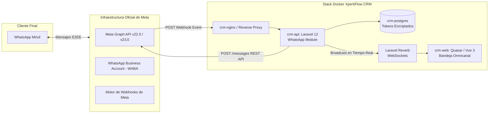

# Guía Maestra de Integración: WhatsApp Cloud API (Meta Oficial)

Esta guía documenta la arquitectura técnica, requisitos de Meta, aprovisionamiento de credenciales permanentes, registro de números telefónicos, webhooks y comandos de diagnóstico para conectar **WhatsApp Cloud API (Meta Oficial)** a **XpertiFlow CRM**.

---

## 1. Arquitectura de la Solución

XpertiFlow CRM cuenta con soporte nativo para **Meta Cloud API (Graph API)**, permitiendo a las empresas comunicarse con clientes utilizando la infraestructura oficial de WhatsApp alojada directamente en los servidores globales de Meta.



### Componentes y Roles:
| Componente | Rol Técnico |
|---|---|
| **Meta Graph API** | Endpoint oficial de Meta para despachar mensajes de texto, multimedia y plantillas HSM interactivas. |
| **WABA (WhatsApp Business Account)** | Entidad comercial que agrupa los números telefónicos, métodos de pago y políticas de mensajería del negocio. |
| **System User Token** | Credencial de máquina con duración **permanente** (sin caducidad) y permisos específicos de mensajería. |
| **Endpoint Webhook CRM** | `/api/whatsapp/webhook` (valida el handshake `hub.challenge` y procesa payloads asíncronos en cola). |
| **Almacenamiento Seguro** | Claves guardadas en la tabla `whatsapp_accounts` protegidas mediante `Crypt::encryptString()` de Laravel. |

---

## 2. Comparativa: Meta Cloud API vs WhatsApp Baileys QR

XpertiFlow CRM es una suite híbrida multicanal. Esta tabla ayuda a decidir cuándo recomendar cada canal a un cliente:

| Criterio | Meta Cloud API (Oficial) | WhatsApp QR (Baileys) |
|---|---|---|
| **Tipo de conexión** | Nube oficial de Meta (REST API + Webhooks) | Emulación de WhatsApp Web (WebSocket Signal) |
| **Costos por mensaje** | Tarifas oficiales de Meta por conversación (24h) | Costo $0 (usa el chip / plan del operador) |
| **Riesgo de bloqueo de chip** | Nulo o mínimo (número certificado por Meta) | Moderado si se envían mensajes masivos no solicitados |
| **Ventana de 24 horas** | Aplica: respuestas libres dentro de 24h; después requiere Plantilla HSM | No aplica: se puede escribir en cualquier momento |
| **Dispositivo físico** | No requiere tener el teléfono encendido ni conectado | El teléfono debe mantener conexión a Internet |
| **Caso de uso ideal** | Grandes volúmenes, operaciones enterprise, bancos, e-commerce | Atención al cliente local, pymes, agentes de venta directa |

---

## 3. Prerrequisitos de la Cuenta de Meta

Antes de tocar código o configurar el CRM, el cliente debe cumplir con estos requisitos en el ecosistema de Meta:

1. **Portfolio Empresarial en Meta Business Suite:** Creado desde [business.facebook.com](https://business.facebook.com/).
2. **Aplicación de Desarrollador:** Creada en [developers.facebook.com](https://developers.facebook.com/) con el caso de uso **«Otro»** o **«Negocio»** y el producto **«WhatsApp»** agregado.
3. **Autenticación en Dos Pasos (2FA) activa:** Obligatoria en el perfil de Facebook del administrador desde su dispositivo de confianza (smartphone).
4. **Método de Pago Vinculado:** Tarjeta de crédito/débito vinculada a la WABA en **Configuración de pagos** (incluso en capa gratuita, Meta exige tarjeta para activar números reales).
5. **Número de Teléfono Disponible:** El chip o línea fija debe estar libre (si estaba activo en WhatsApp móvil o WhatsApp Business, debe eliminarse de la app antes de conectarlo a la API).

---

## 4. Paso a Paso: Guía de Implementación para Clientes

### Paso 1: Obtener el Token Permanente (System User Token)

> [!IMPORTANT]
> **Nunca utilices el Token de Acceso Temporal** del Quickstart en entornos de producción, ya que caduca cada 24 horas. Para producción se debe generar un Token de Usuario del Sistema sin caducidad.

1. Ingresa a: `https://business.facebook.com/settings/system-users?business_id=<ID_PORTFOLIO>`
2. Haz clic en **Añadir** (*Add*):
   - **Nombre:** `crm-system-bot` (evita palabras restringidas como *"Bot"* o *"Meta"* si Meta arroja advertencia).
   - **Rol:** `Administrador`.
3. Con el usuario seleccionado, haz clic en **Asignar activos** (*Assign assets*):
   - En la columna izquierda selecciona **Aplicaciones**.
   - Marca la aplicación del CRM.
   - En la columna derecha activa **Control total / Administrar app**.
   - Haz clic en **Guardar cambios**.
4. Haz clic en el botón superior **Generar identificador / Generar nuevo token**:
   - Selecciona la aplicación.
   - **Caducidad del token:** Selecciona **Nunca** (*Never*).
   - En la lista de permisos (Scopes), marca obligatoriamente:
     - ☑️ `whatsapp_business_messaging`
     - ☑️ `whatsapp_business_management`
   - Haz clic en **Generar token** y guarda el texto (`EAANzx...`).

---

### Paso 2: Dar de Alta y Verificar el Número Telefónico

1. En Meta Business Suite, ve a:  
   `https://business.facebook.com/wa/manage/phone-numbers/?waba_id=<ID_WABA>`
2. Haz clic en el botón azul **Añadir número de teléfono**:
   - Ingresa el nombre para mostrar de la empresa (ej: `Empresa CRM Atención`).
   - Selecciona la categoría comercial y zona horaria.
   - Ingresa el número con código de país (ej: `+591 63921086`).
   - Selecciona el método de verificación: **Llamada de voz** o **SMS**.
   - Introduce el código de 6 dígitos recibido.
3. Al finalizar, la tabla mostrará:
   - **Phone Number ID:** Identificador numérico de 15–16 dígitos (ej: `1379424651914337`).
   - **Estado:** Inicialmente figurará como `Pendiente` (*Pending*).

---

### Paso 3: Registro Oficial de la Línea en Cloud API (`/register`)

Meta requiere una llamada criptográfica de inicialización para desplegar el contenedor del número y fijar el PIN de seguridad de 2 factores:

```bash
curl -X POST "https://graph.facebook.com/v22.0/<PHONE_NUMBER_ID>/register" \
  -H "Authorization: Bearer <PERMANENT_TOKEN>" \
  -H "Content-Type: application/json" \
  -d '{
    "messaging_product": "whatsapp",
    "pin": "123456"
  }'
```

**Respuesta exitosa de Meta:**
```json
{
  "success": true
}
```
*En este momento el número pasa inmediatamente a estado **`CONNECTED`** (verde) en WhatsApp Manager.*

---

### Paso 4: Configurar el Webhook en Meta Developers

1. En [developers.facebook.com](https://developers.facebook.com/), abre tu app y ve a **WhatsApp > Configuración**.
2. En la sección **Webhook**, haz clic en **Editar**:
   - **URL de devolución de llamada (Callback URL):**
     `https://<TU-DOMINIO-O-TUNEL>/api/whatsapp/webhook`
   - **Identificador de verificación (Verify Token):**
     Token secreto configurado en el CRM (ej: `dZBqXOQw2jcvLjeTemrmf0b9OGmDKSQ8`).
   - Haz clic en **Verificar y guardar**.
3. En la tabla de campos del webhook, haz clic en **Administrar campos**:
   - Suscribe el evento: ☑️ **`messages`**
   - *(Opcional)* Suscribe: ☑️ **`message_template_status_update`**

---

### Paso 5: Registrar la Cuenta en XpertiFlow CRM

Para añadir el canal a la base de datos del CRM asignado a la organización cliente:

#### Opción A: Vía Interfaz Web del CRM
1. Ingresa a `http://<DOMINIO>/app/channels/whatsapp`.
2. Presiona **Nuevo Canal > WhatsApp Cloud API**.
3. Rellena los campos:
   - **Nombre de la cuenta:** `WhatsApp Oficial (+591 ...)`
   - **Phone Number ID:** `<PHONE_NUMBER_ID>`
   - **WABA ID:** `<WABA_ID>`
   - **Access Token:** Pega el Token Permanente.
   - **Verify Token:** Token de verificación para el webhook.
4. Guarda y activa el canal.

#### Opción B: Vía Artisan Tinker / CLI Backend
```php
$encToken = \Illuminate\Support\Facades\Crypt::encryptString('EAANzx...');

\Illuminate\Support\Facades\DB::table('whatsapp_accounts')->updateOrInsert(
    ['phone_number_id' => '1379424651914337'],
    [
        'id' => (string) \Illuminate\Support\Str::ulid(),
        'organization_id' => '01m48mb83hmc0rn72qhfkj999k', // ID de la organización tenant
        'name' => 'WhatsApp Cloud Oficial (+591 63921086)',
        'display_phone_number' => '+591 63921086',
        'business_account_id' => '1841227566898143',
        'verify_token' => 'dZBqXOQw2jcvLjeTemrmf0b9OGmDKSQ8',
        'access_token' => $encToken,
        'session_type' => 'cloud_api',
        'status' => 'CONNECTED',
        'is_active' => true,
        'is_default' => false,
        'created_at' => now(),
        'updated_at' => now(),
    ]
);
```

---

## 5. Matriz de Errores Comunes y Soluciones (Troubleshooting)

| Código / Mensaje de Error | Causa Raíz | Solución Inmediata |
|---|---|---|
| **Error 141006 / Payment required** | La cuenta de WhatsApp Business no tiene tarjeta de crédito asociada. | Ir a WhatsApp Manager > **Configuración de pagos** y añadir una tarjeta válida. |
| **"La cuenta no existe en la API de nube / Usa /register API"** | Se intentó cambiar el PIN en la interfaz web antes de ejecutar la llamada `/register`. | Ejecutar el comando cURL `POST /<PHONE_ID>/register` con el PIN `123456`. |
| **"Error de vinculación: cuenta de WhatsApp Business no verificada (PENDING)"** | La WABA es nueva y está en cola de revisión automática (`account_review_status: PENDING`). | Completar la información del negocio (Sitio web, dirección) en *Business Settings > Información del negocio* y esperar la aprobación de Meta (24–48h). |
| **Bucle de 2FA en PC / Telescopio 404** | Meta bloquea la activación de 2FA en navegadores de PC considerándolos dispositivos no habituales. | Activar el 2FA vía SMS abriendo la app de Facebook desde el teléfono celular personal del administrador. |
| **OAuthException 190 / Session expired** | Se utilizó un token temporal de Quickstart en lugar de un System User Token. | Generar un Token Permanente desde *Usuarios del sistema* con caducidad = **Nunca**. |
| **DecryptException 500 en `/api/whatsapp/accounts`** | El token en la BD se guardó en texto plano en lugar de cifrado con `Crypt::encryptString()`. | Usar el modelo Eloquent o ejecutar `Crypt::encryptString($token)` antes del `UPDATE/INSERT`. |

---

## 6. Comandos de Diagnóstico Rápido

### Verificar Estado del Número en Meta:
```bash
curl -s -H "Authorization: Bearer <TOKEN>" \
  "https://graph.facebook.com/v22.0/<PHONE_NUMBER_ID>?fields=verified_name,code_verification_status,display_phone_number,status,quality_rating,name_status"
```

### Verificar Estado de Revisión de la WABA:
```bash
curl -s -H "Authorization: Bearer <TOKEN>" \
  "https://graph.facebook.com/v22.0/<WABA_ID>?fields=id,name,status,account_review_status,business_verification_status"
```

### Probar Handshake de Webhook Local/Túnel:
```bash
curl -i "https://<TUNNEL_URL>/api/whatsapp/webhook?hub.mode=subscribe&hub.verify_token=<VERIFY_TOKEN>&hub.challenge=test_123"
# Debe responder HTTP 200 con el texto: test_123
```

### Enviar Mensaje de Prueba Saliente vía API:
```bash
curl -X POST "https://graph.facebook.com/v22.0/<PHONE_NUMBER_ID>/messages" \
  -H "Authorization: Bearer <TOKEN>" \
  -H "Content-Type: application/json" \
  -d '{
    "messaging_product": "whatsapp",
    "to": "591XXXXXXXX",
    "type": "text",
    "text": { "body": "Hola desde XpertiFlow CRM Cloud API!" }
  }'
```

---

## 7. Checklist de Entrega a Clientes

- [ ] Portafolio empresarial de Meta creado y con 2FA habilitado en el dispositivo del administrador.
- [ ] Aplicación en Meta Developers creada con producto WhatsApp agregado.
- [ ] Tarjeta bancaria añadida en Configuración de pagos de la WABA.
- [ ] Usuario del sistema creado con permisos `whatsapp_business_messaging` y `whatsapp_business_management`.
- [ ] Token Permanente generado con vigencia = **Nunca**.
- [ ] Número telefónico verificado por SMS/Llamada en WhatsApp Manager.
- [ ] Información básica de la empresa (Sitio web, dirección) completada en el portafolio.
- [ ] Llamada `POST /<PHONE_NUMBER_ID>/register` ejecutada con PIN de 6 dígitos.
- [ ] Webhook validado con suscripción activa al evento `messages`.
- [ ] Cuenta dada de alta en XpertiFlow CRM con token encriptado.
- [ ] Mensaje bidireccional probado (entrante reflejado en `/app/conversations` y saliente entregado al cliente).
