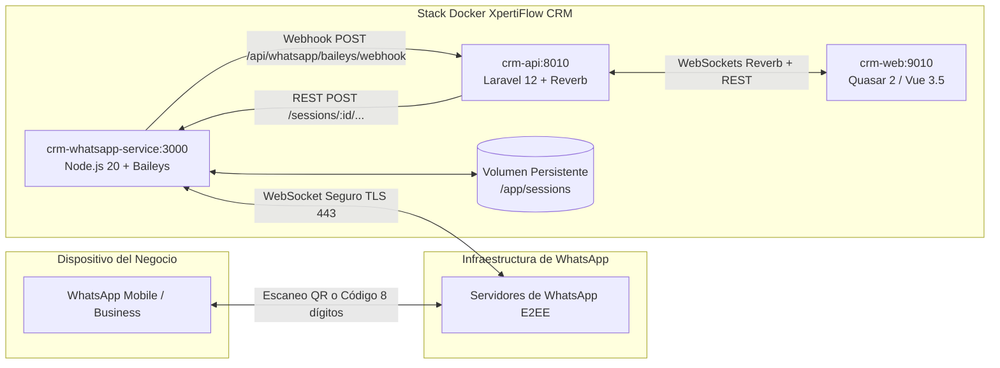

# Guía Maestra de Integración: WhatsApp Web (QR & Pairing Code) con Baileys

Esta guía documenta la arquitectura técnica, protocolos de autenticación, contratos de comunicación, casos críticos resueltos y comandos de mantenimiento del microservicio **WhatsApp Web (Baileys)** integrado en **XpertiFlow CRM**.

---

## 1. Arquitectura del Subsistema

Para soportar WhatsApp sin depender forzosamente de los costos por mensaje o restricciones de plantillas de Meta Cloud API, XpertiFlow CRM implementa una arquitectura híbrida de microservicio en tiempo real basada en **@whiskeysockets/baileys**.



### Componentes y Puertos:
| Servicio | Contenedor | Puerto Interno | Puerto Expuesto | Función |
|---|---|---|---|---|
| **Baileys Engine** | `crm-whatsapp-service` | `3000` | `3001` | Mantiene el túnel WebSocket criptográfico con WhatsApp, gestiona llaves Signal y emite eventos. |
| **Backend CRM** | `crm-api` | `8010` | `8010` | Recibe webhooks, administra contactos, tickets, conversaciones y despacha respuestas salientes. |
| **Frontend CRM** | `crm-web` | `9010` | `9010` | Interfaz de escaneo QR, generación de códigos de 8 dígitos y Bandeja Omnicanal en vivo. |

---

## 2. Métodos de Vinculación Soportados

El CRM ofrece **dos métodos oficiales** para vincular la línea de WhatsApp:

### Método A: Código de 8 Dígitos (Recomendado sin cámara)
Ideal si la cámara del celular presenta fallas de enfoque o la iluminación de pantalla dificulta el escaneo.
1. En el CRM (**Configuración > WhatsApp > Conectar**), entra a la pestaña **«Código de 8 Dígitos»**.
2. Escribe el número celular (admite formato local boliviano de 8 dígitos como `63921086` o internacional `+59163921086`).
3. Presiona **«Obtener Código»**. El sistema devuelve un código alfanumérico (ej: `55M6 - R5FB`).
4. En WhatsApp en tu celular:
   - Ve a **Dispositivos vinculados > Vincular un dispositivo**.
   - En la parte inferior presiona **«Vincular con el número de teléfono»**.
   - Ingresa los 8 caracteres.
5. El CRM detecta la vinculación y cambia automáticamente a **Canal Conectado**.

### Método B: Escaneo de Código QR
1. En la pestaña **«Escanear Código QR»**, apunta la cámara de WhatsApp al código QR en pantalla.
2. Cada código QR tiene una vigencia criptográfica de 60 segundos.
3. Si el código expira, puedes hacer clic en **«Nuevo QR»** para generar un código fresco sin recargar la página.

---

## 3. Desafíos Técnicos y Soluciones Implementadas

### A. Manejo del Código 515 (`restartRequired`)
> [!IMPORTANT]
> Cuando WhatsApp acepta el emparejamiento (sea por QR o código de 8 dígitos), el servidor de WhatsApp desconecta intencionalmente el WebSocket con el código de estado `515: restartRequired` para obligar al cliente a reconectar usando las nuevas credenciales firmadas.

- **Problema encontrado:** Si se eliminaba la carpeta de sesión en cualquier desconexión previa al estado conectado, las llaves recién negociadas se borraban y el celular mostraba *"No se pudo vincular el dispositivo"*.
- **Solución implementada:** En `connection.close`, si el código es `515`, las credenciales en disco (`creds.json`) **nunca se tocan**. El microservicio espera 1000ms a que termine la escritura I/O asíncrona y reinicializa el socket, completando la conexión a estado `open`.

### B. Soporte para Identificadores de Privacidad LID (`@lid`)
> [!NOTE]
> En cuentas modernas y WhatsApp Business, WhatsApp utiliza identificadores opacos denominados **LID** (Linked Identifier, ej: `226400627859588@lid`) para proteger el número telefónico real del usuario.

- **Recepción:** El microservicio detecta JIDs tanto de tipo `@s.whatsapp.net` como `@lid`, extrayendo la identidad de forma transparente sin descartar el mensaje.
- **Envío:** Al responder desde el CRM, si el destinatario corresponde a un LID (14+ dígitos o sufijo `@lid`), el microservicio lo envía al destino `@lid` nativo de Baileys en lugar de forzar `@s.whatsapp.net`.

### C. Desempaquetado de Mensajes Efímeros (`extractMessageContent`)
Si el cliente tiene activados los mensajes temporales (efímeros), WhatsApp envuelve el payload en `msg.message.ephemeralMessage.message`.
- Se integró la función oficial `extractMessageContent()` para desempaquetar automáticamente:
  - Mensajes de texto y texto extendido con enlaces.
  - Mensajes efímeros o temporales.
  - Mensajes multimedia de una sola visualización (*ViewOnce*).
  - Notas de voz / audio, imágenes con pie de foto, videos y stickers.

### D. Enrutamiento Saliente en Laravel (`SendWhatsAppMessageJob`)
- En organizaciones con múltiples líneas registradas, `SendWhatsAppMessageJob` consulta la tabla `whatsapp_message_mappings` para responder **exactamente por la misma línea de Baileys** por donde ingresó la conversación, evitando enviar por cuentas Cloud API expiradas o líneas cruzadas.

---

## 4. Contratos de Comunicación (REST & Webhook)

### Node.js Baileys $\rightarrow$ Laravel Webhook (`POST /api/whatsapp/baileys/webhook`)

```json
// Evento: Código QR generado
{
  "event": "qr",
  "account_id": "01m453jhx7wwn9nztfkar5xp8y",
  "qr_raw": "2@ABC...,179120...,XPERTI-FLOW-CRM",
  "qr_image": "data:image/png;base64,..."
}

// Evento: Dispositivo vinculado exitosamente
{
  "event": "connected",
  "account_id": "01m453jhx7wwn9nztfkar5xp8y",
  "phone": "+59163921086",
  "name": "Mi WhatsApp Empresa"
}

// Evento: Mensaje entrante recibido
{
  "event": "message",
  "account_id": "01m453jhx7wwn9nztfkar5xp8y",
  "provider_message_id": "3EB02A265A83D0BD9CEE5E",
  "from_phone": "+59170123456",
  "from_name": "Cliente Ejemplo",
  "body": "Hola, necesito información de precios",
  "timestamp": 1791209264
}
```

### Laravel API $\rightarrow$ Node.js Microservice

| Endpoint | Método | Descripción |
|---|---|---|
| `/sessions/:id/start` | `POST` | Inicia la sesión y genera el primer código QR. |
| `/sessions/:id/qr` | `GET` | Consulta el estado actual de la sesión y el código QR vigente. |
| `/sessions/:id/pairing-code` | `POST` | Solicita el código de 8 dígitos para vincular por número telefónico (`{ "phone": "59163921086" }`). |
| `/sessions/:id/send-message` | `POST` | Envía un mensaje de texto saliente (`{ "to": "...", "text": "..." }`). |
| `/sessions/:id/logout` | `POST` | Cierra la sesión activa y elimina las credenciales en disco. |
| `/health` | `GET` | Muestra estado del microservicio y número de sesiones activas. |

---

## 5. Operación y Comandos de Diagnóstico

### Ver logs en tiempo real del motor Baileys:
```bash
docker logs -f crm-whatsapp-service
```

### Reiniciar el microservicio WhatsApp:
```bash
docker compose restart whatsapp-service
```

### Verificar sesiones guardadas en disco:
```bash
docker compose exec whatsapp-service ls -la /app/sessions
```

### Ejecutar pruebas automatizadas del módulo WhatsApp:
```bash
docker compose exec -e APP_ENV=testing api php artisan test --filter=WhatsApp
```

---

## 6. Checklist de Verificación Operativa

- [x] Contenedor `crm-whatsapp-service` levantado y respondiendo en puerto `3000/3001`.
- [x] Generación de QR dinámico y código de 8 dígitos en frontend Quasar.
- [x] Persistencia de credenciales en `./apps/whatsapp-service/sessions`.
- [x] Auto-restauración de sesiones conectadas al reiniciar Docker.
- [x] Recepción de mensajes entrantes e inyección en la Bandeja Omnicanal (`status: pending`).
- [x] Envío de respuestas salientes desde la Bandeja Omnicanal al celular del cliente.
